# BlueOS 动态加载与动态链接调研报告

## 摘要

| 核心问题 | 结论 |
| --- | --- |
| 当前能否实现严格意义的用户态 `libc.so` | **不能。** 应用仍与内核共享特权地址空间，没有进程、非特权执行级和可靠的地址空间隔离 |
| 当前能否实现真正的动态链接 | **可以。** 可在 RTOS 线程模型内实现启动期 `DT_NEEDED`、符号解析、重定位、构造/析构和共享 `libc.so.1` |
| 当前“应用”是否等于一个线程 | **不完全等于。** 入口由一个主线程执行，但一个动态应用实例还拥有子线程、ELF/DSO 映像、TLS/atexit、资源配额、退出码和系统 DSO lease；线程是调度单位，应用实例是装载、归属与回收单位 |
| 应用管理模块名称 | 顶层改为 `ApplicationManager`，源码目录为 `application/`；当前执行后端称为 `thread_group/`，生命周期对象称为 `ThreadGroup`。不再以 `AppRuntime` 或 `Rtos*` 命名产品类型 |
| 当前能否用 MPU 隔离应用 | **不能。** Cortex-M 现有 MPU 只实现系统/线程栈 guard，应用线程仍为特权态；RISC-V 尚无 S/U mode 与 PMP domain；AArch64 虽有 EL1 MMU 线性映射，但 EL0 不受支持。当前没有应用运行期 containment；动态分发前必须补签名/allowlist，硬件映像权限只能先作为 hardening |
| 发布格式 | 主程序与 DSO 统一使用标准 `ET_DYN`；主程序带 `PT_DYNAMIC`、不带 `PT_INTERP`，由特权 `ApplicationLoader` 直接链接 |
| libc 形态 | 将 `librs_swi` 及其 PIC 内部依赖生成按需装入的系统 `libc.so.1`；普通 DSO 通过稳定 C ABI 动态依赖它 |
| 产品实现 | 直接扩充现有 `blueos_loader`：内部保留单映像 `ImageLoader`，新增窄化的 `DynamicLinker`；Relink 固定 revision 仅用于宿主侧对照测试，不进入目标固件 |
| 工具链 | 每个 ISA/ABI 使用一套默认 PIC、支持 dynamic 的 target/toolchain 和共享 sysroot；内核采用“PIC codegen + `-static` 最终链接”，应用/DSO 分别以 PIE/shared 链接 |
| MVP 边界 | ARM32 Thumb v7-M soft-float 优先（`thumbv7m-vivo-blueos-newlibeabi`/`qemu_mps2_an385`）、立即绑定、emutls、整 `ThreadGroup` 回收；不做应用侧 `dlopen/dlclose`、lazy binding、原生 ELF TLS、IFUNC、COPY 或 TEXTREL |
| 第一优先级 | 先修复现有 loader 的 BSS 未清零、load bias、未知 relocation 静默忽略、范围/溢出校验和 cache 同步，再引入多 DSO 语义 |

推荐路线不是废弃现有 loader 另写一套，也不是把所有功能继续堆进单个 `load_elf()`。当前交付应在现有 `blueos_loader` crate 内形成 `ImageLoader → DynamicLinker → ElfReader/ImageMemory/ArchRelocator` 的分层，再由内核单一的 `ApplicationManager` 通过 `thread_group/` 后端和 `ApplicationLoader` 调用；未来具备 Process、MMU/MPU 隔离和用户态后，在同一 `application` 中条件编译加入 `process/` 后端与 exec stage0，复用已经验证的 ELF、依赖图、符号、重定位与测试语义。

本文采用“按职责命名、按执行模型分目录”的规则：与操作系统运行模型无关的对象使用 `ImageLoader`、`DynamicLinker`、`LinkSession`、`ImageMemory` 等中性名称；内核控制面使用 `ApplicationManager`，明确它管理的是已装载应用实例而不是线程调度；当前共享地址空间实现放在 `thread_group/`，核心实例称为 `ThreadGroup`。`ApplicationLoader`、`SystemDsoRegistry`、`SystemDsoLease`、`FlatImageMemory` 和 `ApplicationStartInfo` 的职责本身不要求 `Rtos` 前缀，未来如果实现不同语义，再在 `process/` 中使用 `Process`、`AddressSpace`、`ProcessImageMemory` 和 exec stage0 等具体名称。下文小写 `rtld` 只用于业界术语或外部项目中的 runtime linker，不作为 BlueOS 模块名。

## 1. 动态加载与动态链接基础概念

| 概念 | 输入 | 主要工作 | BlueOS 中建议的责任方 |
| --- | --- | --- | --- |
| ELF 装载 | `ET_EXEC` / `ET_DYN` | 校验 ELF、分配地址、复制/映射 `PT_LOAD`、清 BSS、建立权限、确定入口 | 内核 loader / `ApplicationManager` 的执行后端 |
| 启动时动态链接 | PIE `ET_DYN` + `PT_DYNAMIC` + `DT_NEEDED` | 装载 DSO、建立符号作用域、重定位、TLS、RELRO、构造函数 | RTOS 内的特权 `ApplicationLoader` 调用 `blueos_loader::DynamicLinker` |
| 启动元数据 | `ApplicationStartInfo` + 标准 auxv 数组 | 向 crt/libc 传递 program headers、入口、随机数、执行路径和 ABI 信息 | 当前由 `application::thread_group` 构造，`blueos_scrt1` / libc 解析 |
| 运行时动态装载 | 运行中的应用调用 `dlopen` | 在并发条件下增量修改依赖图、发布符号、构造/析构、引用计数 | Phase 3 在同一个 `DynamicLinker` 上增加 runtime session 和 `libdl` 接口 |

`ET_DYN` 也不等于“已经动态链接”。不带 `DT_NEEDED`、把所有库静态链接进去的 static PIE 也是 `ET_DYN`；它通常只需相对重定位。BlueOS 当前测试目标使用 `-static -pie -no-dynamic-linker`，属于这一类，而不是依赖 `libc.so` 的动态应用。反过来，RTOS 应用可以不带 `PT_INTERP`，仍通过 `DT_NEEDED` 由内核内的 `ApplicationLoader` 完成真正的动态链接；`PT_INTERP` 是进程式用户态 ldso 的 handoff 契约，不是动态链接成立的必要条件。

另一个边界是 ABI：

- `blueos-github/libc` 是 Rust 对 C API/类型的绑定，`librs` 才是函数实现。
- Rust 的 `rlib`/`dylib`、Rust 符号名和 crate metadata 不是稳定系统 ABI；编译器版本、构建目录和依赖图都可能改变符号哈希。Theseus 的 out-of-tree 构建必须复用完全匹配的预编译依赖，正说明了这种耦合。
- 因而首版只承诺 `extern "C"` 的 librs ABI。Rust 应用可以使用定制 `std`，但 `core`/`alloc`/`std` 先静态且以 PIC 编译；它们对 C 运行时的未定义引用经 PLT/GOT 指向 `libc.so.1`。不要动态链接 Rust `std` 或普通 Rust crate。

参考：[Theseus loadable 模式](../../../Theseus/book/src/building/configuration.md)、[Theseus out-of-tree ABI 问题](../../../Theseus/book/src/building/rust_builds_out_of_tree.md)、[librs 入口与模块](../../librs/src/lib.rs)、[Rust libc bindings](../../libc/BUILD.gn)。

### 1.1 当前 BlueOS 能否实现“用户态 `libc.so`”

严格来说不能。这里的“用户态”意味着应用和 libc 运行在非特权级，并由独立地址空间或 MPU domain 与内核隔离；而当前 BlueOS 只有线程和系统级内存分配，没有进程、`execve`、可用的 `mmap/mprotect`，RISC-V 尚未进入 U mode，AArch64 应用仍运行在 EL1，Cortex-M 也没有建立稳定的非特权应用域。

但当前 BlueOS **可以实现 RTOS 语义的动态 `libc.so.1`**：把 `librs_swi` 的实现以 PIC 方式构建成 `ET_DYN` DSO，将 `blueos_scal_swi` 静态包含在该 DSO 内，通过 SWI/syscall ABI 调用内核；应用和其他 DSO 通过稳定 C ABI 与 `DT_NEEDED: libc.so.1` 使用它。它与应用一样运行在共享特权地址空间中，应称为“RTOS 应用动态 libc”，不能宣传为安全隔离的用户态 libc。

这个区别不妨碍动态链接本身成立。动态链接解决的是地址分配、依赖发现、符号解析、重定位和生命周期问题；是否处于用户态是执行权限与隔离问题。本文当前方案只解决前者，并明确把成功装载的应用视为受信任代码。

### 1.2 从编译到运行：ELF 中究竟留下了什么

对动态应用而言，构建期和运行期是接力关系：

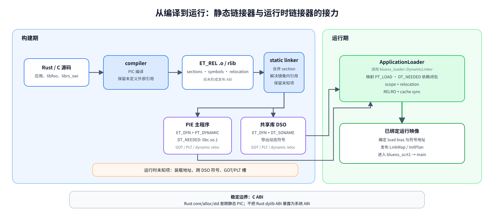

> 静态链接器负责镜像内部已经能够确定的地址，rtld 只处理装载时才能确定的地址和跨 DSO 引用。可编辑源文件：[build-to-runtime.drawio](./assets/dynamic-loading/build-to-runtime.drawio)。

静态链接器已经解决“同一最终镜像内部能够确定”的大部分引用。凡是装载地址才能决定，或定义来自另一 DSO 的引用，会以 dynamic table、dynamic symbol table 和 relocation 的形式留给 rtld。

运行时主要看 program header 和 `PT_DYNAMIC`，不是普通调试工具常展示的 section header。这是**两层结构**：`DT_*` 条目不是 segment，而是 `PT_DYNAMIC` 这个 segment 内部 dynamic table 的成员；解析顺序是"先按 program header 找到 `PT_DYNAMIC`，再按 `DT_*` 条目找到各表"。

**segment 层（program header）**：

| ELF 信息 | 运行时用途 |
| --- | --- |
| `PT_LOAD` | 哪些文件字节映射到哪些虚址、内存尺寸与 R/W/X |
| `PT_INTERP` | 进程式系统请求用户态动态解释器的路径；BlueOS RTOS MVP 不生成、不处理 |
| `PT_DYNAMIC` | dynamic table 的容器：其内部 `DT_*` 条目指向依赖、字符串/符号/hash/relocation/init/fini 等各表 |
| `PT_TLS` | 原生 ELF TLS 模板、尺寸和对齐；BlueOS MVP 暂不用 |
| `PT_GNU_RELRO` | relocation 后应改为只读的 GOT/数据区 |

**dynamic table 层（`PT_DYNAMIC` 内部，`DT_*` 条目）**：

| ELF 信息 | 运行时用途 |
| --- | --- |
| `DT_NEEDED` / `DT_SONAME` | 依赖的逻辑名称 / 本 DSO 的逻辑名称 |
| `DT_SYMTAB` / `DT_STRTAB` / hash | 动态符号、名称及查找索引 |
| `DT_REL*` / `DT_RELA*` / `DT_RELR*` | 普通、显式 addend、压缩 relative relocation |
| `DT_JMPREL` | PLT 对应的函数调用 relocation |
| `DT_INIT_ARRAY` / `DT_FINI_ARRAY` | C/C++/Rust runtime 构造与析构入口 |

auxv 与 `PT_INTERP` 没有绑定关系。它只是以 `AT_NULL` 结束的 `{type, value}` 数组；BlueOS 可以在 `ApplicationStartInfo` 中显式传递它，而无需先构造 Linux 风格的初始用户栈。当前有意义的条目包括 `AT_PHDR/PHENT/PHNUM`、`AT_ENTRY`、`AT_EXECFN`、`AT_RANDOM` 和 `AT_SECURE`；如果目标 ABI 已冻结真实的页/保护粒度，再提供 `AT_PAGESZ`，不能随意用 allocator 对齐值冒充页大小。没有动态解释器时 `AT_BASE` 置零或省略。

动态链接文献常用几个符号描述 relocation：`B` 是 image 的 load bias，`S` 是解析后的符号地址，`A` 是 addend，`P` 是被修补位置（来自重定位条目的 `r_offset` 字段，是一个虚址）。最常见的效果是：

- `RELATIVE`：在 `B + r_offset` 写入 `B + A`，不需查符号（`S` 不参与），适合优先批量处理；
- absolute/symbolic：写入 `S + A`；
- PC-relative：写入 `S + A - P`；
- `GLOB_DAT`/`JUMP_SLOT`：把解析出的 `S` 写入 GOT/PLT slot。

REL 的 `A` 原来就在目标内存里，RELA 把 `A` 显式放在 relocation entry 中；ARM32 常见 REL，AArch64/RISC-V 常见 RELA，rtld 必须分别实现。RELR 只压缩 relative relocation，可后续用于减小包体和启动 IO。

GOT 是位置无关代码间接访问外部数据/函数地址的表；PLT 是外部函数调用的跳板。lazy binding 会让 PLT 首次调用时再进入 resolver，节省未调用符号的启动工作，却增加可写 GOT、架构汇编、并发和实时抖动。BlueOS 首版采用 `-z now`，启动时一次性写完并将 RELRO 设只读，更简单、更确定，也更符合 RTOS 对时延可预测性的要求。

### 1.3 为什么应用/共享库选 `ET_DYN`，而不是 `ET_REL`

Theseus 式 `ET_REL` 模块与标准 `.so` 是两条不同路线，服务的对象也不同：

| 格式 | 运行时主要依据 | 适合场景 | BlueOS 决策 |
| --- | --- | --- | --- |
| `ET_DYN` | program header、`PT_DYNAMIC`、dynsym/hash、`DT_NEEDED` | RTOS 动态应用、共享库 | **应用与 `libc.so` 的唯一发布格式** |
| `ET_REL` | section header、完整静态 relocation、内核导出表 | `.ko`/LLEXT/Theseus crate 等内核扩展 | 如将来做可信内核模块，另立 ABI，不进入应用 MVP |
| 自定义 TBF/预链接格式 | 私有元数据与 crt0 | 极端资源约束、工具链完全受控 | 可借鉴签名和包元数据，不替代标准 ELF |

无 MMU 并不迫使系统采用 `ET_REL`。如果目标是 `librs_swi -> libc.so.1`、标准 `DT_NEEDED` 和可扩展的应用 DSO 图，`ET_DYN` 能减少需要处理的静态 relocation 家族，并可直接使用现有编译器、链接器和 ELF 分析工具。反过来，把应用做成 `ET_REL` 会把内核模块 ABI、应用 ABI 和 Rust 编译器内部 ABI 混在一起，也不利于稳定发布第三方 DSO。

NuttX 的排序导出表和 Zephyr LLEXT 的 linker-section/SLID 导出适合“固件或内核向可信扩展公开一小组宿主符号”，但不能直接替代标准 DSO 的 `.dynsym` 与 GNU/SysV hash。BlueOS 可以借鉴它们的导出 allowlist、分组和构建期冲突检查来生成最小系统服务表；对外发布的应用与 `libc.so.1` 仍必须保留标准动态符号和 hash，避免把私有模块 ABI 伪装成通用 `.so` ABI。

同理，不能先验地把 `COPY` relocation 列为“必需”。现代 PIE/PIC 通常可通过 GOT 访问外部数据；是否出现 `COPY` 取决于编译器、链接器、可见性和选项。MVP 先拒绝它，并以六 target 的 `llvm-readelf -r` 结果决定是调整产物还是补实现。

### 1.4 设计空间与分类坐标

动态加载方案不能只按“有无 MMU”或“是否叫 dlopen”分组。加载器位置、输入格式、隔离、绑定时机、内存放置和 TLS 是相互独立的决策轴；把它们混在一起，会错误地推出“无 MMU 只能用 `ET_REL`”或“支持 `ET_DYN` 就等于支持用户态动态链接”。对 BlueOS 有决策价值的坐标如下：

| 决策轴 | 业界可见选择 | 本报告对 BlueOS RTOS 的选择 | 直接后果 |
| --- | --- | --- | --- |
| 链接责任方 | kernel exec + 用户态 ldso；特权 RTOS linker；extension/module binder；应用 crt0 自重定位 | `application::thread_group` 中的特权 `ApplicationLoader` 调用可独立测试的 `DynamicLinker` | 不需要 `PT_INTERP`/ldso stage0，但链接核心不能与 `ApplicationManager`/VFS 写死 |
| 运行时格式 | `ET_DYN + PT_DYNAMIC`；`ET_REL + SHT_*`；TBF 等私有格式 | 标准 `ET_DYN` | 直接使用 `DT_NEEDED`、SONAME、dynsym/hash 和现有 ELF 工具；内核扩展另立 ABI |
| 地址与特权模型 | 共享特权地址空间；MPU/PMP domain；MMU process | 共享特权地址空间，按可信代码管理 | 签名只证明来源，不能隔离任意指针；必须明确威胁模型和配额 |
| 绑定与生命周期 | 启动期 NOW；首次调用 lazy；运行期 `dlopen/dlclose` | Phase 0–2 启动期 NOW/整 `ThreadGroup` 回收；Phase 3 增加 NOW/local `dlopen` 和逻辑 `dlclose` | 启动和插件装载都可尽早 seal；承担受控增量 scope/并发状态机，但不冒险立即释放裸指针仍可能引用的映像 |
| 存储与执行 | 连续 RAM；按属性内存池；flash XIP；file-backed/COW VM | Phase 0/1 连续 RAM并保留逻辑 region | 先保证统一 load bias、BSS 和 cache 正确性，XIP/MPU 作为 backend 能力后加 |
| TLS | `PT_TLS` + DTV；local-exec；LLVM emutls；不支持 | 保留现有 emutls | 首版拒绝 `PT_TLS`/native TLS relocation，但必须保活 control object 并清理每线程 value |

因此，RT-Thread/NuttX/Zephyr/Theseus 的 `ET_REL` 或 section-centric 模块、Tock 的 TBF/crt0、LiteOS-M 的单 DSO mini linker、Linux/musl 的进程式 ldso 和 Relink 的库级核心都只是这组坐标上的不同组合。后文逐项目提取机制时，只复用与 BlueOS 所选坐标兼容的部分，不把任何一个项目整体当作部署模板。

## 2. 参考项目的实际加载与链接流程

本章不先从 BlueOS 方案出发，而是回到各参考系统的源码控制流。由于当前目标是 RTOS，分析顺序优先放置 RT-Thread、NuttX、Zephyr、OpenHarmony LiteOS-M、Tock 等共享地址空间或受限内存系统；Relink 用于观察 Rust 链接核心的组件边界；Linux、musl、Asterinas 和 StarryOS 只作为完整语义的校验样本与未来展望，不作为当前部署模板。

对每个重点项目统一回答六个问题：输入是什么；谁负责分配或映射；依赖如何发现；未定义符号从哪里解析；重定位、cache、权限和构造函数按什么顺序发生；失败或卸载怎样处理。只有复制 `PT_LOAD` 并跳到入口的实现称为“装载器”；处理依赖、符号和 relocation 的实现才称为“链接器”。

下面的比较表先标明每个项目所属路线，后续 §2.1–§2.10 再展开实际调用链。源码路径均相对于本地工作区。

| 项目 | 采用的模型 | 最值得 BlueOS 借鉴 | 不应直接照搬 |
| --- | --- | --- | --- |
| RT-Thread | `dlmodule` 共享地址空间模块；LWP 又走 `PT_INTERP`/auxv | 同一系统从 RTOS 模块到 process ldso 的双轨演进实例 | `RTM_EXPORT` 全局内核符号表不是长期应用 ABI |
| NuttX | binfmt + `ET_REL`/`ET_DYN` 模块 bind + registry/export table | 显式导出、构造/析构、模块依赖与引用计数 | 其 module/dlopen binder 不是 `PT_INTERP` + `DT_NEEDED` 的通用用户态 rtld |
| Zephyr LLEXT | section-centric extension，分离 text/data/bss，架构 relocation | EDK、导出符号分组、Harvard/MPU 内存池、依赖与 use count | 主要是扩展模块语义，不是标准进程动态链接 |
| OpenHarmony LiteOS-M | Cortex-M 内核态 mini linker，单个 `ET_DYN`、拒绝 `DT_NEEDED` | 资源受限下 fail-closed、ELF hash、引用计数和最小代码量参考 | 单块 RWX、无 TLS/依赖，无法直接承载多 DSO `libc.so` 目标 |
| Tock | TBF 包、签名 footer、MPU 进程，PIC/固定地址应用 | 将完整性、ABI 元数据和装载策略放入可验证包格式 | TBF 不是 ELF 动态链接方案 |
| Theseus | 运行时加载 Rust crate object，namespace 与细粒度依赖 | namespace、对象生命周期、runtime-persistent bounds | Rust ABI/编译哈希耦合，不适合作为 BlueOS 发布 ABI |
| Embox | 极小 `PT_LOAD` 复制器和构建期模块体系 | 展示“只装载、不链接”的体量下限 | 不清 BSS/不做 relocation 的路径不能称为动态链接 |
| FreeRTOS | 无原生应用二进制动态加载 | 说明动态加载不是 RTOS 的必选项，MPU wrapper 可参考 | 没有可复用的 ELF/链接流程 |
| `rust-elfloader` | `no_std` ELF 装载 trait，调用方处理 relocation | 简单的 parser/mapper 分离思想 | 已归档，且没有依赖图/符号作用域/完整 rtld |
| Relink | `no_std` ELF loader/runtime linker 库 | 最适合作为组件边界、事务语义和 differential test oracle | 所需子集经小补丁可在 BlueOS Rust 1.84 编译，但完整库体量和平台适配面过大；不作为产品运行时依赖 |
| `dlopen-rs`（本地目录 `rust-dynlinker/`） | Relink 上的 `dl*` 与实验性 Linux rtld | auxv/stage0、link_map、C API 的 Rust 参考 | 公共库只支持 x86_64/AArch64/RISC-V64；replacement rtld 当前聚焦 x86_64 Linux/glibc |
| Linux / FDPIC | 内核 exec loader + 用户态 ld.so；FDPIC 支持无 MMU 分段 load map | ELF 校验、逐段布局、重定位后权限收紧和失败回滚 | `PT_INTERP`、Linux 初始用户栈和完整进程语义不进入当前 RTOS 方案；auxv 只复用其标准键值语义 |
| musl | 小型 libc 与 ldso，分阶段自举 | 依赖、符号、重定位、TLS、RELRO、ctor 的完整顺序 | 当前不移植用户态 ldso，也不实现 stage0 |
| Asterinas / StarryOS | Rust 内核中的 Linux 式用户 ELF；另有 static PIE/kmod 特例 | 事务式加载和 loader/linker 职责分离 | VMAR、用户态 handoff 和完整 Linux ABI 仅作未来参考 |
| OpenHarmony musl | musl 基线 + namespace/CFI/加载随机化/打包扩展 | 保持通用链接核心与产品策略分层 | namespace、CFI、预链接不进入 RTOS MVP |

### 2.1 RT-Thread：`dlmodule` 与 LWP 两条演进路线

RT-Thread 在同一代码库中保留了 no-MMU 模块和 MMU 进程两条路线。

[`dlmodule_load()`](../../../rt-thread/components/libc/posix/libdl/dlmodule.c) 的模块路径为：

1. 打开文件、取长度、一次读入堆缓冲，校验 RTM/ELF magic 和 class，创建 module object。
2. 按 `e_type` 分到 ET_REL 或 ET_DYN。ET_DYN 路径扫描 `PT_LOAD` 求总包络，分配一块 `mem_space`，先整块清零再复制各段，入口换算为 `mem_space + e_entry - vstart`。
3. 未预链接对象遍历 `SHT_REL/SHT_RELA`。模块内部符号按 load base 换算；未定义符号由 `dlmodule_symbol_find()` 线性扫描 `RTMSymTab`，再交给架构 `dlmodule_relocate()` 写入。它不读取 `DT_NEEDED`。
4. 从 `.dynsym` 收集全局函数构建模块导出表，释放原始 ELF buffer；flush D-cache、invalidate I-cache 后查找并调用自定义 `module_init/module_cleanup`。
5. `dlmodule_exec()` 创建独立线程，解析命令行为 `argc/argv`，线程入口调用模块 entry。模块退出后进入清理流程。
6. `dlmodule_destroy()` 先拒绝仍为 RUNNING 的模块，执行 cleanup，并逐类销毁模块创建的线程、锁、信号量、队列、定时器等内核对象，最后释放 symbol table、映像和 module object。

[`lwp_elf.c`](../../../rt-thread/components/lwp/lwp_elf.c) 则面向有地址空间的 LWP：映射 `PT_LOAD`、处理 `PT_INTERP`、建立用户栈/auxv，并将链接工作交给用户态解释器。前者是“可信内核模块”，后者是“进程动态应用”，正好展示从 RTOS module ABI 演进到通用系统 ABI 时需要保留的边界。

### 2.2 NuttX：binfmt、ELF bind 与 module registry

NuttX 的 ELF 实现由格式分发、通用 libelf 和 module registry 组合而成，存在 exec、insmod、rmmod 三条控制流。

**exec 路径**：

1. `exec()` 经 `load_module()` 遍历 `g_binfmts`，由 ELF handler 调 `libelf_initialize()` 打开文件、读 Ehdr 并校验。
2. [`libelf_load()`](../../../nuttx/libs/libc/elf/elf_load.c) 读 program/section headers并计算 text/data。ET_REL 可分开分配 text/data；ET_DYN 用单块 allocation 保持段间/GOT 相对关系；XIP 配置可让只读 text 直接指向文件映射。
3. [`libelf_bind()`](../../../nuttx/libs/libc/elf/elf_bind.c) 找 `SYMTAB/DYNSYM`，每个未定义符号先查已安装 module registry，再查内核 exports；命中其他模块时增加 exporter 的 dependents，并由 `up_relocate()/up_relocateadd()` 执行架构 relocation。
4. 完成 D/I-cache 同步，读取 `nx_stacksize/nx_priority`，由 `exec_module()` 创建并激活 task。

**insmod 路径**：持 registry lock 按名称去重，复用 initialize/load/bind；[`elf_insert.c`](../../../nuttx/libs/libc/elf/elf_insert.c) 再保存本模块 `STB_GLOBAL + STV_DEFAULT` 导出符号，运行 preinit/init arrays，最后加入全局 registry。其他模块只有在注册完成后才能解析到它。

**rmmod 路径**：[`elf_remove.c`](../../../nuttx/libs/libc/elf/elf_remove.c) 先处理 `nopen`；存在 dependents 时拒绝卸载；随后执行 fini array 和自定义 uninitializer、释放 text/data、撤销它对其他 exporter 的依赖，最后从 registry 删除。当前 fini array 是正序调用，并不等同于通用 ldso 的逆序析构。

NuttX 的“依赖”是未定义符号绑定时记录对已安装模块的引用，不是解析 `DT_NEEDED` 后自动搜索和装入 DSO；二者的加载时机和失败语义不同。

NuttX 的 XIP 路径还有一个值得保留、但不能泛化的细节：文件系统通过 [`FIOC_XIPBASE`](../../../nuttx/include/nuttx/fs/ioctl.h) 提供稳定映射基址，非写 section 可以直接留在文件映射中；loader 再把 GOT 中落入各 section 原文件范围的值从 file-relative 地址修正为 runtime 地址。它依赖“文件内容在模块存活期持续可执行、目标 section 无需加载期写入、cache/取指属性正确”等前提，不等价于让任意 `PT_LOAD` 直接 XIP。BlueOS 应先复用其“只读且无 relocation 才可零拷贝”的判定原则，Phase 0/1 仍以 RAM 映射作为正确性基线。

### 2.3 Zephyr LLEXT：从 section 到受保护 region

Zephyr LLEXT 的主线位于 [`llext.c`](../../../zephyr/subsys/llext/llext.c)、[`llext_load.c`](../../../zephyr/subsys/llext/llext_load.c)、[`llext_link.c`](../../../zephyr/subsys/llext/llext_link.c) 和 [`llext_mem.c`](../../../zephyr/subsys/llext/llext_mem.c)：

1. `llext_load()` 先按名称查全局链表；已存在只增加 `use_count`。新对象创建 `struct llext` 后进入 `do_llext_load()`。
2. loader 的 read/seek/peek 抽象读取并校验 Ehdr、section headers，定位 `SYMTAB/DYNSYM` 与字符串表。ET_REL/ET_DYN 都按 section header 驱动，而不是遍历 `PT_DYNAMIC`。
3. `llext_map_sections()` 按 `NOBITS/EXECINSTR/WRITE` 将 section 归并为 BSS/TEXT/RODATA/DATA/PREINIT/INIT/FINI/EXPORT regions，处理 alignment/prepad，并检查 VMA 和文件范围重叠。
4. `llext_copy_regions()` 根据 MMU 页、2 次幂 MPU、ARMv8-M 粒度或 RISC-V PMP granularity 对齐分配。loader 明确区分 `TEMPORARY`、`PERSISTENT` 和 `WRITABLE` 三种 backing：临时输入全部复制；持久只读输入仅在 region 不可写且无 relocation 时才可经 `peek()` 复用；可写且全生命周期保活的输入允许原地修改。需要写 relocation 的只读 text 必须复制到 RAM。ARM 还会预留远跳 veneer。
5. 复制 symbol table 并将 `st_value` 换算为 runtime address；`llext_link()` 遍历 REL/RELA。未定义符号先查内核 export，再查已加载扩展；命中扩展时立即 `llext_dependency_add()`，增加 provider use count 并记录依赖，然后调用 `arch_elf_relocate()`。
6. 重定位完成后 flush D-cache，对 TEXT/VENEER invalidate I-cache；构建 export table；将 TEXT 设可执行、RODATA 去写；最后挂入全局 `llext_list`。
7. 加载与执行分离。调用方显式 `llext_bringup()` 执行 PREINIT/INIT，调用 entry，再显式 `llext_teardown()` 执行 FINI。`llext_get_fn_table()` 在 relocation 后复制函数表时逐项验证指针落在该 extension 的 text region 内，避免损坏的 init/fini 元数据把执行流导向任意数据地址。
8. `llext_unload()` 先 flush deferred log，按 `use_count` 判断是否可释放，从全局链表摘除并递减 providers，最后释放 regions 和表。它不会替调用方自动执行 teardown。

LLEXT 不处理 `DT_NEEDED`；依赖只在未定义符号命中已加载扩展时隐式建立，并受 `LLEXT_MAX_DEPENDENCIES` 上限约束。它解决的是 extension linking 与 MPU/XIP 放置，不是标准共享库搜索和 `PT_INTERP` handoff。三类 storage 的定义见 [`loader.h`](../../../zephyr/include/zephyr/llext/loader.h)，init/fini 指针检查见 [`llext_handlers.c`](../../../zephyr/subsys/llext/llext_handlers.c)。

### 2.4 OpenHarmony：LiteOS-M mini linker 与 musl 扩展层

OpenHarmony 同样包含两种不同量级的实现。

#### 2.4.1 LiteOS-M `LOS_SoLoad()`

[`los_dynlink.c`](../../../openharmony/kernel/liteos_m/components/dynlink/los_dynlink.c) 的流程为：

1. 获取全局 dynlink mutex，按路径查已加载链表；命中增加引用计数。
2. `OsLoadInit()` 分配临时 DSO 状态并读取 Ehdr/Phdr；只接受本机 `ET_DYN`，限制 program-header 数量和文件最大 256 KiB。
3. `OsReserveSpace()` 扫 `PT_LOAD` 求地址包络并拒绝 `PT_TLS`；分配一块对齐内存，逐段读入并清零 BSS。
4. `OsGetDynBase()` 找 `PT_DYNAMIC`；`OsParseDynamic()` 提取 SysV hash、dynsym/strtab、REL/RELA/JMPREL。发现 `DT_NEEDED` 返回 `-ENOTSUP`，发现 `DT_TEXTREL` 直接拒绝。
5. 每个 relocation 先用 ELF hash 查本 DSO，再二分查内核导出表；不搜索其他已加载 DSO。架构层只处理 NONE、GLOB_DAT/JUMP_SLOT、ABS32、RELATIVE 四类行为。
6. 解析并调用 `DT_INIT/INIT_ARRAY`，成功后加入全局链表并释放文件/header 临时状态。任一前置步骤失败按逆序释放 load image、headers 和 DSO。
7. `LOS_SoUnload()` 递减引用；归零时逆序调用 FINI_ARRAY、再调 `DT_FINI`，从链表摘除并释放映像。

它确实做了动态符号解析和 relocation，但可见域只有“当前 DSO + 内核导出表”；拒绝 `DT_NEEDED`、模块间查找和 TLS，使它不能表达一般 DSO 图。

#### 2.4.2 OpenHarmony musl 扩展

[`third_party/musl/ldso`](../../../openharmony/third_party/musl/ldso) 保留上游 musl 核心，同时在 `ldso/linux/` 增加 linker namespace、allowed-libraries、CFI shadow、加载随机化、RELRO/GOT 加固和 ADLT 打包。基本 map/dependency/symbol/relocation/init 控制流仍来自 musl，平台扩展通过额外 policy/state 包裹。它是“保持通用 ldso 语义，在外围加入产品策略”的样本，而不是 LiteOS-M mini linker 的增强版。

### 2.5 Tock：动态装载应用，但不做共享库动态链接

Tock 的链路跨越构建工具、内核 process loader 与应用 crt0：

1. 构建期按受控 PIC/固定地址规则链接应用；[`elf2tab`](../../../tock/elf2tab/src/convert.rs) 从 ELF 提取 load image 与 relocation 元数据，生成带 base header、TLV 和 credentials footer 的 TBF。
2. boot 时 [`discover_process_binary()`](../../../tock/tock/kernel/src/process_loading.rs) 顺序扫描 flash，校验 TBF version/header/total size；`ProcessBinary` 继续检查 checksum、enabled flag、kernel version 和 fixed addresses。
3. 启用 credentials 的路径由 [`ProcessCheckerMachine`](../../../tock/tock/kernel/src/process_checker.rs) 遍历 footer，将受保护的 binary region 交给可替换的签名策略，并按 AppID/ShortID/version 去重。
4. [`ProcessStandard::create()`](../../../tock/tock/kernel/src/process_standard.rs) 为 flash 建 RX MPU/PMP region、为 RAM 建 RW region，清零应用 RAM，放置 grant/upcall 元数据，构造初始异常帧并把 init function call 入队。
5. 首次调度到应用时，[`crt0.c::_c_start_pic()`](../../../tock/libtock-c/libtock/crt0.c) 在支持的目标上修 GOT、复制 data、清 BSS、修 `.rel.data` 中的绝对指针，最后调用 `main`；该 PIC 函数明确排除 rv64。
6. 运行期 [`AppLoader`](../../../tock/tock/capsules/extra/src/app_loader.rs) 使用 `setup → write → finalize → load/abort` 协议向 flash 写入新 TBF。setup 先写 padding header，避免掉电留下破坏顺序扫描的半个对象；load 后复用 credential check 和 process creation。

整个流程没有 `DT_NEEDED`、跨应用 dynsym scope 或 DSO relocation。libc 和 syscall wrappers 静态进入每个应用，应用以 driver-number syscall ABI 访问内核。因此 Tock 是“安全包 + MPU process + crt0 自重定位”的动态应用装载器，不是 `.so` 链接器。

### 2.6 Theseus 与边界样本：ET_REL 链接、纯装载和完全不支持

#### 2.6.1 Theseus crate loader

Theseus 将 Rust crate 编译成 `ET_REL .o`，运行期由 [`mod_mgmt`](../../../Theseus/kernel/mod_mgmt/src/lib.rs) 链接：

1. 启动时解压 `modules.cpio.lz4` 到 namespace 对应的 memfs，并把 nano_core 公共符号写入全局 `symbol_map`。
2. `CrateNamespace::load_crate()` 强制输入为 ET_REL，按 executable/readonly/readwrite sections 分配 text、rodata、data 三块 `MappedPages`；加载期先保持可写。
3. 复制 sections 后遍历 `SHT_RELA`。本 crate 定义直接换算 section runtime address；外部符号在当前/父 namespace 的 trie 中查找，缺失时可从符号名推断 crate 并触发按需加载。
4. [`write_relocation()`](../../../Theseus/kernel/crate_metadata/src/lib.rs) 执行架构 relocation；每个跨 crate 引用同时记录使用者的 weak-dependent 和提供者的 strong-dependency，形成双向依赖图。
5. relocation 后把 text remap 为 R+X、rodata 为 R；只将 global sections 发布到 symbol map，最后把 crate 插入 namespace tree。调用者按符号名获取入口并 spawn task。
6. [`crate_swap`](../../../Theseus/kernel/crate_swap/src/lib.rs) 在临时 namespace 完整加载新 crate，复制同名 data/bss 状态，沿 dependent 边重写旧调用点，再替换 symbol/tree。旧代码被故意保留而不释放，因为系统无法证明没有任务仍在旧栈帧中执行。

这是一套以 Rust 编译器符号和 section 为 ABI 的单地址空间 module linker，不处理 `PT_DYNAMIC/DT_NEEDED`，也不适合作为独立应用的稳定发布 ABI。

#### 2.6.2 Embox、FreeRTOS 与 `rust-elfloader`

- Embox `load_app` 只读 ELF32 headers、求 `PT_LOAD` 包络、整块 malloc/copy、换算 entry 后同步调用；它没有 BSS 清零、符号解析或 relocation，是纯装载体量下限。Embox 的主要模块体系在构建期完成。
- FreeRTOS 没有原生 ELF 应用动态加载；任务创建只接收已静态链接的函数指针。它提供的是 MPU wrapper 与 per-task C runtime TLS，不提供可复用的 rtld 流程。
- [`rust-elfloader`](../../../rust-elfloader/src/lib.rs) 解析 `ET_EXEC/ET_DYN`、遍历 `PT_LOAD` 和 relocation entries，再回调调用方的 `allocate/load/relocate/tls/make_readonly`。库只枚举 relocation 类型，不计算符号地址，也没有依赖图、搜索路径、module registry 或 init/fini；因此是 loader framework，不是完整 runtime linker。

### 2.7 Relink 与 `dlopen-rs`：事务化的库级链接管线

Relink 不负责内核 `exec` 或 initial stack；它从 reader/memory backend 开始，将 ELF 输入变成带生命周期的已链接模块。其高层职责分为 `Loader`、`Relocator`、`Linker` 和 `LinkContext`，主调用链位于 [`linker/run.rs`](../../../Relink/src/linker/run.rs)、[`resolve.rs`](../../../Relink/src/linker/resolve.rs) 与 [`session.rs`](../../../Relink/src/linker/session.rs)：

1. `LinkerRun::load()` 检查 domain 和已提交的同 key 模块，创建本次 `ResolveSession`。
2. `KeyResolver::load_root()` 返回已存在模块、需要读取的 ELF，或 synthetic module；`LoaderRun` 解析 ELF/program headers，创建地址空间，装入 `PT_LOAD`，解码 dynamic table、符号/hash、relocation 与 TLS 元数据，产出尚未发布的 `RawDynamic`。
3. `resolve_pending()` 以 BFS 解析每个模块的 `DT_NEEDED`，按 key/visited 去重并形成显式依赖图；`build_scope()` 按 BFS 结果冻结本次符号查找域。
4. `build_lifecycle_order()` 另做 DFS 后序，生成依赖先于使用者的 relocation/init 顺序。依赖发现顺序与生命周期顺序是两份数据，不用一次遍历同时承担两种语义。
5. `relocate_pending_modules()` 逐模块触发 observer 后进入 [`Relocator`](../../../Relink/src/relocation/dynamic.rs)：准备 PLT → relative/RELR → 普通动态符号 relocation → PLT relocation → lifecycle 元数据 → RELRO → TLS publish。
6. `publish()` 将完整模块图提交进 `CommittedStorage`，`acquire()` 产生持有引用的 `ModuleLease`；随后 `initialize()` 才运行 init。
7. prepare/relocate 阶段失败只丢弃 session 和 mappings；发布后失败通过 `FailedLoad::rollback()` 撤销 committed modules 和引用。init 已执行的业务副作用仍不在自动回滚范围内。

BlueOS 应复用这条流水线的**设计语义**，而不是直接部署完整 Relink：保留 reader/memory/resolver、依赖图与符号作用域分离、分阶段事务、原子 publish、lease 和架构 relocation backend 等边界；产品核心不带入 Relink 的 `ET_REL`、section 重排、lazy binding、原生 ELF TLS、IFUNC、通用 observer 及 Linux/Windows backend，并对输入中的对应特征 fail closed。这里的 `ET_REL` 是 `.o` 的 ELF 文件类型，不是 `R_*_RELATIVE` relocation，也不是 REL/RELA 表格式；BlueOS 仍需支持白名单内的 `R_*_RELATIVE`，并分别解析 ARM 常见 REL 与 AArch64/RISC-V 常见 RELA。Relink 固定 revision 后作为宿主侧对照实现，用相同 fixture 比较依赖图、符号绑定、relocation 结果和 init/fini 顺序。

[`dlopen-rs`](../../../rust-dynlinker/src)（工作区目录名为 `rust-dynlinker/`）在 Relink 上补充 POSIX 层：[`resolver.rs`](../../../rust-dynlinker/src/dlopen/resolver.rs) 负责搜索路径和文件身份，[`observer.rs`](../../../rust-dynlinker/src/dlopen/observer.rs) 组合 global/group/deepbind scope，[`registry/manager.rs`](../../../rust-dynlinker/src/registry/manager.rs) 管理全局 registry、loader lock 与调试状态，[`api/dlopen.rs`](../../../rust-dynlinker/src/api/dlopen.rs) 暴露 C API。`RTLD_LOCAL` 的对象不进入 global list；`RTLD_DEEPBIND` 将 group scope 放在 global scope 前。卸载由 lease/unload group 的所有权关系控制，而不是仅凭一个裸 handle 释放内存。当前 crate 对 x86_64、AArch64 和 RISC-V64 之外的架构直接编译失败，独立 replacement rtld 又限定为 x86_64 Linux/glibc，因此 BlueOS 只借鉴 API/registry/scope 语义，不把它列为覆盖六目标的产品候选。

### 2.8 Linux：标准 ELF、FDPIC 与内核模块是三条不同流程

Linux 同时提供三种常被混写的加载路径。标准动态应用、FDPIC 应用和内核模块的输入格式、地址模型及链接责任方都不同。

#### 2.8.1 标准 `load_elf_binary()` 路径

[`load_elf_binary()`](../../../linux/fs/binfmt_elf.c) 的控制流可以压缩为：

1. 校验 ELF magic、`ET_EXEC/ET_DYN`、目标架构和 program-header 表；标准路径明确拒绝 FDPIC 文件。
2. 第一遍扫描 program headers。发现 `PT_INTERP` 时读取解释器路径、打开解释器并校验其 ELF header。
3. `begin_new_exec()` 建立新的执行映像，`setup_arg_pages()` 建栈；尚未提交到用户线程。
4. 对主程序的每个 `PT_LOAD` 调 `elf_load()`。`ET_EXEC` 使用固定地址；PIE 先计算总跨度、随机化基址和统一 load bias。文件尾不足整页由 `padzero()` 清零，剩余 BSS 由匿名页补齐。
5. 若有解释器，`load_elf_interp()` 映射解释器各 `PT_LOAD`，最终执行入口改为解释器入口；无解释器才直接使用主程序 `e_entry`。
6. `create_elf_tables()` 在用户栈写入 `argc/argv/envp/auxv`，其中 `AT_PHDR/PHENT/PHNUM/ENTRY/BASE/PAGESZ` 是 ldso 后续工作的输入。
7. `START_THREAD()` 提交 PC/SP。内核到此为止，不读取 `DT_NEEDED`，不查 `.dynsym`，也不处理 `GLOB_DAT/JUMP_SLOT/TLS` relocation。

因此标准路径的接口契约是“内核提供已映射主程序、解释器与初始栈，用户态 ldso 完成链接”，而不是内核替应用装完所有共享库。

#### 2.8.2 `binfmt_elf_fdpic` 路径

[`binfmt_elf_fdpic.c`](../../../linux/fs/binfmt_elf_fdpic.c) 不假定所有 `PT_LOAD` 共享一个 load bias。它为每段建立 `{addr, p_vaddr, p_memsz}` loadmap，主程序入口、program headers 和 `PT_DYNAMIC` 地址都通过 loadmap 分段换算，并把主程序/解释器 loadmap 一并放入用户栈。无 MMU 配置下，写段需要独立分配、复制和清零；只读 text 才有机会共享。FDPIC 因而是一套需要编译器、ABI、内核和用户态 loader 共同支持的地址模型，不只是给普通 ELF loader 增加一个开关。

#### 2.8.3 `load_module()` 路径

[`kernel/module/main.c::load_module()`](../../../linux/kernel/module/main.c) 处理的是 `ET_REL` 内核模块：签名检查 → ELF/section 校验 → 按 text/rodata/data/init 分类布局并分配 → `simplify_symbols()` 将未定义符号解析到内核或已加载模块 → `apply_relocations()` 调架构实现 → cache/权限收紧 → constructor/module init → 状态切换为 LIVE。卸载还要等待引用和并发读者，执行 module exit 并延迟释放 init/text。它适合对照 Theseus、LLEXT 与 `.ko`，不能作为标准应用 `.so` 的直接模板。

### 2.9 musl：从 ldso 自举到 `main`，以及运行期 `dlopen`

musl 的 [`dlstart.c`](../../../musl/ldso/dlstart.c) 与 [`dynlink.c`](../../../musl/ldso/dynlink.c) 展示了完整用户态链接器如何“先让自己可运行，再链接别人”。启动流程分为四个可辨认阶段：

| 阶段 | 实际动作 | 顺序原因 |
| --- | --- | --- |
| `_dlstart_c` | 从初始栈找到 auxv 和自身 `PT_DYNAMIC`；取 `AT_BASE`；只应用自身 REL/RELA/RELR 中的 relative relocation；跳 `__dls2` | 普通函数地址和全局对象尚未可信，只能执行不需要符号查找的基址修正 |
| `__dls2` | 建 ldso 的 DSO 描述，解码 dynamic table、dynsym、字符串/hash；用完整 relocation 引擎重定位 ldso；通过已可用的符号解析进入下一阶段 | 完整链接代码依赖第一阶段修好的最小运行环境 |
| `__dls2b` | 建 builtin TLS/DTV，复制初始 TLS 并安装 thread pointer | 后续路径会使用 `errno`、锁和线程局部状态 |
| `__dls3` | 建主程序 DSO；加载 preload 与 `DT_NEEDED`；建立全局 scope；规划 constructor/TLS；重定位依赖和主程序；RELRO；发布调试状态；跳主程序 crt | 必须先收齐依赖和 scope，才能确定符号地址；constructor 只能在 relocation/TLS/权限完成后运行 |

依赖发现不是递归 DFS。`load_deps()` 从主程序开始遍历 DSO 链，新库追加到链尾，链表本身同时充当 BFS 队列；因此全局查找顺序与 `DT_NEEDED` 的层序一致。每个 DSO 的链接内部则按 PLT relocation、REL、RELA、RELR 和 RELRO 收尾；主程序放在依赖之后处理，以保证 COPY 等需要读取库数据的 relocation 不会看到未完成状态。

`map_library()` 先扫描 program headers 求完整地址跨度并保留虚拟地址，再逐段以 `MAP_FIXED` 映射；BSS 先清零文件尾所在页，再补匿名零页。`PT_GNU_RELRO` 不能在映射时置只读，因为 GOT 尚需写入，只能在该 DSO relocation 完成后收紧权限。

运行期 `dlopen` 还有一条独立状态机：

1. 获取 loader lock，保存 DSO 链尾、符号链尾、TLS 计数/偏移等状态快照。
2. 映射根 DSO，继续发现依赖并扩展 group scope；按 `RTLD_LOCAL/GLOBAL` 决定是否进入后续加载可见的全局 scope。
3. 对新增对象执行 relocation、TLS 登记和 RELRO；释放 loader lock 后才调用 constructor，以允许 constructor 内嵌套 `dlopen`。
4. 失败时恢复可恢复的 loader 元数据。constructor 已产生的外部副作用无法由链接器撤销。
5. musl 的 `dlclose()` 是 no-op；它避免因悬空 GOT、函数指针、TLS destructor 或正在执行的代码造成 use-after-free，fini 统一在进程退出时执行。

musl 接受 `RTLD_LAZY`，但没有 glibc 式首次函数调用 trampoline resolver。它只暂存当前尚未找到定义的 PLT/GOT relocation，待本次加载扩展 scope 后由 `redo_lazy_relocs()` 再试。

### 2.10 Asterinas 与 StarryOS：Rust 内核中的 Linux 式 handoff

Asterinas 与 StarryOS 的共同点是：内核只做地址空间构建与解释器 handoff，动态链接仍留给用户态 ldso。它们说明“Rust 内核”并不意味着“用 Rust 在内核中实现所有 `.so` 语义”。

**Asterinas** 的 [`load_elf_to_vmar()`](../../../asterinas/kernel/src/process/program_loader/elf/load_elf.rs) 流程为：

1. `execve` 先解析 shebang/ELF，校验 `ET_EXEC/ET_DYN`、class、machine，并收集 `PT_LOAD/PT_INTERP`。
2. 在全新的 VMAR 中解析并映射主程序；有 `PT_INTERP` 时再次打开和解析 ldso，将其作为独立 ELF 装到自由地址。
3. 主程序的 file-backed VMO 以私有 COW 方式映射；PIE 先 reserve 总区间，再逐段建立映射和权限。
4. 映射 vDSO，生成 `AT_PAGESZ/PHDR/PHNUM/ENTRY/BASE`，构造 argv/envp/随机数/auxv 初始栈并初始化 heap。
5. 所有步骤成功后才杀旧线程、激活新 VMAR 和设置 CPU context；失败只丢弃尚未提交的新地址空间。

**StarryOS** 的 [`mm/loader.rs`](../../../tgoskits/os/StarryOS/kernel/src/mm/loader.rs) 也映射主程序并把动态应用交给解释器，但额外保留一个 riscv64 static-PIE 特例：无解释器的 `ET_DYN` 会在内核中解析 `PT_DYNAMIC`，处理 `R_RISCV_RELATIVE/64/JUMP_SLOT` 后直达主程序。其 [`kmod`](../../../tgoskits/os/StarryOS/kernel/src/kmod/mod.rs) 又是另一套 `ET_REL` section loader：分配 section、解析 kallsyms、应用架构 relocation、改权限、flush cache、调用 module init。static PIE、用户动态应用和内核模块三条路径的输入与信任边界不能合并成同一个“ELF loader”。

### 2.11 应用管理命名与生命周期竞品分析

仅比较 loader 名称会遗漏“应用到底由谁管理”。下面把运行实例、执行单元和资源所有权放在同一张表中：

| 系统 | 管理对象与名称 | 应用与线程/任务的关系 | 对 BlueOS 的启示 |
| --- | --- | --- | --- |
| NuttX | `binfmt` 负责 `binary_s` 的 load/exec/unload；调度器用 `task_group_s` 保存共享资源 | 主 task 与其 pthread 都引用同一 task group；最后一个线程离组时释放环境、文件、映射和 `tg_bininfo`，随后调用 `binfmt_exit()` 卸载映像 | “线程是执行单元、group 是资源寿命单位”与 BlueOS 最接近；当前后端命名为 `ThreadGroup` 比 `AppRuntime` 或 `RtosAppDomain` 更准确 |
| AOSP CHRE | hub 侧 `EventLoop` 持有 `Nanoapp` 实例，调用 `startNanoapp()` / `unloadNanoapp()`；装载细节由 `PlatformNanoapp` 负责 | nanoapp 是事件驱动应用，不等于独立 OS 线程；即使同一 event loop 串行执行，也仍有 instance ID、事件队列、订阅、消息和 start/end 生命周期 | 控制面可称 manager，但运行实例应直接称 application/nanoapp；没有必要在所有类型前重复底层 OS 类型 |
| AOSP framework | `ContextHubService` 对接 HAL；`NanoAppStateManager` 只维护 hub 回报的已装载 nanoapp 镜像 | 该 state manager 的源码注释明确它服务旧 API，并计划在旧 API 退役后删除 | 不应据此把 BlueOS 内核运行控制面命名为 `AppStateManager`；它不是 CHRE 真正的装载/执行 owner |
| AOSP legacy nanohub | `Task` 保存 `AppHdr`、平台装载信息、订阅、TID、flags 和 I/O 计数；`osStartApp/osStopTask/osUnloadApp` 形成生命周期 | 一个 nanoapp 对应一个 `Task` 记录；heap、timer、DMA、IRQ 等资源按 TID 记账并在停止时回收 | 即便应用和一个执行 task 一一对应，也仍需要一个稳定实例记录来承接资源归属和卸载 |
| RT-Thread | `rt_dlmodule` 保存 module status、main thread、module 内对象列表、映像、符号和引用计数 | main thread 只是 module 的一个字段；销毁 module 时还要终止子线程并清理同步对象、timer 等 | “module + main_thread”再次说明应用状态不能用 scheduler thread state 替代 |
| Zephyr | 动态代码称 `llext`；受保护执行使用 `k_mem_domain` 把线程与 text/data/rodata partition 关联 | extension 与 thread 是分离对象；thread 加入 memory domain 后继承相同的可访问区 | loader/extension、执行单元和保护域应是三个接口，不要揉成一个带平台前缀的类型 |
| Tock | 内核对象直接称 `Process`，并以 `ProcessId` 区分一次运行实例与稳定应用标识 | Process 同时是调度、内存、grant/upcall 和 MPU 配置边界 | 只有在 BlueOS 真正具备非特权级和地址保护域后，才应把当前 `ThreadGroup` 升级为安全意义上的 Process |

CHRE 的分层尤其值得避免误读：AP 侧 `ContextHubService` 通过 HAL 发起 load/unload/enable/disable，`NanoAppStateManager` 只是兼容旧 API 的已加载状态镜像；hub 侧真正拥有实例和事件分发的是 `EventLoop`，平台装载动作再下沉到 `PlatformNanoapp`。因此 BlueOS 顶层可以有 `ApplicationManager` 统一控制面，但不能把“state mirror”“ELF loader”“线程调度器”和“资源 owner”合成一个 `Runtime` 类型。

参考：[NuttX task group](../../../nuttx/include/nuttx/sched.h)、[NuttX 最后线程退出与 binfmt 回收](../../../nuttx/sched/group/group_leave.c)、[NuttX binary descriptor](../../../nuttx/include/nuttx/binfmt/binfmt.h)、[AOSP Context Hub/nanoapp 架构](https://source.android.com/docs/core/interaction/contexthub)、[CHRE framework overview](https://android.googlesource.com/platform/system/chre/+/main/doc/framework_overview.md)、[CHRE EventLoop](https://android.googlesource.com/platform/system/chre/+/main/core/include/chre/core/event_loop.h)、[AOSP NanoAppStateManager](https://android.googlesource.com/platform/frameworks/base/+/main/services/core/java/com/android/server/location/contexthub/NanoAppStateManager.java)、[legacy nanohub Task](../../../aosp/device/google/contexthub/firmware/os/inc/seos_priv.h)、[legacy nanohub 生命周期](../../../aosp/device/google/contexthub/firmware/os/core/seos.c)、[RT-Thread dlmodule](../../../rt-thread/components/libc/posix/libdl/dlmodule.h)、[Zephyr LLEXT memory domain](../../../zephyr/subsys/llext/llext_mem.c)、[Tock Process](../../../tock/tock/kernel/src/process.rs)。

据此，BlueOS 推荐命名为：`application/ApplicationManager` 表示系统级控制面；`thread_group/ThreadGroup` 表示当前“主线程 + 子线程 + 共享应用资源”的执行后端；`ApplicationLoader` 表示启动期装载/链接适配器。`AppRuntime` 容易与 libc/language runtime 混淆，`Rtos*` 会把产品类型绑死在阶段性定位上，`AppStateManager` 又容易误解为只维护查询镜像，三者都不再使用。

### 2.12 BlueOS 模块命名规范与参考词典

后续设计和实现以本节为命名的唯一基准。命名先表达**对象是什么、由谁拥有、处于哪一层**，不表达当前部署方式；因此不使用 `Rtos*`，也不把 `Runtime` 当作内核应用控制面的同义词。Rust 公共类型统一写全 `Application*`，`app` 只保留在外部术语或产物名中，例如 CHRE `Nanoapp`、`app.elf` 和稳定 C ABI 字段 `app_handle`。

职责后缀的含义固定如下：

| 后缀 | 只用于 | BlueOS 示例 | 命名参考 |
| --- | --- | --- | --- |
| `Manager` | 系统级控制面，拥有全局实例表并编排后端 | `ApplicationManager` | AOSP [`ActivityManagerService`](https://android.googlesource.com/platform/frameworks/base/+/main/services/core/java/com/android/server/am/ActivityManagerService.java)、CHRE `EventLoopManager` |
| `Backend` | 可替换的执行模型或算法/硬件策略实现；具体类型必须带所实现的模型或架构 | `ThreadGroupBackend`、`ProcessBackend`；架构实现称 `ArchRelocator` | Tock `Process` 实现、Relink 的 platform/backend 分层；应用控制面的 `backend.rs` 只放执行模型实现 |
| `Loader` | 把一个工件或一组应用工件变成已映射对象 | `ImageLoader`、`ApplicationLoader` | NuttX `binfmt` load/exec、Zephyr `llext_load`、Relink [`Loader`](../../../Relink/src/loader/handle.rs) |
| `Linker` | 处理多映像依赖、符号、重定位和生命周期计划 | `DynamicLinker` | musl [`dynlink.c`](../../../musl/ldso/dynlink.c)、Relink [`Linker`](../../../Relink/src/linker/driver.rs) |
| `Registry` | 可变的已发布实例索引，以及并发装载/卸载协调 | `SystemDsoRegistry`、`ApplicationRegistry` | NuttX/RT-Thread module 表、Relink [`storage`](../../../Relink/src/linker/storage.rs) |
| `Catalog` | 已验证但尚未运行的不可变工件元数据 | `DsoArtifactCatalog` | Tock `ProcessBinary`/process loading 将凭据与运行实例分开；Linux file/page-cache 与运行时 link map 分层 |
| `Session` | 尚未发布、失败可回滚的一次链接事务 | `LinkSession` | Relink [`session.rs`](../../../Relink/src/linker/session.rs)、musl `dlopen` 的加载事务 |
| `Context` | 已提交的链接命名空间或 libc 所有权上下文，不负责全局生命周期 | `LinkContext`、`LibcApplicationContext` | Relink [`LinkContext`](../../../Relink/src/linker/context.rs)、musl 的 per-thread/per-process libc 状态 |
| `Lease` | RAII 保活令牌；销毁只释放引用，不在持锁路径执行 fini | `SystemDsoLease` | Relink [`ModuleLease`](../../../Relink/src/linker/storage.rs)、NuttX/Zephyr module use count |
| `Permit` | 一次并发首装的排他提交权限，不表示实例长期保活 | `SystemDsoLoadPermit` | Relink staged session、musl loader lock 下的单次加载所有权 |
| `Layout` | 已校验、尚未分配的地址与 segment 布局 | `ImageLayout`、`SegmentLayout` | Relink [`elf/layout.rs`](../../../Relink/src/elf/layout.rs)、Linux/musl 的 load-map 预规划 |
| `Policy` | 无 I/O 的准入和约束判定 | `ApplicationArtifactPolicy` | Tock package credential policy、Linux module/ELF admission checks |
| `Resolver` | 把名称或请求解析为候选工件 | `ApplicationArtifactResolver` | musl library search、Relink [`resolver`](../../../Relink/src/linker/resolver/mod.rs) |
| `Adapter` | 平台或遗留接口到通用 trait 的薄适配 | `application/adapters/` 的 `VfsElfReader`/`SystemLibraryPaths`、`thread_group/adapters/` 的 `FlatImageMemory`/`ApplicationArtifactResolver` | Zephyr `fs_loader`/`buf_loader`、Relink input/memory/os traits |
| `Plan` | 明确的待执行有序动作，不表示内存布局 | `InitPlan`、`FiniPlan` | musl constructor 顺序、Relink ELF lifecycle |
| `Storage` | 为稳定 ABI 指针提供所有权和地址稳定性 | `ApplicationStartStorage` | Linux initial stack/auxv backing；BlueOS 线程 entry+arg ABI 的定制实现 |

最终模块和核心对象采用下面的词典；表中未列出的私有 helper 跟随所在模块命名，不再自行引入 `Core`、`Runtime`、`Rtos` 或裸 `App*` 前缀。

| 边界 | 规范模块与核心名称 | 采用该名称的依据 |
| --- | --- | --- |
| 内核应用控制面 | `application/{model,manager,registry,lifecycle,accounting,metrics,protection}.rs`；`ApplicationManager`、`ApplicationRegistry`、`ApplicationHandle`、`ApplicationLaunchRequest`、`ApplicationState`、`ApplicationInstance`、`ApplicationEvent` | AOSP 使用 manager 表示系统控制面；NuttX `task_group_s` 和 RT-Thread `rt_dlmodule` 证明运行实例、执行线程和资源表应分开 |
| 当前执行后端 | `application/thread_group/{backend,group,loader,system_dso,start_info,membership}.rs`；`ThreadGroupBackend`、`ThreadGroup`、`ApplicationLoader`、`SystemDsoRegistry`、`ApplicationStartInfo` | NuttX task group、CHRE `EventLoop`/`Nanoapp`、RT-Thread module+main-thread 分层；目录名描述真实执行模型，不绑定 RTOS 产品类型 |
| 平台适配（通用） | `application/adapters/{vfs_reader,system_library_paths}.rs`；指令缓存维护下沉为 `arch/*/cache.rs` 通用 API，不设独立 adapter 文件 | 只依赖 VFS、系统路径策略与架构能力，与执行模型无关，thread_group 与未来 process 后端共用；`Adapter` 与执行模型 `Backend` 不混用 |
| 平台适配（模型特有） | `thread_group/adapters/{flat_memory,artifact_resolver}.rs`；`FlatImageMemory`、`ApplicationArtifactResolver` | 依赖共享地址空间映射与 `SystemDsoRegistry` 实例状态；未来由 `ProcessImageMemory` 与每进程 resolver 替换 |
| 未来进程后端 | `application/process/{backend,process,exec,address_space,initial_stack}.rs`；`ProcessBackend`、`Process`、`AddressSpace`、`ProcessImageMemory` | Tock `Process`/MPU、Asterinas program loader/VMAR、Linux `exec` 与 initial stack |
| 单映像装载 | `blueos_loader::{address,identity,reader,memory,error}` 与 `image/{parser,metadata,layout,loaded}`；`ImageLoader`、`ElfReader`、`ImageLayout`、`StagedImage` | Zephyr LLEXT loader、Relink loader/image/ELF layout、Linux/musl segment loader |
| 多映像链接 | `dynamic_linker/{linker,session,context,dependency,scope,symbol,lifecycle}.rs`；`DynamicLinker`、`LinkSession`、`LinkContext` | musl ldso 和 Relink linker/context/session；`Core` 不增加职责信息，故不用 `DynamicLinkerCore` |
| 架构重定位 | `relocation/{model,arch/*}.rs`；`ArchRelocator` | Linux、Zephyr、Relink 都用 `arch` 隔离 ISA relocation；`arch` 是行业通用缩写，可以保留 |
| libc 应用级状态 | `librs/{start,application_context,auxv,pthread,tls}.rs`；`LibcApplicationContext`、`PthreadTcb` | musl startup/pthread/TLS 分层；加 `Libc` 是为避免与 Android `Context` 或内核控制面混淆 |
| SDK 启动对象 | `blueos_scrt1.o`、入口 `_start(ApplicationStartInfo *)` | 沿用 musl/GCC `Scrt1.o` 的启动对象惯例，同时用 `blueos_` 标明这是定制 ABI，不伪装成标准 Linux initial stack |
| 保护能力 | `application/protection.rs`；`ProtectionDomain`、`ProtectionDomainId`、`ProtectionLevel` | Zephyr [`k_mem_domain`](../../../zephyr/kernel/userspace/mem_domain.c)、Tock [`Process`](../../../tock/tock/kernel/src/process.rs) 的 MPU 配置、FreeRTOS [`mpu_wrappers.h`](../../../FreeRTOS/FreeRTOS/Source/include/mpu_wrappers.h) 与 [`mpu_wrappers_v2.c`](../../../FreeRTOS/FreeRTOS/Source/portable/Common/mpu_wrappers_v2.c) |

现有草案中的旧名按下表一次性迁移；左列只允许出现在竞品原名、历史说明和本迁移表中：

| 旧名 | 规范名 | 调整原因 |
| --- | --- | --- |
| `AppRuntime`、`RtosAppDomain` | `application::ApplicationManager` + `thread_group::ThreadGroup` | 把控制面与资源寿命对象分开，并避免与 libc runtime 或阶段性 OS 类型绑定 |
| `DynamicLinkerCore`、`dynamic_linker/core.rs` | `DynamicLinker`、`dynamic_linker/linker.rs` | `Core` 没有提供额外边界信息；Relink 和通用业界名称直接使用 Linker |
| `AppHandle/AppState/AppQuota/AppUsage/AppEvent/AppInstance` | `ApplicationHandle/ApplicationState/ApplicationQuota/ApplicationUsage/ApplicationEvent/ApplicationInstance` | 公共 Rust API 使用完整 domain noun，避免与外部 `NanoApp`、Tock `AppID` 等术语混杂 |
| `types.rs` | loader 拆为 `address.rs + identity.rs`；application 拆为 `model.rs + accounting.rs` | 文件名直接表达聚合原因，避免无边界的 catch-all 类型文件 |
| `image/decoder.rs`、`image/plan.rs`、`ImagePlan` | `image/parser.rs`、`image/layout.rs`、`ImageLayout` | parser 与已校验布局是两个阶段；`Plan` 留给 init/fini 等待执行动作 |
| `thread_group/app_loader.rs` | `thread_group/loader.rs` | 父目录已经限定应用执行模型，无需在私有文件名重复 `app` |
| `thread_group/registry.rs` | `thread_group/system_dso.rs` | 文件只管理系统 DSO；顶层 `registry.rs` 已专用于 `ApplicationRegistry` |
| `thread_group/backends/` | `application/adapters/` + `thread_group/adapters/` | 其中是 VFS/memory/cache/resolver 平台桥接，避免与 `ThreadGroupBackend`/`ProcessBackend` 混淆；只依赖内核通用能力（VFS/系统策略）者上移 `application/adapters/`，依赖共享地址空间与 registry 实例者留在 `thread_group/adapters/`，cache 维护归 `arch/*/cache.rs` |
| `ProcessAppBackend`、`UserVmMemory` | `ProcessBackend`、`ProcessImageMemory` | 与 `ThreadGroupBackend`、`FlatImageMemory` 形成同构命名，不把未来实现绑定到某一种 VM API |
| `ApplicationContext`、`app_context.rs` | `LibcApplicationContext`、`application_context.rs` | 明确这是 libc 所有权上下文；目录 `librs/` 已限定文件层级，无需在文件名重复 `libc` |
| `AppScrt1.o` | `blueos_scrt1.o` | 保留标准 `Scrt1` 启动对象语义，同时明确 BlueOS 定制 entry+arg ABI |

还需遵守三条消歧规则：第一，`LinkDomainId` 只表示一个 `LinkContext` 的符号命名空间，`ProtectionDomainId` 只表示硬件访问控制域，禁止用裸 `domain` 同时指代二者；线程组参数统一叫 `group`/`group_id`。第二，`Runtime` 只用于 libc、语言运行时或确实发生在运行期的数据，例如 `RuntimeImageMetadata`，不用于 manager、loader 或 group。第三，`Core` 只在存在同名外围层且确实表示可独立复用核心时使用；本方案没有这种必要，统一采用 `DynamicLinker`，未发布单映像统一采用 `StagedImage` 与具体 `*State` payload。


## 3. 从参考项目提取的 RTOS 动态加载流程

本章只归纳参考项目的共同机制，不预设 BlueOS 的组件名称或最终方案。前一章各项目使用的术语并不一致：Linux/musl 以 segment、process 和 ldso 描述，NuttX/RT-Thread/Zephyr 以 module、section、export table 和 registry 描述，Tock 以受签名保护的应用包和 MPU region 描述，Relink 则以 reader、link context 和 transaction 描述。它们也不都支持共享库：有的只装入主程序，有的绑定内核导出符号，有的才会递归处理 `DT_NEEDED`。

因此不能把某一个项目的调用栈直接称为“RTOS 通用流程”。可复用的部分应按它们共同解决的问题归一：输入先准入，布局先规划再分配，文件内容复制后补零，执行前完成 NOW 绑定或安装好受控的 lazy resolver，修改代码或 GOT 后完成权限/cache 收口，完整对象才发布，初始化晚于重定位，回收晚于最后一次代码可达。各项目对这些问题给出的证据如下：

| 共同问题 | 参考项目中的表现 | 提取出的通用原则 |
| --- | --- | --- |
| 输入是否可信且兼容 | Tock 校验包元数据/签名；Linux、NuttX、Zephyr 校验 ELF 类型、架构和范围 | 在分配和写内存前完成格式、ABI、来源与资源上限准入 |
| 如何确定内存布局 | Linux/FDPIC 规划 segment/load map；Zephyr/Theseus 规划 section；Tock 规划 MPU region | 先完整计算地址、大小、对齐和权限，再执行不可回滚的映射或复制 |
| 未定义符号从哪里来 | musl/Relink 构建 DSO scope；NuttX/RT-Thread/Zephyr 查询 export/module registry | 依赖发现、符号可见范围和生命周期所有权必须显式建模 |
| 何时执行重定位与 cache 操作 | OpenHarmony、Zephyr、RT-Thread 先重定位再 flush cache；Linux 再收紧 RELRO/权限 | 所有写入完成后统一 seal/cache sync，之后才能执行代码 |
| 何时让其他执行流看见模块 | Relink 分阶段 commit；Linux/Asterinas 先建新映像再切换；模块系统在成功后注册 | prepare 阶段保持私有，完整成功后一次 publish，失败只回滚未发布资源 |
| 初始化和回收如何排序 | musl、Relink 建立依赖顺序和逆序 fini；NuttX 登记 init/fini 并用依赖边阻止早卸载，但其当前 fini array 内部为正序；Zephyr/Theseus 以引用关系保活 | init 晚于绑定；BlueOS 明确定义 fini 为 init 的逆序，且映像寿命覆盖线程、回调和所有依赖边，不继承参考实现的顺序偏差 |

### 3.1 跨项目共同的主流水线

把 segment loader、section module loader 和标准 DSO linker 投影到同一条时间轴，可以得到下面的共同骨架。`ET_REL` 模块可能以 section 为装载单位，纯应用 loader 可能没有依赖发现和符号绑定，只有真正的多 DSO linker 才会执行全部阶段；但被保留的阶段仍须遵守这一先后关系。

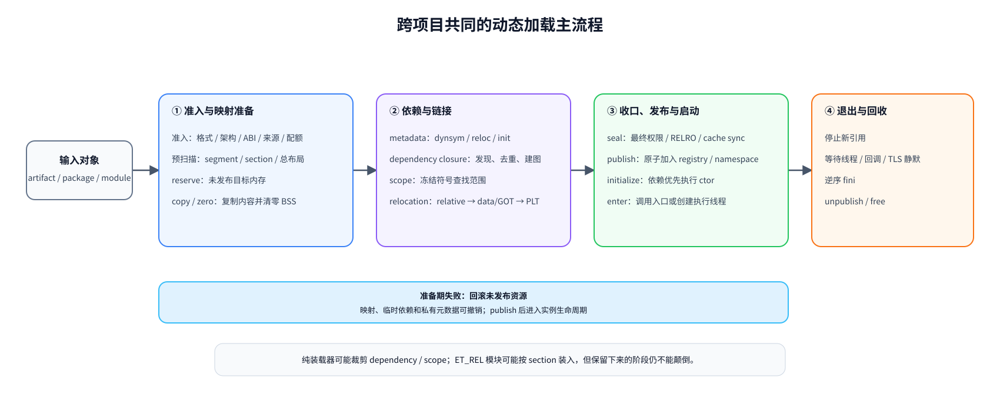

> 这张图压缩了不同项目的共同骨架；3.4 再把它展开成带提交边界的十二阶段检查表。可编辑源文件：[common-loading-pipeline.drawio](./assets/dynamic-loading/common-loading-pipeline.drawio)。

### 3.2 从项目差异中提取的五个边界

1. **装载与链接分开。** Embox、Tock 和部分 static PIE 路径证明“把字节放进内存并找到入口”可以独立存在；musl、Relink 和 NuttX bind 路径则说明依赖闭包、符号作用域和 relocation 属于另一层。通用核心不能把 `copy PT_LOAD` 与“已经完成动态链接”混为一谈。
2. **依赖顺序、查找顺序和初始化顺序分开。** `DT_NEEDED`/模块依赖形成所有权图；符号 scope 决定未定义符号按什么顺序查找；init/fini 使用依赖先于使用者及其逆序。Relink 和 musl 表明三者相关但并不相同，不能用一次 DFS/BFS 同时替代。
3. **准备、发布和执行分开。** Linux/Asterinas 的新地址空间、Relink 的 session、Zephyr/NuttX 的成功后注册都说明：映射和重定位期间对象应保持私有；publish 是原子可见性边界；constructor/入口执行又是不可完全回滚的副作用边界。
4. **引用计数与可卸载性分开。** NuttX、Zephyr、Theseus 和 Relink 都记录依赖或 use count，但计数归零只说明显式所有者已经释放，不能证明线程 PC、回调、TLS destructor、函数指针或 unwind 元数据不再指向映像。安全回收还需要执行流静默条件。
5. **通用语义与平台动作分开。** 依赖图、符号绑定和 relocation 顺序应只有一套；文件读取、连续 RAM/MPU/MMU 分配、权限落实和 cache 指令由平台 backend 提供。这样才能让同一链接语义覆盖共享地址空间 MCU、带 MPU 的 RTOS 和有 MMU 的系统。

### 3.3 `dlopen` 是第二套更难的状态机

启动链接通常发生在目标应用线程运行前，待装载对象尚未对外可见；`dlopen` 则要在应用运行后修改共享状态，额外需要：

- loader 全局锁和递归调用规则；
- 文件身份去重、依赖环和引用计数；
- `RTLD_LOCAL/GLOBAL`、`RTLD_DEFAULT/NEXT` 等符号作用域；
- relocation 全部成功并完成构造后，才能原子地向其他线程发布新 DSO；
- `dlclose` 前证明没有线程 PC、函数指针、TLS destructor、回调或 unwind metadata 指向目标 DSO，现实中很难可靠证明。

因此从调研中应提取两条不同的流程：启动链接处理一个尚未运行、可整体丢弃的对象闭包；运行期装载处理已经被多线程观察的增量状态。资源受限 RTOS 常见的最小闭环是“启动期解析全部依赖 + 整个应用/模块组退出时回收”，而不是先实现 POSIX `dlopen/dlclose`。BlueOS 将插件接口放在 Phase 3，作为带 loader lock、增量 scope、generation handle 和更强保活规则的独立子阶段，不能只在启动函数外包一层 C API。

### 3.4 统一的十二阶段流水线与提交边界

把 Linux/musl、Relink、NuttX、Zephyr、RT-Thread、Tock 和 Theseus 的不同形态归一后，可以得到下面的实现检查表。某个系统可以裁剪不适用的阶段，却不能颠倒保留下来的因果顺序：

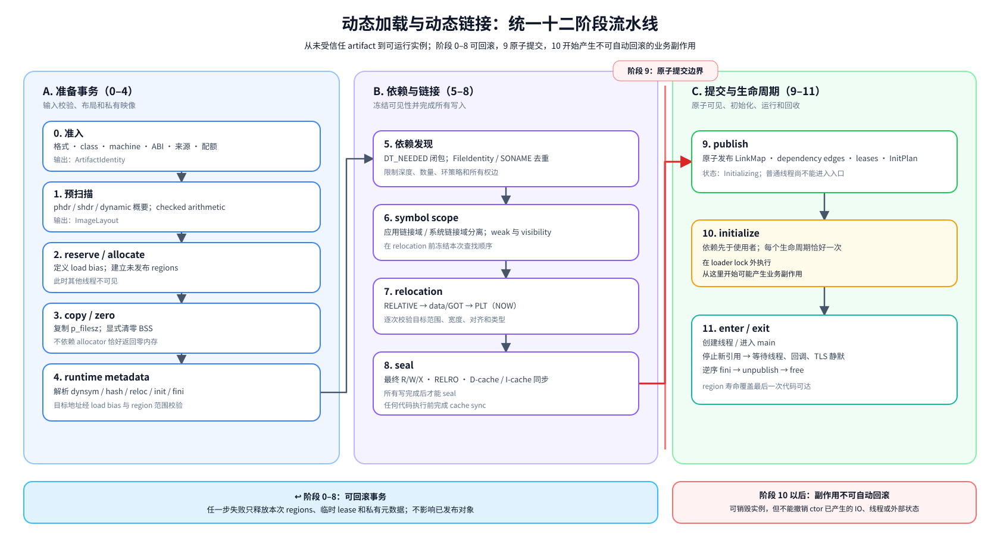

> 图中阶段 0–8 构成未发布、可回滚的链接事务；9 是对其他组件可见的原子提交点；10 开始执行构造函数并进入不可自动回滚的副作用区。可编辑源文件：[blueos-12-stage-pipeline.drawio](./assets/dynamic-loading/blueos-12-stage-pipeline.drawio)。

| 阶段 | 输入与输出 | 不可破坏的不变量 |
| --- | --- | --- |
| 0. 准入 | 文件/固件对象 → 已验证 `ArtifactIdentity` | 在任何分配和写内存前完成格式、class、endianness、machine、ABI、长度、配额和来源检查 |
| 1. 预扫描 | phdr/shdr/dynamic 概要 → `ImageLayout` | checked arithmetic；所有 file range、virtual range、最大对齐和总资源可证明有界 |
| 2. reserve/allocate | `ImageLayout` → 未发布 regions | 统一定义 load bias；连续 RAM 或按属性内存池的选择在复制前完成，映像尚不可被其他线程发现 |
| 3. copy/zero | file bytes → 完整内存映像 | `p_filesz <= p_memsz`；BSS 必须在 relocation 前清零 |
| 4. runtime metadata | dynamic/module 元数据 → 只读表视图与运行时计划 | 所有运行时地址都经过 load bias 与 region 范围校验；不支持的 TLS、符号类型或扩展在执行前明确拒绝 |
| 5. 依赖发现 | needed/import/module refs → 有界依赖图 | 按稳定文件身份/逻辑名称去重；确定深度、数量、环策略和所有权边；标准 DSO 通常由依赖发现顺序导出 BFS scope |
| 6. scope | 依赖图 + export policy → 确定的 symbol scope | 在 relocation 前冻结本次可见范围；weak、visibility、version 和宿主导出策略唯一且可测试 |
| 7. relocation | mappings + scope → 已绑定映像 | relative 可先批量处理；所有符号提供者已进入 scope；每次写入校验目标范围、宽度和对齐；未知类型 fail closed |
| 8. seal | 已绑定映像 → 最终权限/cache 状态 | 所有写完成后才应用 RELRO/MPU/MMU 权限；无硬件保护的平台仍保留逻辑权限；cache sync 在任何代码执行前完成 |
| 9. publish | 私有会话 → `LinkMap`/module registry | 只原子发布完整一致的模块图；状态为 `Initializing`，普通运行线程尚不能进入入口 |
| 10. initialize | lifecycle plan → `Initialized` | 依赖先于使用者执行 init，且每个已装载生命周期只执行一次；调用前复核已重定位的 init/fini 指针位于所属 image 的可执行 region；在 loader lock 外进入可能有副作用的代码 |
| 11. enter/exit | entry contract → 运行实例 → fini/回收 | 调用入口或创建线程只能发生在初始化完成后；fini 与 init 逆序，所有执行流、回调和依赖边失效后才能释放 region |

阶段 0–8 可以归并为 `prepare → relocate → seal` 的可回滚事务，9 是元数据提交点，10 是**副作用边界**。Relink 的 staged session、Linux/Asterinas 的新映像后切换以及各 RTOS 模块的成功后注册都支持这一结论。“rollback”只能可靠撤销映射、引用计数和注册表，无法撤销 constructor 已经发出的 IO、创建的线程或修改的外部对象；因此初始化失败可以销毁尚未进入正常运行的整个实例或模块组，但不能宣称业务副作用自动回滚。

init 的执行责任也必须唯一。链接器可以生成确定的 lifecycle plan，但应由拥有目标执行上下文的 runtime 在 loader lock 外执行：标准动态应用通常是主程序 preinit → 依赖按拓扑顺序 init → 主程序 init → 入口；内核模块或 RTOS extension 可能由特权模块管理器直接调用 init。两种形式的共同不变量都是“依赖先于使用者、同一装载生命周期恰好一次、fini 逆序”；安全卸载后重新装入则开始新的生命周期。

## 4. BlueOS 现状盘点

### 4.1 已有基础

BlueOS 已经具备若干有价值的起点：

- 内核 loader 使用 goblin 解析 ELF，区分 `ET_DYN` 的分配式映射与 `ET_EXEC` 的固定映射，并有 QEMU 集成测试。
- VFS 已能提供 `open/read/lseek`，加载器测试也已从文件读取镜像。
- `librs_swi` 与内核内 `librs` 使用同一 `src/lib.rs`，但依赖 `blueos_scal_swi`，且注释已明确其目标是动态装载应用；这正适合作为 `libc.so.1` 的源码基线。它当前仍只生成 `rlib`，还不是可发布 DSO。
- GN 有 `rust_cdylib`/`solink` 规则和 cdylib 测试，具备生成 `.so` 的构建基础；各板级配置也已有独立 `app_config`。仍需为各目标验证 PIC 依赖、SONAME、导出表和最终 relocation，不能仅凭构建规则存在就宣称已经可用。
- 六个 Rust target 全部使用 LLVM emutls，`librs` 已实现 `__emutls_get_address`，这可作为首版 TLS 的降复杂度方案。
- AArch64 已有 EL1 MMU 线性映射基础，Cortex-M v8-M 已有 MPU stack guard 代码，为以后逐段权限和保护域实现提供了硬件落点；这些现有代码本身尚不构成应用隔离。

参考：[现有 loader](../../kernel/loader/src/lib.rs)、[MemoryMapper](../../kernel/loader/src/memory_mapper.rs)、[loader 测试应用构建](../../kernel/loader/tests/inputs/no_std_app/BUILD.gn)、[librs 构建](../../librs/BUILD.gn)、[emutls](../../librs/src/tls.rs)、[GN 动态库工具](../../build/toolchain/blueos.gni)。

### 4.2 当前 loader 实际能力与缺口

| 项目 | 当前行为 | 影响/处置 |
| --- | --- | --- |
| ELF 类型 | `ET_EXEC`、`ET_DYN` | 动态应用应主要收敛为 PIE `ET_DYN`；固定地址 ELF 保留给受控固件场景 |
| 映射 | 所有 `PT_LOAD` 的最小到最大虚址一次性分配，假设段紧凑 | 段间洞也占 RAM，无法逐段权限；改为 reserve span + 逐段 map |
| BSS | 只复制 `p_filesz`，假定剩余空间已经为零 | `Storage::from_layout` 使用 `alloc` 而非 `alloc_zeroed`，假设不成立；必须显式清零 `[p_filesz, p_memsz)` |
| load bias | 相对重定位写入 `real_start + addend` | 正确定义是 `B + A`，其中 `B = 实际映射地址 - ELF 虚址基准`；最低 `p_vaddr != 0` 时现实现可能错误 |
| relocation | 仅遍历 `binary.dynrelas` 并处理 `R_RISCV_RELATIVE`；`dynrels` 未遍历，其他类型静默跳过 | ARM 常见 REL 会被整体遗漏，未解析符号的程序仍可能启动后随机崩溃；REL/RELA 必须分别处理，未知类型必须 fail closed |
| 校验 | 主要依赖解析器和少量范围检查 | 缺少 class/data/machine/ABI、`p_filesz <= p_memsz`、`p_align`、溢出、重叠、入口在 X 段等系统校验 |
| 权限 | 分配内存是整块可写内存；固定映射只验证授权区 | 没有按 `PF_R/W/X` 落实权限、W^X、GNU RELRO、不可执行栈 |
| 缓存 | 复制后直接把地址转成函数调用 | ARM/RISC-V 必须提供架构化 D-cache clean / I-cache invalidate 或等价同步 |
| 动态段 | 不处理 `PT_DYNAMIC`、`DT_NEEDED`、dynsym/hash、init/fini | 还没有动态链接；RTOS MVP 不需要补 `PT_INTERP` |
| 生命周期 | `MemoryMapper` 持有一块 `Storage` | 没有应用、DSO、线程、TLS、回调之间的所有权关系，无法安全卸载 |

源码证据包括：[只收集 `PT_LOAD` 且假设紧凑](../../kernel/loader/src/lib.rs)、[仅处理 `R_RISCV_RELATIVE`](../../kernel/loader/src/lib.rs)、[未清零的 Storage 分配](../../kernel/infra/src/storage.rs)、[当前测试对 static PIE 的限制说明](../../kernel/loader/tests/inputs/no_std_app/src/main.rs)。

这些不是抽象的“以后优化”。BSS 未清零和未知 relocation 静默成功都是当前正确性缺陷；整数溢出、任意写和 RWX 则会在 loader 接受外部文件后成为内核安全边界问题。

### 4.3 执行与内存模型是最大的结构性约束

BlueOS 目前是线程模型而不是进程模型：系统调用表有 `CreateThread`、`AllocMem`、`FreeMem`，没有 `execve`、进程地址空间、`mmap/mprotect/munmap`；创建线程直接接收函数地址、参数和调用方栈。RISC-V 源码明确说明尚未支持 S/U mode；Cortex-M 的 `CONTROL` 设置选择 PSP，但没有设置 `nPRIV`；AArch64 进入 EL1 运行。

因此当前动态应用必须被定义为**可信的、特权的、与内核共享地址空间的代码**。在签名包机制交付前只能接收内置或由受控供应链提供的映像；以后增加签名校验也只能证明来源，仍不能隔离代码错误或恶意指针。报告后续的 W^X、范围校验和配额仍然能防止 loader 自身被畸形 ELF 破坏，也能减少意外写入，但不能把第三方应用变成安全用户态代码。

“应用当前由线程执行”不等于“应用对象就是 `Thread`”。scheduler 的 thread state 回答某个执行单元是 ready/running/suspended/retired；`ApplicationManager` 的应用记录回答某次装载是否仍在 Loading、是否已经允许创建子线程、哪些映像和 lease 必须保活、何时可以执行 fini、最后一个线程之后由谁回收。两者只有在“永远单线程、没有私有 DSO、TLS、atexit、资源配额和重新装载”的极简模型中才可合并，而本方案的 Phase 1 已经包含 pthread/emutls 和共享 libc lease。

当前保护能力必须按架构精确描述：

| 架构 | 已有能力 | 当前缺口 | 现在可承诺的安全效果 |
| --- | --- | --- | --- |
| Cortex-M v8-M | `USE_MPU`、系统栈 guard、切换线程时更新线程栈 guard；MemManage fault 已启用 | MPU 只使用 guard region；`CONTROL.nPRIV=0`，应用线程仍为 privileged；没有每应用 region set、用户指针校验和受限 syscall gateway | 可发现部分栈越界；不能阻止动态应用读写内核或重配 MPU |
| RISC-V32/64 | 当前 M-mode 线程模型 | 源码明确未支持 S/U mode；未见每应用 PMP 配置、trap/syscall 和上下文切换协议 | 不能用 PMP 声称隔离；MVP 只运行内置/构建期 allowlist 的可信代码，产品分发必须再过签名门禁 |
| AArch64 | EL1 MMU 和 kernel linear map | EL0 vector 明确不支持，应用仍在 EL1；没有每应用页表/ASID 与 copy-in/out 边界 | 可以为内核映射逐步增加页权限硬化，但不能隔离恶意 EL1 应用 |

参考：[Cortex-M MPU Kconfig](../../kernel/arch/arm/cortex_m/Kconfig)、[现有 MPU stack guard](../../kernel/kernel/src/arch/arm/mpu/mpu_v8m.rs)、[Cortex-M CONTROL](../../kernel/kernel/src/arch/arm/mod.rs)、[调度切换更新 guard](../../kernel/kernel/src/scheduler/mod.rs)、[RISC-V privilege 状态](../../kernel/kernel/src/arch/riscv/mod.rs)、[AArch64 EL0 unsupported vector](../../kernel/kernel/src/arch/aarch64/vector.rs)、[AArch64 EL1 MMU](../../kernel/kernel/src/arch/aarch64/mmu.rs)。

参考：[系统调用 ABI](../../kernel/header/src/lib.rs)、[线程创建](../../kernel/kernel/src/syscall_handlers/mod.rs)、[线程入口模型](../../kernel/kernel/src/thread/mod.rs)、[RISC-V privilege 状态](../../kernel/kernel/src/arch/riscv/mod.rs)、[Cortex-M CONTROL](../../kernel/kernel/src/arch/arm/mod.rs)、[AArch64 EL1 启动](../../kernel/kernel/src/arch/aarch64/mod.rs)。

### 4.4 六个目标工具链并不一致

这里的“六条工具链”在 Rust 源码中体现为六个自定义 target：

| Rust target | 当前 relocation/dynamic | linker | 统一工具链需要完成的工作 |
| --- | --- | --- | --- |
| `aarch64-vivo-blueos-newlib` | Static；未开启 dynamic | `aarch64-none-elf-gcc` | 改为默认 PIC、开启 dynamic 能力，并迁移/验证 clang + LLD 与 kernel `link.x` |
| `thumbv7m-vivo-blueos-newlibeabi` | PIC；dynamic=true | `arm-none-eabi-gcc` | 作为首个纵向切片，迁移并验证 LLD 下的 ELF32、soft-float EABI、Thumb bit、veneer、指令 RAM 与板级脚本 |
| `thumbv8m.main-vivo-blueos-newlibeabihf` | PIC；dynamic=true | `arm-none-eabi-gcc` | 保留 PIC/dynamic，冻结硬浮点 ABI，并验证 LLD 生成的内核与动态产物 |
| `riscv64-vivo-blueos` | PIC；未开启 dynamic | `rust-lld` | 后续开启 dynamic/PIE 能力，复用已由 ARM32 首发切片验证的统一工具链、共享 PIC sysroot 和 artifact contract |
| `riscv32-vivo-blueos` | Static；未开启 dynamic | `rust-lld` | 改为 PIC/dynamic，区分 ILP32 与 ISA feature 并检查代码尺寸回归 |
| `riscv32imc-vivo-blueos` | Static；未开启 dynamic | `rust-lld` | 改为 PIC/dynamic；无原生 A 扩展时继续验证 portable atomic 路径 |

所有 target 当前都是 `TlsModel::Emulated`。目标状态是**每个 ISA/ABI 只保留一套 BlueOS target/toolchain 和一份 PIC sysroot，由内核、应用与 DSO 共同使用**：target 默认 PIC 并声明支持 dynamic linking；GN toolchain 统一选择编译器和链接驱动；board config 只保留 ISA/MABI/float ABI。这里的 `dynamic=true` 表示工具链能够生成 PIE/DSO，不表示内核最终映像带 `PT_DYNAMIC` 或运行时依赖。

当前板级 `kernel_config/app_config` 仍重复指定 relocation model、linker 和 `-z norelro`，AArch64/ARM 又仍使用裸机 GCC。应将这些决策从板级 target 收敛到统一工具链与产物模板；同一架构的内核和应用不再选择不同 Rust target、linker 或 sysroot。内核、应用和 DSO 仍必须使用不同的最终链接策略，因为它们的启动契约不同。

参考：[六个 target 的注册表](../../../rust/compiler/rustc_target/src/spec/mod.rs)、[target 定义目录](../../../rust/compiler/rustc_target/src/spec/targets)、[BlueOS toolchain](../../build/toolchain/BUILD.gn)、[板级构建配置](../../build/boards)。

### 4.5 对当前可实现性的判断

| 问题 | 当前判断 | 还需要完成的工作 |
| --- | --- | --- |
| 能否动态装入 `ET_DYN` | **已有原型** | 修正 BSS/load bias/校验/cache，并从单一 RISC-V relative relocation 扩展到多架构 |
| 能否把 `librs_swi` 做成 `libc.so.1` | **可以，但尚未实现** | 新增 DSO target、全依赖 PIC、SONAME/导出清单、消除不允许的 undefined symbol，并验证最终 ELF |
| 能否链接其他 `.so` | **可以作为本方案目标** | 实现 `DT_NEEDED` 图、SONAME 去重、动态符号 hash、作用域、init/fini 与应用私有生命周期 |
| 能否支持 ARM32/AArch64/RISC-V | **架构上可行，必须逐目标验证** | 分别实现 REL/RELA 和 psABI relocation 白名单、Thumb 函数地址规则、cache backend 与 golden fixtures |
| 能否链接后直接创建线程运行 | **现有线程 ABI 可承载** | 定义 `ApplicationStartInfo`/blueos_scrt1 ABI、线程归属、退出协议，并在最后线程退出前禁止回收映像 |
| 能否称为用户态 `libc.so` | **不能** | 需要非特权执行级、隔离域和用户指针边界；这些不属于当前 RTOS 实施范围 |

所以当前并非“已有用户态动态链接，只差生成一个 `.so`”，而是“已有动态 ELF 装载和 syscall libc 的关键积木，可以工程化组合成 RTOS 启动链接”。最短路径是保留现有线程模型，补齐 DSO 依赖/符号/重定位和生命周期，而不是先建设进程与用户态解释器。

### 4.6 参考项目的安全确认方式

“在共享地址空间下动态加载，怎么确认安全问题”在参考项目中有三种回答，对应三个能力档位。BlueOS 当前处于第一档，§7.2.3 的 L0/L1/L2 分层即由这三档归纳而来。

| 档位 | 代表系统 | 运行时隔离 | 信任/来源校验 | 公开承认不能防 |
| --- | --- | --- | --- | --- |
| 仅结构校验 | RT-Thread dlmodule、Zephyr LLEXT、NuttX flat build、OpenHarmony LiteOS-M | 无：扩展与内核同特权、同地址空间 | 仅 ELF 魔数/架构/segment 重叠等结构检查，无签名无哈希 | dlmodule 的扩展即内核代码；flat build 组件互访 |
| 非特权 + MPU + 受控入口 | NuttX protected build、AOSP legacy nanohub、FreeRTOS MPU 端口 | 非特权 Thread 模式 + 静态或每任务 MPU region，内核区禁用户访问 | nanohub：RSA-2048/SHA-256 先验签后落盘、公钥白名单、启动 CRC 复查；NuttX 验签外置 MCUboot | NuttX 无 copy-in/out；nanohub 无 per-app region 与配额，故障整机复位 |
| 完整隔离 + syscall 校验 | Tock、Zephyr userspace、RT-Thread LWP | 每进程/每任务 MPU/PMP/MMU，切换时重编程 | Tock：凭证派生 AppId、syscall driver allowlist；LWP 仍无签名 | 侧信道等微架构面 |

#### 4.6.1 第一档：结构校验不等于信任

RT-Thread [`dlmodule_load()`](../../../rt-thread/components/libc/posix/libdl/dlmodule.c) 只查 RTM 魔数、segment 大小/地址不重叠、`e_machine/e_class` 匹配，另有 `nref` 引用计数；模块代码与内核同特权运行，无任何来源校验。Zephyr [`llext_load.c`](../../../zephyr/subsys/llext/llext_load.c) 同样只做 ELF 头/节表结构校验，无签名、无 CRC、无信任链；区别只在于：开了 userspace 后扩展受 `k_mem_domain` 约束，否则与内核同空间。NuttX flat build 的文档（[`protected_build.rst`](../../../nuttx/Documentation/guides/protected_build.rst)）直接承认所有组件同地址空间互访。这一档的共同问题是“魔数即信任”：链接正确性被当成安全校验使用。

#### 4.6.2 第二档：共享地址空间下最小的可靠组合

**NuttX protected build** 证明在共享地址空间里可以用很低成本获得基本隔离：

- 静态 MPU region：user FLASH=RO+X、user SRAM=RW、内核区禁 user 访问（[`armv7-m/arm_mpu.c`](../../../nuttx/arch/arm/src/armv7-m/arm_mpu.c)）；启动时一次性配置，**不做 per-task 重编程**；
- 特权切换：进出 syscall 时置/清 `CONTROL.nPRIV`（[`arm_svcall.c`](../../../nuttx/arch/arm/src/armv7-m/arm_svcall.c)）；
- 内核/用户**双堆分离**（`mm/kmm_heap` 与 `mm/umm_heap`），内核数据不被用户写；
- exec 按 uid/gid/x 位检查（[`binfmt_checkexec.c`](../../../nuttx/binfmt/binfmt_checkexec.c)）；签名验证外置 MCUboot，loader 不兼做验签。

它的两个已知洞恰恰是 BlueOS 必须补的：**没有 copy-in/out**（内核直接解引用用户指针，[`security.rst`](../../../nuttx/Documentation/security.rst) 公开承认参数校验缺失）和没有 per-task MPU region（ARMv7-M 仅 8 region，静态全局共享）。

**AOSP legacy nanohub** 在第二档里把“信任链”做得最完整（[`appSec.c`](../../../aosp/device/google/contexthub/firmware/os/core/appSec.c)、[`nanohubCommand.c`](../../../aosp/device/google/contexthub/firmware/os/core/nanohubCommand.c)）：

- MPU **default-deny 背景**：REG0 覆盖全地址空间 XN|NA（[`stm32/mpu.c`](../../../aosp/device/google/contexthub/firmware/os/platform/stm32/mpu.c)），app 以非特权 Thread 模式运行，RAM 常设 XN 禁自修改代码；内核仅在 flash 写期间临时放开权限，用完即恢复；
- 上传期流式 RSA-2048/SHA-256 验签，**通过且公钥命中 bootloader 白名单才置 `SEG_ST_VALID`**，失败即擦除；每次启动再复查 header/CRC；
- heap 按 TID 记账回收，但**无 per-app 配额**（DoS 缺口）；fault 写入持久化 dropbox 后**整机复位**，只能事后归因。

**FreeRTOS MPU 端口** 提供 syscall 入口纪律的范本（[`mpu_wrappers_v2.c`](../../../FreeRTOS/FreeRTOS/Source/portable/Common/mpu_wrappers_v2.c)、[`ARM_CM4_MPU/port.c`](../../../FreeRTOS/FreeRTOS/Source/portable/GCC/ARM_CM4_MPU/port.c)）：`xTaskCreateRestricted` 建非特权任务；svc 入口三重校验——来源必须落在 `__syscalls_flash` 区间、专用 syscall 栈防重入、syscall 号合法；退出即强制降权。

#### 4.6.3 第三档：完整隔离

**Tock** 是安全模型最完整的样本：AppId 由**被接受的凭证派生**而非路径/名字决定（[`process_checker.rs`](../../../tock/tock/kernel/src/process_checker.rs)、[`signature.rs`](../../../tock/tock/capsules/system/src/process_checker/signature.rs)）；每进程 MPU + config dirty/id 缓存，配置未变不刷硬件（[`arch/cortex-m/src/mpu.rs`](../../../tock/tock/arch/cortex-m/src/mpu.rs)）；syscall 入口统一 filter allowlist（[`tbf_header_filter.rs`](../../../tock/tock/capsules/system/src/syscall_filter/tbf_header_filter.rs)）；grant/allow 用交换语义防 TOCTOU；威胁模型与 SECURITY.md 公开安全边界。

**Zephyr userspace** 提供 syscall 校验的工程化范本：`z_mrsh/z_vrfy` 由脚本自动生成，`K_SYSCALL_MEMORY_*` 强制 copy-in/out（[`syscall_handler.h`](../../../zephyr/include/zephyr/internal/syscall_handler.h)）；`k_object` 每线程权限位图（[`kobject.h`](../../../zephyr/include/zephyr/sys/kobject.h)）；`k_mem_domain` 挂在上下文切换上重编程 MPU/PMP（[`mem_domain.c`](../../../zephyr/kernel/userspace/mem_domain.c)）。注意其动态扩展 LLEXT 本身仍无签名。

**RT-Thread LWP** 以 MMU 进程隔离（[`lwp_user_mm.c`](../../../rt-thread/components/lwp/lwp_user_mm.c)），syscall 边界先 `lwp_user_accessable()` 验指针再 `lwp_get_from_user/put_to_user` copy-in/out（[`lwp_syscall.c`](../../../rt-thread/components/lwp/lwp_syscall.c)）；但两条路线都没有加载期签名验证。

#### 4.6.4 共同规律与对 BlueOS 的结论

1. **三个校验必须解耦**：格式校验、信任校验（签名/白名单）、运行时隔离各归一层。混在一起就会出现 dlmodule 式“魔数即信任”。
2. **共享地址空间下的最小可靠组合** = 非特权执行 + MPU + syscall 入口三重校验 + 退出即降权（第二档），成本远低于第三档；BlueOS 最便宜的下一步就是这一档。
3. **copy-in/out 是分水岭**：有（Zephyr/Tock/LWP）与没有（NuttX protected）的系统安全承诺完全不同。BlueOS 若降权而不同时补 syscall 指针校验，等于复制 NuttX 的已知洞；当前 40+ syscall（含 `CreateThread` 的 4 个裸函数指针与 VFS buffer）都必须纳入。
4. **验签与隔离独立演进**：NuttX 外置 MCUboot、nanohub“先验签后落盘 + 公钥白名单 + 启动复查”、Tock 凭证→身份。BlueOS Phase 3 的安装期+加载期双重校验应参照 nanohub 补上“验签失败即擦除/不可执行”的 fail-closed 落盘语义。
5. **“确认安全”一半靠文档**：NuttX [`security.rst`](../../../nuttx/Documentation/security.rst) 的“能防/不能防”承认清单与 CVE 流程、Zephyr [`doc/security/`](../../../zephyr/doc/security) 的漏洞年报与上报流程、Tock 的 threat model，都是把残余风险显式化。BlueOS 应在签名包交付前建立同等机制。

据此，§7.2.3 的 L0→L1→L2 演进顺序保持成立：L0 靠受控供应链（同第一档），L1 补映像权限硬化（第二档的一半），L2 必须同时完成非特权级、per-domain MPU/PMP、fault 归属与 syscall copy-in/out 后才可宣称应用隔离（第三档）。中途任何一步只做 MPU 而不做 syscall 校验，都不能算安全边界。

## 5. BlueOS RTOS 推荐的动态加载流程

### 5.1 推荐的启动与退出主流程

第3节得到的是与产品无关的阶段和不变量；把它映射到 BlueOS 后，当前最优方案是**单一 RTOS 前端 + 单一链接核心**，不实现用户态动态解释器。组件交接关系如下：

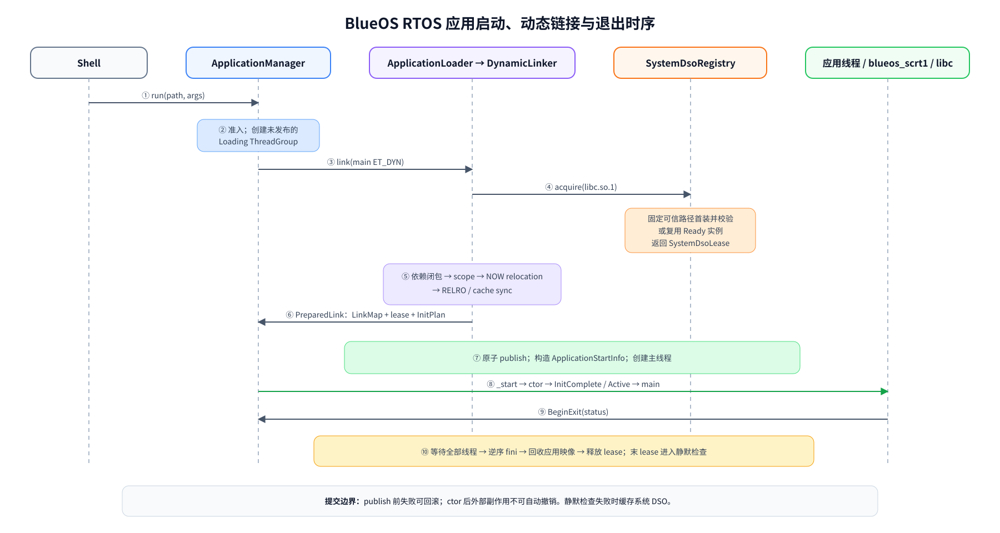

> 时序图突出组件交接和生命周期；链接事务内部的阶段仍以 3.4 为准。可编辑源文件：[blueos-startup-exit.drawio](./assets/dynamic-loading/blueos-startup-exit.drawio)。

具体执行顺序如下：

1. shell 调用 `run <path> [args...]`；统一的 `ApplicationManager` 验证工件信任证据、manifest、`.note.blueos.abi`、执行模型、架构/浮点 ABI/ISA 和资源配额。MVP 的信任证据只允许内置/构建期 allowlist，产品分发启用签名后只接受有效签名；当前只接受 `ExecutionModel::ThreadGroup`，交给 `thread_group/` 后端创建资源阶段为 `Loading`、公共状态同为 `Loading`、尚未向运行线程发布的 `ThreadGroup`。
2. `DynamicLinker` 校验主程序 `ET_DYN`，预扫描所有 `PT_LOAD/PT_DYNAMIC`，用 checked arithmetic 规划地址包络和对齐，通过 `FlatImageMemory` adapter 分配 region，复制文件内容并显式清零 BSS。
3. 从主程序开始按 BFS 解析 `DT_NEEDED`。首个 `libc.so.1` 请求触发 `ApplicationLoader` 从 ABI 配置指定的可信绝对路径装入由 `librs_swi` 生成的映像，MVP 校验只读系统映像身份/build-id，产品阶段再校验签名；并发请求等待同一 `Loading` 事务。Ready 系统 DSO 通过 `SystemDsoLease` 复用，应用包 `lib/` 中的 DSO 则装入当前 `ThreadGroup`，全程按文件身份和 `DT_SONAME` 去重并限制依赖数量与深度。
4. 冻结两个层次的符号域：应用链接域为“主程序 → 应用私有 DSO 的 BFS 顺序 → 系统 DSO”；系统 DSO 只能在系统 scope 内解析，避免系统库被某个应用的同名符号劫持。
5. 先处理每个 image 的 `RELATIVE`，再处理需要查符号的 data/GOT relocation，最后处理 `JUMP_SLOT`。全部采用立即绑定；ARM32 同时支持 REL 和 Thumb 函数地址规则，AArch64/RISC-V 支持 RELA，实际类型以产物测试生成的白名单为准。
6. relocation 完成后应用 RELRO 和最终逻辑 R/W/X 权限，在支持 MMU/MPU 的板上落实硬件保护，并执行目标架构所需的 D-cache clean、I-cache invalidate 或 `fence.i`。
7. `DynamicLinker` 原子提交应用 `LinkMap`、所持 `SystemDsoLease` 和 `InitPlan`；这些链接产物由仍处于 `Loading` 的 `ThreadGroup` 接管。`Relocated/Sealed/Published` 只属于 `LinkSession` 的内部阶段，不成为应用状态。此前任一步失败都释放本次新增的 region 和临时 lease，不破坏已发布 registry entry。
8. `ApplicationManager` 调用 `ThreadGroupBackend` 分配主线程栈并填充 `ApplicationStartInfo { argc, argv, envp, auxv, app_handle, init_plan }`，以应用 ELF 的 `e_entry`（SDK `blueos_scrt1::_start`）为线程入口、以 `ApplicationStartInfo *` 为参数创建线程。
9. `_start` 调用 `libc.so.1` 的 `__librs_start_main`，初始化 stdio 和当前线程的 POSIX/emutls 状态，在 loader lock 外执行一次 init plan；初始化完成事件使公共状态进入 `Running`、内部资源阶段进入 `Active`，随后调用 `main`。
10. `main` 返回后进入 `begin_application_exit`；只有组内全部线程退出并执行逆序 fini 后，才能回收应用私有 DSO 和主程序、释放系统 DSO lease。lease 归零后由 registry 进入 quiescence 检查，成功才卸载，否则缓存当前实例。

构造函数是不可回滚的副作用边界：启动期 ctor 失败时，公共状态由 `Loading` 进入 `Failed`，资源阶段经 `Draining` 回收到 `Reaped`；但不能宣称已发生的 IO 或外部状态变更被自动撤销。系统 `libc.so.1` 不因任意一个应用退出而析构，而是由 system registry 在最后 lease 释放且静默条件满足时统一卸载；Phase 1 MVP 仍不提供面向应用的 `dlopen` 或单 DSO `dlclose`，Phase 3 才增加受限运行期接口。

### 5.2 分层

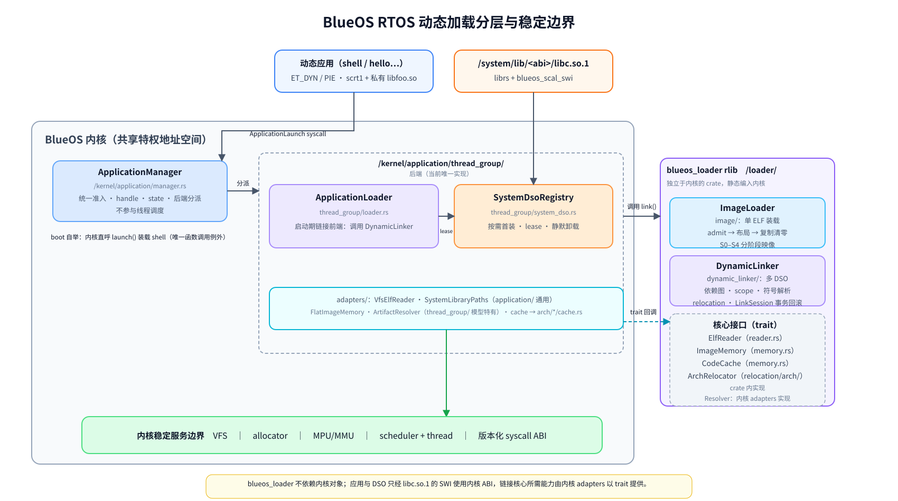

> `ApplicationLoader` 是当前 thread-group 部署前端；`DynamicLinker` 是现有 `blueos_loader` crate 扩充后的多 DSO 链接层，内部复用单映像 `ImageLoader`。平台能力通过 `ElfReader`、`ImageMemory`、`ArchRelocator` 和 `CodeCache` 适配。可编辑源文件：[blueos-layered-architecture.drawio](./assets/dynamic-loading/blueos-layered-architecture.drawio)。

解析/链接策略不直接操作裸指针分配器，而是请求 `allocate/copy/zero/protect/release/sync_icache`。`FlatImageMemory` 可以先用连续 RAM 实现统一 load bias；Cortex-M/受保护 RISC-V 可按 MPU/PMP 粒度归并 region；AArch64 可在现有 MMU 能力上落实页权限。各后端能力不同，但 loader 的范围校验、重定位和发布顺序必须一致。

三种部署方式的取舍如下：

| 方式 | 当前代价 | RTOS 适配性 | 结论 |
| --- | --- | --- | --- |
| 直接在当前单个 `load_elf()` 调用链中递归加入依赖、registry 和线程操作 | 初始改动最少，但很快形成单体状态机 | 难以单测、难以表达多 DSO 生命周期，也无法迁移到用户态 ld.so | 拒绝 |
| 扩充现有 `blueos_loader`，内部拆成 `ImageLoader + DynamicLinker`；内核 `ApplicationLoader` 负责适配 | 不重写已有 loader 和测试，只需逐步抽象 `ElfReader/ImageMemory`、链接会话和依赖图 | 只有一个 ELF/relocation 实现源，直接适配共享地址空间、VFS、线程和 SWI ABI | **当前唯一推荐部署** |
| `PT_INTERP` + 用户态 `ld.so` | 需要进程、非特权级、Linux initial stack、mmap 和 stage0 | 超出当前 RTOS 目标 | 当前不实施；未来复用同一 `DynamicLinker` 语义和 fixture，替换启动 frontend 与 memory backend |

RTOS 应用链接时使用 `-pie --no-dynamic-linker`，但不能再使用 `-static`：主程序保留 `PT_DYNAMIC` 和 `DT_NEEDED`，由 `ApplicationLoader` 直接处理。首版发现 `PT_INTERP` 应明确拒绝，避免把进程式产物误当作 RTOS 应用执行。

这里的 `DynamicLinker` 是职责名称，不要求新建或改名为另一个 crate。推荐的第一版源码布局是：

```text
kernel/loader/                         # 保留现有 blueos_loader rlib
  src/
    lib.rs                             # 兼容 load_elf() 包装与公共 API
    address.rs identity.rs             # TargetAddr/TargetRange 与各类稳定 ID
    image/                             # parser/metadata/layout/policy/loaded
    reader.rs                          # ElfReader trait
    memory.rs                          # ImageMemory/TargetAddr trait
    relocation/arch/                   # 唯一的架构 relocation 实现
    dynamic_linker/                    # 多 DSO DynamicLinker
      linker.rs context.rs session.rs
      dependency.rs scope.rs symbol.rs lifecycle.rs

kernel/kernel/src/application/        # 唯一的内核应用控制面入口
  mod.rs model.rs manager.rs           # ApplicationManager/ApplicationHandle/ApplicationLaunchRequest/ApplicationState
  registry.rs lifecycle.rs             # 实例表、事件、查询与延迟回收
  accounting.rs metrics.rs             # 配额、使用量与统计
  protection.rs                        # ProtectionDomain 能力接口
  adapters/                            # 通用内核能力：VfsElfReader、SystemLibraryPaths
  thread_group/                        # 当前唯一实现的执行后端
    backend.rs group.rs                # ThreadGroupBackend/ThreadGroup
    loader.rs system_dso.rs            # ApplicationLoader/SystemDsoRegistry
    start_info.rs membership.rs
    adapters/                          # 模型特有：FlatImageMemory、ApplicationArtifactResolver
  process/                             # 未来由 blueos_user_process 条件编译
    backend.rs process.rs exec.rs
    address_space.rs initial_stack.rs
```

`application` 只有一份顶层状态表和公共 API。`application/adapters/` 只放依赖内核通用能力（VFS、系统路径策略）的适配，与执行模型无关；`thread_group/adapters/` 只放依赖共享地址空间映射和 `SystemDsoRegistry` 实例状态的适配，未来由 `ProcessImageMemory` 与每进程 resolver 替换；指令缓存维护（`fence.i`、D-clean/I-invalidate）是架构服务，实现在 `arch/*/cache.rs`，`ApplicationLoader` 直接调用，不包装成独立 adapter 文件。当前构建不需要实现 `process/`，只编译 `thread_group/`；未来由唯一的内核配置源生成 `blueos_user_process`，在模块边界启用 `process/`，而不是用互斥 `cfg` 生成第二套 `ApplicationManager`。支持兼容 RTOS 应用的通用内核可以同时编入两个后端，并根据已签名 manifest/ABI note 中的 `ExecutionModel` 显式分派，不能只依据是否存在 `PT_INTERP` 猜测执行模型。

当前 `load_elf(buffer, mapper)` 继续作为 static PIE、`ET_EXEC` 和既有测试的兼容入口，但内部改为调用 `ImageLoader`；动态应用由同一 crate 的 `DynamicLinker` 顺序消费单映像 `StagedImage`，把 state/lease 吸收到 `LinkSession` 的 rollback log，成功后一次性移交给 committed link product。这样不会尝试同时保存多个各自借用同一 `&mut ImageMemory` 的 stage。`blueos_loader` 的生产代码不得依赖待装入的 `librs/libc.so.1`；若现有 BUILD 依赖只服务于测试，应移到测试 target，避免 `DynamicLinker` 与 libc 形成 bootstrap 环。

### 5.3 核心对象及所有权

建议建立以下概念，而不是让 `MemoryMapper` 单独拥有匿名 `Storage`：

- `DsoArtifactCatalog`：记录已验证的 SONAME、build-id、固定路径/包内身份、ABI note 和可复用解析元数据，不包含 load bias、可写状态或构造状态。当前可作为 `SystemDsoRegistry` 的内部层；未来可直接演进为系统级文件/页缓存。
- `DsoInstanceRegistry`：记录某个 `LinkDomainId` 中真正映射并 relocation 后的 DSO 实例、依赖边、lease 和 link map。RTOS 当前只有一个共享的 system link domain，因此对外仍可称为 `SystemDsoRegistry`；未来每个进程各有 instance registry，不能把当前全局实例直接跨地址空间复用。
- `ThreadGroup`：当前执行模型下的一次应用实例；拥有稳定 `LinkDomainId`、ABI profile、主线程与子线程集合、应用私有 `LinkContext`、资源配额和退出状态。它是管理与回收单位，不是 scheduler 的 `Thread`，也不是安全地址空间；未来进程后端以 `Process` 作为同级实例，不把 `ThreadGroup` 改名冒充进程。
- `StagedImage<'a, M, S>`：一个尚未发布的主程序或 DSO；绑定 rollback authority，并在 state payload 中拥有文件身份、目标地址宽度下的 load bias、每个 region、动态元数据和调试信息。核心只保存 `TargetAddr/TargetWord`，不得把目标地址直接表达为 loader 自身可解引用的 Rust 指针；成功后这些资源整体移交给 committed owner，不再保留第二种同义 wrapper。
- `MemoryRegion`：绑定 `LinkDomainId/AddressSpaceHandle`，有明确目标虚拟地址范围、backing、最终逻辑 R/W/X 权限和释放方式；Drop 时可回滚尚未发布的装载。RTOS flat backend 可以把目标地址映射为当前可访问 RAM，未来 VM backend 则映射进指定进程页表。
- 公共 `ApplicationState` 只暴露 `Loading → Running → Stopping → Terminated/Failed`。`S0`–`S10` 和 `LinkSession` 负责链接内部的 Parsed/Mapped/Relocated/Published/Initialized 阶段，避免把 loader 细节重复塞进查询 API；`ThreadGroup` 内部只保留禁止新线程、活动线程计数、fini 是否完成、资源是否已被 reaper 取走等回收所需不变量。
- `SystemDsoLease`：由已提交的 `ThreadGroup` 或系统 DSO 依赖边持有；Drop 只触发 quiescence 尝试，不直接释放代码。
- `ApplicationStartInfo`：传给 `blueos_scrt1::_start` 的稳定 C ABI 结构，携带 argc/argv/envp、标准 auxv、应用句柄和 init plan；不要求 Linux 初始栈布局。
- `ThreadGroupMembership`：所有从该应用创建的线程都登记到 `ThreadGroup`；最后一个线程退出且析构完成后才释放映射。

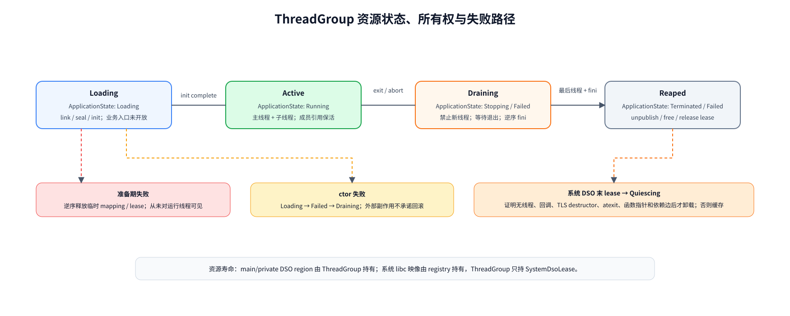

> `ThreadGroup` 拥有应用主程序和私有 DSO；系统 `libc.so.1` 映像由 registry 持有，应用只持阻止其过早卸载的 `SystemDsoLease`。可编辑源文件：[thread-group-lifecycle.drawio](./assets/dynamic-loading/thread-group-lifecycle.drawio)。

统一的 `libc.so.1` 符合 RTOS 的共享运行时模型，也能避免在无 MMU 设备上为每个应用复制完整 librs。代价是 libc 的普通全局状态默认系统级共享，不能声称应用间隔离。需要隔离的状态必须改造成 thread-local 或显式挂到 `ThreadGroup`；在完成这种改造前，应用包必须来自受信任来源，并接受共享 cwd、环境或 stdio 策略的产品约束。

### 5.4 kernel 与扩充后 loader 的职责边界

| 事项 | `ApplicationManager` / `ThreadGroupBackend` | `ApplicationLoader` | `blueos_loader`：`ImageLoader/DynamicLinker` | `libc.so.1` / blueos_scrt1 |
| --- | --- | --- | --- | --- |
| 包签名、ABI note、资源上限 | 负责产品准入 | 固定路径、allowlist 和配额策略 | 对 ELF、note、范围和 feature 再做防御校验 | 不负责 |
| `PT_LOAD/PT_DYNAMIC` 与 DSO 查找 | 提供 VFS 和内存能力 | 将 SONAME/包内身份解析成 `ElfReader` | 解析映像、形成分配计划和 `DT_NEEDED` 请求 | 不负责 |
| 依赖图、符号与 relocation | 不负责 | 提供系统/应用 resolver 与 registry 视图 | 负责依赖图、scope、符号绑定和唯一的 relocation 实现 | 只提供导出符号 |
| 最终权限与 I-cache 同步 | backend 强制执行 | 提供并调用 BlueOS memory/cache adapter | 生成 region 权限并请求 seal/cache，校验结果 | 不负责 |
| argc/argv/envp、auxv 与主线程栈 | 构造 `ApplicationStartInfo` 和标准 auxv | 接收已链接结果 | 返回入口、phdr、link map 和 init plan | `_start`/`getauxval` 解析后进入 start-main |
| emutls/线程运行时 | 维护线程归属和退出通知 | 保活 control object 所属 DSO | 正确 relocation control object 并记录 owner | 初始化/清理每线程状态 |
| ctor/fini | 决定启动/退出时机 | 持有应用/DSO lease | 生成确定顺序的 plan，不直接执行应用代码 | 在应用线程中执行 plan |
| syscall/POSIX API | 提供稳定 SWI ABI | 不向应用导出内核符号 | 不依赖内核 syscall handler 或 `librs` | `blueos_scal_swi` 调内核 |
| 整体回收 | 等待最后线程并释放域 | 撤销 link map、释放 lease；静默后卸载系统 DSO | 回滚未提交 session，给出映像释放计划 | 执行 atexit/fini、清理 TLS/stdio/回调 |

短期即使动态链接核心仍在特权态执行，也要维持这个源码和接口边界。不要让应用/DSO直接解析或绑定内核的完整 Rust/C 符号表；内核能力只通过稳定 syscall 或一份严格版本化的最小服务 ABI 暴露。

### 5.5 面向进程与 MMU 演进的兼容设计

当前不能为了未来通用内核同时交付第二套 loader，但必须避免把 `DynamicLinker`、产物 ABI 和生命周期对象写死在“内核可直接解引用所有应用地址、全系统只有一个 libc 实例”的假设上。内核只建立一个 `application`：公共层持有 `ApplicationHandle`、`ApplicationRegistry` 和粗粒度生命周期，当前 `thread_group/` 后端持有 `ThreadGroup` 与系统 DSO 实例；未来 `process/` 后端持有 `Process/AddressSpace`。推荐从第一版就形成下面的统一应用控制面、双 frontend、单语义链接层结构：

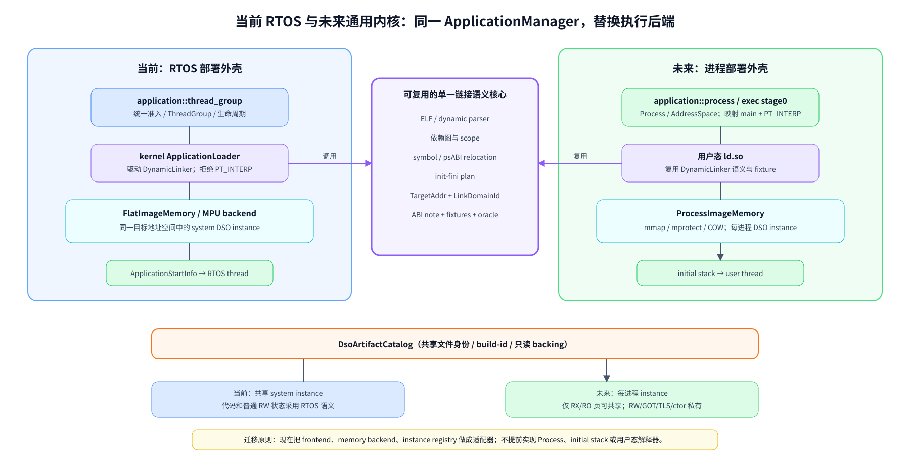

> 当前与未来复用 parser、依赖图、符号规则、relocation、init/fini 和测试语义；替换的是启动 frontend、memory backend 与运行实例 registry。可编辑源文件：[rtos-general-kernel-compatibility.drawio](./assets/dynamic-loading/rtos-general-kernel-compatibility.drawio)。

未来的 `application::process`/kernel `exec` 只负责校验可执行文件、建立进程地址空间、映射主程序和解释器、构造 initial stack 并进入用户态；依赖图、符号绑定和普通 DSO relocation 应迁移到用户态 `ld.so`，避免内核长期执行复杂动态链接策略。当前的 `ApplicationLoader` 是 `application::thread_group` 的部署适配器，不应变成未来通用内核唯一允许的动态链接入口。

条件编译只允许出现在后端模块边界，例如 `#[cfg(blueos_user_process)] mod process;` 以及对应的 `ApplicationInstance::Process` 分支。`ApplicationManager`、`ApplicationHandle`、`ApplicationLaunchRequest`、`ApplicationEventQueue` 和公共查询/退出 API 始终只有一份。开关必须由一个权威内核配置生成；不能再用 GN 开关、Cargo feature 和零散 rustflags 分别决定执行模型。通用内核若仍需兼容 RTOS 应用，可以同时编入 `thread_group/` 与 `process/`，按已签名 manifest/ABI note 的 `ExecutionModel` 选择后端。

为保证这条迁移路线，当前方案增加以下设计约束：

| 维度 | 当前 RTOS 立即采用的设计 | 有进程/MMU 后的映射 | 适配度 |
| --- | --- | --- | --- |
| ELF 解析与策略 | parser 识别标准 phdr/dynamic tag，`ApplicationArtifactPolicy` 决定拒绝 `PT_INTERP/PT_TLS` | 换成 `ProcessArtifactPolicy`，允许 `PT_INTERP`；需要时再启用 native TLS 语义 | 核心直接复用，策略扩展 |
| 地址表达 | `TargetAddr/TargetWord + allocation/offset`，`DynamicLinker` 不解引用裸地址 | 同一计算作用于另一个进程的虚拟地址，host 工具也可交叉链接 | 直接复用 |
| 内存接口 | `ImageMemory` 绑定 shared-flat/MPU backend，并显式 `copy/zero/protect/cache` | 替换为绑定 `AddressSpaceHandle` 的 VM backend，支持 `map/unmap/protect/COW` | 替换 backend |
| link domain | `ThreadGroup` 有稳定 `LinkDomainId`，当前 system DSO 位于共享 system domain | 每个 Process/AddressSpace 一个 `LinkContext/DsoInstanceRegistry` | 对象模型直接扩展 |
| DSO 共享 | artifact/catalog 与 runtime instance 分离；当前可共享一个 libc instance | RX 文件页经 page cache 跨进程共享，RW/GOT 和构造状态按进程私有或 COW | catalog 复用，instance 策略替换 |
| 启动信息 | `ApplicationStartInfo` 使用版本化结构，同时维护标准 auxv 键值语义 | exec builder 把相同 argc/argv/envp/auxv 语义编码为 Linux 风格 initial stack | 语义复用，布局替换 |
| libc 状态 | 从一开始把环境、atexit、cwd、stdio、TLS 等归入 `LibcApplicationContext/thread/system` 明确所有权 | `LibcApplicationContext` 自然迁入每进程 libc RW/TLS，避免拆分遗留全局状态 | 高度复用 |
| syscall 边界 | opaque integer handle、pointer+length、版本+size；即使当前特权也先 copy-in/out | 增加用户地址范围、页权限和 fault-safe copy 校验，不改变 libc C ABI | ABI 直接复用，校验增强 |
| ctor/fini 执行 | `DynamicLinker` 只产出 plan，应用线程在 loader lock 外执行 | 用户态 ld.so 在目标进程执行，内核不调用用户构造函数 | 直接复用 |
| 调试 | 地址空间无关的 image/build-id/load-bias `LinkMap` | 每进程导出 link map，并可增加 `DT_DEBUG/r_debug` 兼容层 | 数据模型复用 |

这里最重要的是区分“共享 DSO 文件/只读页”和“共享 DSO 运行实例”。当前无 MMU RTOS 为节省 RAM 可以让活动应用共享同一个 `libc.so.1` 映像及其普通可写状态；未来进程模型下只能共享相同文件对应的 RX/RO 物理页，libc 的 RW、GOT、TLS、atexit 和构造状态必须属于各进程。若现在把两者都塞进一个全局 `SystemDsoRegistryEntry`，未来会被迫重写 registry、link map 和 lease；按 artifact/instance 两层实现可以把变化限制在 backend 和实例策略。

`PT_INTERP`、`PT_TLS`、symbol version 等当前不支持的标准字段也应采用“解析为 typed metadata，再由当前 profile 明确拒绝”的方式。无需现在实现用户态解释器或 native TLS relocation，但不要在底层 parser 中把这些标准字段当成损坏 ELF；这样未来启用能力时只需增加 policy、runtime 和 fixture，不必推翻输入模型。

按此边界，未来可直接复用的部分包括 ELF/动态表校验、依赖图、符号规则、各架构 relocation、init/fini 排序、ABI note、构建产物和测试 fixture；需要替换的是 VFS/VM adapter、启动 frontend、运行实例 registry 和 link-map 发布方式；需要新增的是 Process、用户地址校验、exec stage0、initial stack 与用户态 `ld.so` 自举。当前 RTOS 方案因此不是未来进程 loader 的一次性原型，而是其链接语义核心和工具链基础。

## 6. 方案选择理由

前述方案不是对某一个参考项目的直接移植，而是根据 BlueOS 的 RTOS 线程模型、共享地址空间、现有 `librs_swi` 和多架构目标，在代码体积、RAM、实时确定性和实现成本之间作出的取舍。

### 6.1 关键架构决策与风险取舍

主要选择及理由如下：

- 采用标准 `ET_DYN`、`PT_DYNAMIC`、`DT_NEEDED` 和各 ISA psABI，是为了直接复用编译器、链接器、readelf 和现有 DSO 产物规则；这并不要求同时采用 `PT_INTERP` 或 Linux 进程 ABI。
- 直接扩充现有 `blueos_loader`，但把单映像 `ImageLoader` 与多 DSO `DynamicLinker` 分层，是为了复用已有代码和测试而不把当前单文件调用链扩成大状态机；特权 `ApplicationLoader` 只提供 RTOS 的 VFS、内存、registry 与线程适配。这是源码组件边界，不是用户态安全边界。
- 只保留一种启动方式，是为了避免同时维护“内核服务链接”和“用户态解释器链接”两套入口、栈协议和测试矩阵；`PT_INTERP`/ldso stage0 对当前目标没有收益。auxv 本身成本很低且有利于 crt/libc 兼容，应作为 `ApplicationStartInfo` 的一部分支持。
- 使用一个按需装入的系统级 `libc.so.1` 实例，是为了让所有活动应用和 DSO 统一经过 `librs_swi` 的 C/POSIX 与 SWI ABI，并节省无 MMU 设备的 RAM。共享可写状态是 RTOS 选择的代价；最后 lease 释放后可以尝试安全卸载，但不能仅凭引用计数直接释放代码。
- 普通 `.so` 动态依赖 `libc.so.1`，而不是静态包含 `librs_swi`，是为了保证 allocator、stdio、pthread 和 emutls 只有一套运行时实现，同时避免重复导出符号。
- MVP 选择立即绑定、emutls 和整组回收，是为了让启动时延、权限收紧和生命周期可预测；Phase 3 再为 `dlopen` 增加增量事务、并发和 handle 协议，lazy binding、原生 ELF TLS 与单 DSO 立即卸载仍需更复杂的悬空引用协议。
- Relink 只作为设计基线和宿主侧测试 oracle；产品代码是在现有 `blueos_loader` 内自研裁剪的 `DynamicLinker`。实测表明 Relink 所需子集在 Rust 1.84 上的语法兼容补丁很小，但完整库约 4.2 万行，其通用抽象、平台 backend 和长期 backport 不是当前 RTOS 产品必须承担的成本。

| 决策/风险 | 建议 |
| --- | --- |
| 是否扩充当前 `kernel/loader` | 是；保留 `blueos_loader` crate 和既有测试，内部拆成 `ImageLoader + DynamicLinker`。拒绝的只是把全部功能继续堆进单个 `load_elf()` |
| 是否采用 Rust ABI | 否。发布面仅 C ABI；Rust std/core/alloc 首期静态 PIC |
| 是否直接移植 musl ldso | 不作为主方案；用 musl 验证完整动态链接语义，用 Relink 验证 Rust 事务/所有权模型，产品链接核心由 BlueOS 自研 |
| Relink 是否作为产品依赖 | 否；固定参考 revision 并保留宿主 oracle/fixture。BlueOS 在现有 `blueos_loader` 内、按相同接口边界实现窄化 `DynamicLinker`，不维护完整 Relink backport fork |
| `librs_swi` 与动态链接核心是否合并 | 否；`ApplicationLoader` 静态编入系统且不能依赖待装入的 libc，`librs_swi` 独立生成 `libc.so.1` |
| 当前是否共享一个全局 `libc.so.1` | 活动期间是；首次依赖时从固定可信路径装入，registry 发放 lease，归零且静默检查成功后可卸载 |
| 其他 DSO 如何使用 librs | 通过 `DT_NEEDED: libc.so.1` 和 C ABI；禁止每个 DSO 静态嵌入 `librs_swi` |
| 主程序是否带 `PT_INTERP` | 否；使用 `ET_DYN + PT_DYNAMIC`，由特权 ApplicationLoader 直接链接，`blueos_scrt1::_start(ApplicationStartInfo*)` 启动 |
| MVP/Phase 3 是否支持 `dlopen`、卸载和 lazy | Phase 1 MVP 不提供；Phase 3 提供 NOW/local `dlopen/dlsym/dlerror` 和逻辑 `dlclose`。仍无 lazy；运行中不立即释放应用 DSO，system registry 只在内部 quiescence 协议后卸载共享 DSO |
| 是否立刻实现标准 ELF TLS | 否；所有目标继续使用现有 emutls，线程退出时清理，应用 DSO 卸载前等待全部线程 |
| 是否支持 `ET_REL` 应用 | 否；应用与 DSO 固定 `ET_DYN`，内核扩展不在本报告范围 |
| `COPY` 是否必须进入 MVP | 否；先通过 artifact tests 禁止/观察，只有目标产物不可避免时才实现 |
| 是否继续维护两个 relocation 核心 | 否；`ImageLoader` 与 `DynamicLinker` 共用 `blueos_loader::relocation`，static PIE 与动态 DSO 只有一个架构实现源 |
| syscall ABI 仍可随意改号吗 | 对外发布前必须停止；append-only + 版本 note + 兼容期 |
| ARM32/AArch64/RISC-V 是否一次实现 | 先在 ARM32 Thumb v7-M soft-float 纵向验证，再共用核心扩展 Thumb v8-M hard-float、RISC-V64、AArch64 和 RISC-V32；每个平台用产物门禁验收 |

### 6.2 为什么在现有 loader 内参照 Relink 实现裁剪的 `DynamicLinker`

当前 loader 的结构是 `parse whole buffer → one allocation → copy → one relocation kind`。RTOS 动态链接还需要依赖图、文件身份去重、符号 hash、weak/global/visibility、RELRO、构造顺序和生命周期，并且必须对 symbol version、原生 TLS 等未实现语义显式拒绝；这些都不是添加一个 `match R_*` 能解决的。

Relink 已经证明以下边界是可行的，也是 BlueOS 应保留的设计资产：

- `ElfReader`：可接 VFS、内存包或远端输入，不强制一次读入整个文件；
- `Mmap`、`RegionAccess`、`ImageMemory`：可接当前 flat memory 或未来 VM；
- `LinkContext`：隔离一个应用的模块、依赖图和符号作用域；
- aarch64/arm/riscv32/riscv64 的架构 relocation 抽象；
- `DT_NEEDED`、GNU/SysV hash、REL/RELA/RELR、RELRO、init/fini；
- typed symbol lifetime 和模块所有权模型。

但 Relink 的产品目标明显宽于 BlueOS RTOS：当前源码约 4.2 万行，包含 `ET_REL`、section 重排、lazy binding、原生 ELF TLS、多宿主 OS backend、通用 observer 和 BlueOS 不需要的架构。其 bare-metal 文件 backend 仍直接返回不支持，通用 `Mmap`、runtime、锁和 allocator 假设也需要逐一适配；即使源码能够编译，仍不能省掉 `SystemDsoRegistry`、`SystemDsoLease`、`ThreadGroup`、auxv、线程归属、quiescence 和签名策略等 BlueOS 产品逻辑。

因此最优实现分成三层，但不新建第二个产品 loader：

1. 现有 `blueos_loader` rlib：先把当前流程整理为单映像 `ImageLoader`，再在同一 crate 内增加 `DynamicLinker`，冻结 `ElfReader/ImageMemory/ArtifactResolver/ArchRelocator/LinkSession/LinkContext/LoadError`；两层共用 ELF 校验、地址类型、内存接口和架构 relocation，只实现标准 `ET_DYN`、启动期 `DT_NEEDED`、NOW relocation、GNU/SysV hash、weak/visibility、REL/RELA、RELRO 和 init/fini。
2. 内核 `ApplicationLoader`：实现 BlueOS VFS、flat/MPU memory、cache、系统 DSO registry、应用 `LinkDomainId`、auxv 与线程生命周期，不让 `blueos_loader` 直接依赖内核内部对象。
3. Relink oracle：固定已审计 revision，仅在开发/CI 宿主侧运行相同人工 ELF fixture，比较依赖图、符号解析、relocation 写值、link map 和构造顺序；目标固件不链接 Relink。

ARM32 Thumb 的 `app → libc.so.1` MVP 预计需要约 3000–5000 行生产代码；覆盖多 DSO、registry/lease/quiescence 和 ARM32/AArch64/RISC-V 后，产品核心预计约 8000–12000 行，另需约 7000–12000 行 fixture、单测、fuzz 和板上测试。这比维护 Relink 全功能 fork 更贴近当前需求，同时仍保留未来替换内部实现的接口边界。

无论是参考还是复制局部实现，纳入特权 runtime 前都必须做面向敌意 ELF 的 unsafe、范围、OOM、锁和失败回滚审计；“Rust 实现”不自动等于“安全解析不可信文件”。参考：[Relink crate features](../../../Relink/Cargo.toml)、[输入抽象](../../../Relink/src/input/traits.rs)、[内存抽象](../../../Relink/src/memory/traits.rs)、[runtime 抽象](../../../Relink/src/runtime/traits.rs)、[架构 relocation](../../../Relink/src/arch)。Relink 使用 MIT/Apache-2.0 双许可证；若直接复制其代码或 relocation 实现，必须保留对应许可证与 NOTICE，纯粹参考架构并按 psABI 独立实现则仍要在设计记录中标明参考来源。

### 6.3 Relink 的 Rust 1.84 实测结果与最终选择

本次对当前工作区 Relink 0.16 做了隔离兼容性验证：使用 BlueOS `rustc 1.84.0-dev`、Cargo 1.84、`--no-default-features`，不修改正式源码，只在临时副本降低清单版本并加入兼容处理。

| 验证项 | 结果 | 工程含义 |
| --- | --- | --- |
| 清单门槛 | edition 2024 → 2021，`rust-version` 1.93 → 1.84 | 两处清单修改即可越过 Cargo/MSRV 声明门槛 |
| 核心依赖 | `elf 0.8`、`spin 0.10.1`、`bitflags 2.13.1`、`cfg-if` 均在 1.84 编译通过 | RTOS 最小 feature 不需要连锁降低依赖版本 |
| RISC-V64/RISC-V32/ARM32 | 加 `let_chains/trait_upcasting/unsigned_is_multiple_of` feature gate 后编译通过 | 若接受 BlueOS dev compiler，兼容补丁只有少量清单/属性修改 |
| 不使用 feature gate | 需改写约 8 处 let-chain、6 处 `is_multiple_of` 和 1 处 trait upcast | 稳定语法 backport 约涉及 10 个文件、60–150 行，不构成主要风险 |
| AArch64 | 额外拒绝 3 个原生 TLSDESC resolver 后编译通过 | 当前统一 emutls，禁用 Relink 原生 ELF TLS 与产品边界一致 |
| 默认 full feature | 未作为目标；它会引入 lazy binding、`ET_REL`、原生 TLS、宿主 backend 和更多依赖 | 不应为了未规划能力扩大 backport 与验证矩阵 |

这个结果否定了“Relink 因版本问题完全不可用”，但也不推出“应把完整 Relink 放进固件”。最终选择已经冻结：

1. 不为了 Relink 单独升级 BlueOS Rust fork，也不维护完整降级 fork。
2. 在现有 `blueos_loader` 内实现 BlueOS 专用 `DynamicLinker`，直接按当前 RTOS 功能白名单控制代码量、unsafe 面、内存和实时行为。
3. 复用 Relink 的接口分层、事务提交、lease 所有权和测试语义；需要借鉴的架构 relocation 按 psABI 独立实现，或在满足许可证/NOTICE 后有选择地移植。
4. 固定 Relink 参考 revision 和 fixture，作为宿主 differential oracle，而不是目标依赖。
5. `blueos_loader` 同时暴露兼容的单映像入口和 `DynamicLinker` 动态链接入口；两者复用同一 parser/memory/relocation 模块，不另建第二套 loader 或 relocation 语义。

## 7. 实现步骤

推荐按“先冻结契约和安全边界，再完成纵向 MVP，最后扩展平台与运行期能力”的顺序实施。

### 7.1 首版 ABI 与功能边界

#### 7.1.1 ELF 契约

首版动态应用建议要求：

- little-endian ELF32/ELF64，`e_machine` 必须与当前 target 匹配；
- 主程序为 PIE `ET_DYN`，包含 `PT_DYNAMIC`，不包含 `PT_INTERP`；DSO 为带 `PT_DYNAMIC` 的 `ET_DYN`；
- 以 program header 为装载依据，运行时不依赖 section header；
- `PT_LOAD` 满足 `p_filesz <= p_memsz`、`p_align` 为 0/1 或 2 的幂，且 `p_offset` 与 `p_vaddr` 模对齐；
- 拒绝 W+X segment、`DT_TEXTREL`、可执行栈、重叠且权限冲突的页、超限 segment/依赖/字符串表；
- 支持 `PT_DYNAMIC`、`PT_GNU_RELRO`、`PT_GNU_STACK`；首版统一走 emutls，拒绝 `PT_TLS`；
- 除 `libc.so.1` 自身外，应用和普通 DSO 必须通过 `DT_NEEDED: libc.so.1` 使用 librs C ABI；禁止静态嵌入 `librs_swi`；
- DSO 必须有 `DT_SONAME`；首版发现 `PT_INTERP`、`PT_TLS`、`DT_RPATH/RUNPATH` 或不在白名单内的 dynamic tag 时拒绝装载。

不要急于注册私有 `EI_OSABI`。先保持 System V 兼容，并增加 `.note.blueos.abi`/`PT_NOTE`：包括 note schema 版本、syscall ABI 版本、librs ABI、架构/位宽/endianness、ARM float ABI、RISC-V ISA/ABI、最低内核 feature 和构建 ID。内核在映射前校验；这样既不破坏通用 ELF 工具，又能阻止把 rv32imc、rv32imac、hard-float 等不兼容镜像混装。

上述拒绝项属于 `ApplicationArtifactPolicy`，不是 ELF parser 的永久能力上限。parser 应把 `PT_INTERP/PT_TLS`、symbol version 等标准信息解析成带范围校验的 typed metadata，当前 profile 再返回明确的 `UnsupportedByProfile`；未来的 `ProcessArtifactPolicy` 可以在补齐 exec、VM、用户态 ld.so 或 native TLS runtime 后选择接受。主程序当前使用 `--no-dynamic-linker`，未来进程 profile 则可生成带 `PT_INTERP` 的第二类产物；两类 profile 必须有不同 ABI note/manifest，防止内核误用启动路径。

#### 7.1.2 首版 relocation 白名单

动态链接只实现编译器实际产物所需的最小集合，并由 CI 用 `llvm-readelf -r` 生成/核对清单：

| 架构 | MVP 允许 | MVP 明确拒绝 |
| --- | --- | --- |
| AArch64 | `RELATIVE`、`ABS64`、`GLOB_DAT`、`JUMP_SLOT` | `COPY`、`IRELATIVE`、TLS reloc、TEXTREL |
| ARM/Thumb EABI | `RELATIVE`、`ABS32`、`GLOB_DAT`、`JUMP_SLOT` | `COPY`、`IRELATIVE`、TLS reloc、运行时改写 text；分支 veneer 单独验证 |
| RISC-V 64 | `RELATIVE`、`R_RISCV_64`、`JUMP_SLOT` | `COPY`、`IRELATIVE`、TLS reloc、TEXTREL |
| RISC-V 32 | `RELATIVE`、`R_RISCV_32`、`JUMP_SLOT` | 同上 |

必须分别处理 ARM 常见 REL（addend 在目标位置）与 AArch64/RISC-V 常见 RELA（显式 addend），不能假定所有平台都只用 `dynrelas`。每次写 relocation 前校验目标地址、宽度、对齐和对应 mapping；未知类型返回包含 DSO、offset、symbol、type 的确定性错误，绝不能跳过。

#### 7.1.3 符号与依赖策略

MVP 采用最简单的确定性策略：

- 只允许系统 registry/`/lib` 和当前应用包的 `lib/`，禁止环境变量、当前目录、`RPATH/RUNPATH` 和 `$ORIGIN`；
- 系统 DSO 按 SONAME/build-id 全局去重并通过依赖 lease 保活；应用私有 DSO 只在所属 `ThreadGroup` 中去重和可见；
- 应用 scope 为“主程序 → 应用私有依赖 BFS → 系统 DSO”；系统 DSO 的 relocation 只使用系统 scope，不被应用符号 interpose；
- 支持 global/weak、`STV_DEFAULT/HIDDEN/PROTECTED` 的必要语义和 GNU/SysV hash；
- `-z now`，所有 PLT 在进入应用前完成；不生成 resolver trampoline；
- 拒绝同一 scope 中重复的 strong export；不支持 preload、audit、IFUNC、filter/auxiliary object 和 GNU symbol version；
- 应用私有 DSO 只随整个 `ThreadGroup` 回收，不提供单 DSO 卸载；系统 DSO 只由 registry 在 lease 归零且静默检查通过后卸载；
- MVP 用 SONAME、ABI note、导出清单和 ABI diff 管理兼容性；`libc.so.1` 同 major 内保持 append-only 导出。

OpenHarmony 的 namespace 和 allowed library 机制适合后续多应用/第三方 SDK，但首版一个 `ThreadGroup` 一个 namespace 足够。

#### 7.1.4 TLS 策略

首版继续使用现有 emutls 是合理的：六个 target 已统一生成对 `__emutls_get_address` 的调用，能暂时避开 `PT_TLS`、static TLS offset、DTV、`__tls_get_addr` 和动态装载后的 TLS 扩容。

emutls DSO 不需要 loader 像 `PT_TLS` 那样登记 TLS 模板。编译器生成的 `EmutlsControl` 是普通数据对象，代码把其地址传给 `__emutls_get_address`，librs 再惰性分配线程私有副本。loader 的责任是正确重定位并保活这些 control object；额外困难发生在多 ThreadGroup registry 归属和 DSO 卸载，而不是 PT_TLS 注册。

但要满足三个条件：

1. 所有应用和 DSO 必须解析到系统 `libc.so.1` 中唯一的 `__emutls_get_address`，不能静态带入第二份实现；
2. 每个 BlueOS 线程拥有独立的 emutls value table，并在线程退出时释放；`ThreadGroupBackend` 维护线程与 `ThreadGroup` 的归属；
3. emutls control object 属于产生它的 image。只要组内还有线程，主程序和应用私有 DSO 就不能卸载；每个活动 ThreadGroup 同时持有 libc lease。最后 lease 释放前必须清空所有线程 emutls value/destructor，之后 libc 才可能通过 quiescence 并卸载。

当前 ABI note 固定标记 emutls，首版直接拒绝 `PT_TLS` 和原生 TLS relocation。是否改用标准 ELF TLS 留给未来单独评估，不进入 RTOS 动态链接的交付范围。

#### 7.1.5 将 `librs_swi` 改造成 `libc.so.1` 所需的工作

当前 `librs` 和 `librs_swi` 都是 `rlib`；后者只是静态链接进可装载应用。要成为系统 `libc.so`，需完成：

1. 保留内核内 `librs` 的 `rlib` target；新增以 `librs_swi` 依赖图为基础的 DSO target，生成 `libc.so.1`、`DT_SONAME=libc.so.1` 和仅供 SDK 链接的 `libc.so` 名称。
2. 可以先验证 Rust `cdylib`；若裸机 target 的 rustc 链接受限，则把 PIC rlib/object 交给 clang+LLD 统一执行 `-shared`。两条构建路径必须产出相同 ELF/ABI 契约，不能把 Rust crate metadata 当运行时接口。
3. `blueos_scal_swi`、compiler builtins、spin 等内部依赖全部以 PIC 静态进入 `libc.so.1`；最终 DSO 不得未定义引用内核普通 Rust/C 符号，所有内核调用只能经过 SWI ABI。
4. 建立机器可审查的导出清单。默认隐藏内部 Rust/LLVM 符号，只导出已承诺的 C/POSIX API、必要 compiler runtime、emutls 和启动 ABI；为每次增删做 ABI diff。
5. 把 ABI 类型与函数声明继续留在 `libc` bindings，实现在 `librs`；应用和普通 DSO 编译时依赖 bindings/SDK import library，但不能再把 `librs_swi.rlib` 静态拉入。
6. 新增 SDK `blueos_scrt1.o`，定义 `_start(ApplicationStartInfo *)`。修改目前无参数的 `__librs_start_main()`，使其接收 `main`、argc/argv/envp、app handle 和 init plan，在应用主线程内完成 stdio/POSIX TCB/emutls 初始化、构造函数与退出处理。
7. 审计 `errno`、pthread、stdio、allocator、locale、环境和 cwd：线程状态进入 TLS；应用级状态通过 app handle 查询 `LibcApplicationContext`；明确保留为系统全局的状态写入 ABI 文档。当前 `malloc` 可继续通过 `AllocMem/FreeMem` 使用系统 allocator，不要求先实现 `mmap`。
8. 为 `libc.so.1` 冻结按 ABI 区分的可信路径和签名策略；system registry 负责并发按需加载、单次 init、lease 和 quiescence 卸载。`ApplicationLoader` 自身静态编入系统且不依赖该 DSO，避免 bootstrap 环。

`librs` 主目标入口是 `librs/src/lib.rs`；包含 `#[global_allocator]` 和 `#[panic_handler]` 的 `newlib.rs` 目前只被 `tests/newlib_c_cc` 使用。新增 DSO target 必须继续以 `src/lib.rs` 为 crate root，不得把测试 binary 的 allocator/panic lang item 拉进 `libc.so`，并通过最终的 `readelf -s`/link map 检查确认。

参考：[当前 `librs` crate type](../../librs/BUILD.gn)、[当前 start main](../../librs/src/lib.rs)、[malloc 使用 AllocMem/FreeMem](../../librs/src/stdlib/malloc.rs)、[BlueOS mmap 尚未实现](../../librs/src/syscall/blueos/mod.rs)。

#### 7.1.6 应用线程启动 ABI

建议在 SDK 头文件和 Rust bindings 中冻结以下等价的 C ABI，而不是模拟 Linux 初始栈：

```c
typedef void (*BlueOsInitFn)(void);

struct BlueOsInitPlan {
    uint32_t abi_version;
    uint32_t struct_size;
    size_t count;
    const BlueOsInitFn *entries;
};

struct BlueOsAuxvEntry {
    uintptr_t a_type;
    uintptr_t a_value;
};

struct BlueOsApplicationStartInfo {
    uint32_t abi_version;
    uint32_t struct_size;
    uintptr_t app_handle;
    int32_t argc;
    const char *const *argv;
    const char *const *envp;
    const struct BlueOsAuxvEntry *auxv;
    size_t auxv_count;
    const struct BlueOsInitPlan *init_plan;
};

void _start(struct BlueOsApplicationStartInfo *info) __attribute__((noreturn));
void __librs_start_main(
    int (*main)(int, char **, char **),
    struct BlueOsApplicationStartInfo *info
) __attribute__((noreturn));
```

`abi_version + struct_size` 允许尾部追加字段；auxv 使用目标字长并以 `AT_NULL` 结束，`auxv_count` 同时提供解析上限。MVP 生成 `AT_PHDR/PHENT/PHNUM/ENTRY/EXECFN/SECURE`，有可靠随机源时提供指向至少 16 字节随机数据的 `AT_RANDOM`，目标 ABI 已定义真实页/保护粒度时才提供 `AT_PAGESZ`；`AT_BASE` 为零或省略。`AT_PHDR` 指向已装入主程序的 program header，若原 ELF 没有可直接保活的 `PT_PHDR`，则指向 `ThreadGroup` 持有的只读副本；`AT_EXECFN` 字符串、`AT_RANDOM` 数据、auxv 数组及其所有指针目标都保活到组内最后线程退出。`AT_SECURE` 由包信任/安全执行策略明确给出，不能从“当前是特权态”含糊推导。BlueOS 私有信息继续放在 `ApplicationStartInfo`，不滥用标准 tag。

`__librs_start_main` 把 auxv 与 `LibcApplicationContext`/线程 TCB 关联，子线程继承应用归属；共享 `libc.so.1` 中的 `getauxval()` 按当前线程找到对应 auxv，而不是读取可被另一个应用覆盖的全局指针。找到条目时返回值；条目不存在时返回 0 并设置 `errno = ENOENT`，从而兼容常见 libc 语义。

init entry 已按依赖先于使用者的顺序排列，libc 只顺序调用，不再自行遍历 DSO 图；fini plan 由 `ThreadGroup` 保留到退出阶段。`blueos_scrt1::_start` 只负责取得 `main` 并进入 libc；libc 建立当前线程的 POSIX TCB/emutls 状态、执行 init plan、调用 `main`，再用 `app_handle` 走稳定 syscall 退出应用。线程栈仍遵循现有 32 位 8 字节、64 位 16 字节对齐要求。普通 DSO 没有 `_start`，只通过 dynamic table 暴露 init/fini。

#### 7.1.7 Rust panic、C++ 与跨 DSO ABI 边界

MVP 应把“能链接 C ABI”与“支持所有语言运行时语义”分开：

- Rust 发布 ABI 只允许 `extern "C"` + `#[repr(C)]`；trait object、Rust enum、panic payload 和 unwinding 不跨 DSO。
- 六 target 保持 `panic=abort`。应用 panic 进入 `begin_application_exit/abort`，由 `ApplicationManager` 分派给 `ThreadGroupBackend` 停止该组的线程并回收整个 `ThreadGroup`；不能 unwind 穿过 librs/`DynamicLinker` 边界。
- C++ 一期建议 `-fno-exceptions -fno-rtti`。在 init/fini 计划正确后可支持全局构造/析构、静态局部 guard 和模板实例化；跨 DSO exception、RTTI/dynamic_cast、`STB_GNU_UNIQUE` 与 unwind frame 注册后置。
- 若支持 `__cxa_atexit`，登记项必须携带 `__dso_handle`/ThreadGroup owner，整组退出时逆序调用。普通函数指针、回调、TLS destructor 或 unwind metadata 只要可能逃逸到组外，就禁止单 DSO 卸载。

这一边界也解释了为什么首版“整 ThreadGroup 回收”比 `dlclose` 安全：所有组内线程已经停止，应用和私有 DSO 一起销毁；系统 `libc.so.1` 则保持驻留，不需要证明任意外部指针的不可达性。

### 7.2 内存映射与安全要求

#### 7.2.1 loader 的正确映射算法

对一个 ELF image，应按以下顺序实现：

1. 以 checked arithmetic 计算所有 load segment 的页对齐范围和完整 image span；设置 segment/image/文件大小硬上限。
2. 为 `ET_DYN` 选择满足最大 `p_align` 的目标地址，定义 `load_bias = mapped_page_start - aligned_min_vaddr`；所有 `P/B/S/A` relocation 公式都使用显式目标字宽的 `TargetAddr/TargetWord`，不能用 loader 自身的 `usize` 或可解引用裸指针代替目标地址。
3. 按每个 `PT_LOAD` 的逻辑 region 处理文件首尾、复制 file bytes，并显式清零 page tail 和 `p_memsz - p_filesz`；连续内存后端可以共用一次物理分配，但不能丢失 segment 边界。
4. relocation 期间记录需要写入的 region；完成后应用最终 `PF_*` 和 `PT_GNU_RELRO`。有 MMU/MPU/PMP 的后端落实硬件权限，无保护能力的平台保留逻辑权限并拒绝输入中的 W+X。
5. 执行架构 cache maintenance 和必要 fence，然后才发布入口/符号。
6. 失败时按逆序释放全部临时 mapping，不能留下半初始化对象或已运行的 ctor。

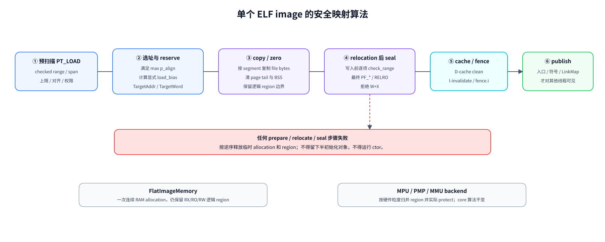

> 连续 RAM、MPU/PMP 与 MMU 只改变后端怎样落实 allocation 和权限，不改变预扫描、复制清零、重定位收口、cache 同步和发布的先后关系。可编辑源文件：[image-mapping-algorithm.drawio](./assets/dynamic-loading/image-mapping-algorithm.drawio)。

RTOS 首版可由 `FlatImageMemory` 以一块连续 RAM 保存 image，同时在元数据中保留 RX/RO/RW region；有 MPU/PMP 的板再将逻辑 region 按硬件粒度归并和保护。权限无法物理落实时，错误信息和威胁模型必须明确说明它只是逻辑保证。

#### 7.2.2 必须新增的最小内核能力

当前不需要先实现 POSIX `mmap/mprotect/munmap/execve`。`ApplicationLoader` 需要的是一组只在特权组件间使用的 RTOS backend 接口：

- `read_at(image, offset, buf)`：从 VFS 或应用包按偏移读取，避免整文件常驻；
- `allocate_image(layout, owner, address_space)`：按总跨度、最大对齐和 ThreadGroup 配额在指定 address-space backend 中分配连续 RAM 或属性内存池；RTOS 当前传共享特权域，未来传进程 VM handle；
- `write/zero/check_range`：所有复制和 relocation 写入都经过 owner、范围、宽度和对齐检查；
- `protect_region(region, perms)`：支持时配置 MMU/MPU/PMP，不支持时记录逻辑权限并返回能力信息；
- `sync_instruction_cache(start, len)`：提供 ARM32/AArch64/RISC-V 的真实实现，禁止空 stub；
- `release_image(owner)`：只释放未发布事务或已无运行线程的 ThreadGroup image；
- `create_application_thread(entry, arg, stack, owner)` 与 `begin_application_exit`：沿用线程模型，但登记线程归属并在最后线程退出时触发回收。

现有 `AllocMem/FreeMem` 可以作为 `FlatImageMemory` 的底层起点，但不能由 loader 直接把任意 heap 指针转成入口执行；可执行内存的对齐、cache、owner 和逻辑权限必须经专用 backend 管理。syscall 编号当前源码也标注为不稳定，在发布应用 ABI 前必须变为 append-only，并由 `.note.blueos.abi` 做版本协商。

`owner/address_space` 即使在当前都落到同一个物理地址空间，也不能在接口上省略。`DynamicLinker` 只通过 allocation ID、region ID 和目标地址读写，具体 adapter 才能把它转换为当前内核可访问的 slice；这同时支持将来的“内核向另一个进程复制页面”和“用户态 ld.so 操作自己的 mmap”两种实现。

#### 7.2.3 威胁模型

MVP 应清楚写在产品文档中：

- 动态应用必须来自受信任的软件源；MVP 仅接受内置/构建期 allowlist，任何产品级外部分发都必须先交付签名验证；
- ELF 解析器面对损坏/恶意文件时不应越界或任意写，但成功装载的代码仍拥有内核等价权限；
- 每应用限制最大文件、映射 RAM、segment 数、依赖深度/数量、符号/字符串表、TLS 与线程数；
- 构造函数在应用发布前运行，但它本身是任意代码；只有用户态隔离后才可安全处理第三方 ctor；
- 日志不可泄露随机地址给非特权主体；开发版保留完整 link map 和 relocation 诊断。

安全方案分三层交付，不能把后两层写成当前既有能力：

| 层次 | 执行权限与内存边界 | 主要机制 | 能抵御什么 | 不能抵御什么 |
| --- | --- | --- | --- | --- |
| L0：当前可信特权应用 | 与内核共享特权地址空间 | 内置/构建期 allowlist；产品阶段签名；ELF 防御解析、配额、固定系统库解析、W^X 输入拒绝、生命周期回收 | 损坏工件、loader 越界、资源耗尽和误卸载的一部分风险 | 已获准代码的任意指针、特权指令和内核内存访问 |
| L1：映像权限硬化 | 仍可能是共享特权执行，但 RX/RO/RW/RELRO 尽量由 MPU/MMU/PMP backend 落实 | relocation 后 seal、NX、只读代码/RELRO、guard region | 常见意外写代码、执行 data、部分越界 | 特权应用绕过/重配保护；应用间完整隔离 |
| L2：非特权保护域 | Cortex-M unprivileged Thread mode、RISC-V U mode 或 AArch64 EL0；每个应用绑定 protection domain | 上下文切换装载 MPU/PMP/页表，syscall/copy-in/out，opaque handle，按域 heap/stack/data | 应用越权访问内核和其他域，可将 fault 归属并终止单一应用 | 硬件 region 数不足带来的粗粒度共享；设备 DMA/IOMMU 等另需治理 |

`ProtectionDomain` 应作为 scheduler/thread 与 memory backend 之间的独立契约，而不是把访问策略散落到 `ApplicationManager`：

```rust
pub trait ProtectionDomain {
    fn seal_image(&mut self, regions: &[ImageRegion]) -> Result<(), ProtectionError>;
    fn attach_thread(&mut self, thread: ThreadId) -> Result<(), ProtectionError>;
    fn activate(&self) -> Result<(), ProtectionError>;
    fn validate_user_range(&self, ptr: TargetAddr, len: usize, access: Access)
        -> Result<(), ProtectionError>;
}
```

实现策略不是用软件检查应用的每一次 load/store。硬件在访存路径并行检查；软件只在四处付费：装载时规划/对齐 region，relocation 后一次 seal，跨 protection domain 的上下文切换时写有限个 MPU/PMP/页表寄存器，以及 syscall 边界的用户指针校验。Tock 的 Cortex-M MPU backend 会缓存当前 config ID，配置未变化时跳过重复写寄存器；Zephyr 则把 extension 的 text/data/rodata 分区加入 `k_mem_domain`，线程继承所属 domain。这两种做法都比在业务代码中插入逐访问检查更合适。

对 BlueOS 的具体门禁是：L0 随 Phase 0/1 交付；L1 可在有硬件能力的板先做，但只能称 hardening；L2 必须同时具备非特权级、per-domain 配置、context-switch hook、fault attribution、copy-in/out 和 syscall capability 检查后才能宣称“应用隔离”。Cortex-M 现有 MPU 模块可以演进为 L1/L2 backend，但不能原样复用为动态应用沙箱；ARM32 MVP 在非特权 Thread mode 和 per-domain MPU 闭环完成前继续按 L0 运行。

性能验收应测量而不是猜测：记录同一 protection domain 内线程切换、跨 domain 切换、syscall 往返、应用启动 seal、Flash/RAM 浪费和可用 region 数；设置每板预算。若 region 不足，优先把应用代码/只读数据归并为 RX/RO、把 heap/data/stack 放入少量连续 arena，并拒绝无法安全表达的布局，不退化为逐指令软件地址检查或静默 RWX。

参考：[Zephyr LLEXT 分区与 `llext_add_domain`](../../../zephyr/subsys/llext/llext_mem.c)、[Zephyr thread memory domain](../../../zephyr/kernel/userspace/mem_domain.c)、[Tock Process MPU 配置](../../../tock/tock/kernel/src/process_standard.rs)、[Tock Cortex-M33 MPU config cache](../../../tock/tock/arch/cortex-m33/src/mpu_v8m.rs)、[FreeRTOS MPU task settings](../../../FreeRTOS/FreeRTOS/Source/include/FreeRTOS.h)、[legacy nanohub MPU default-deny user map](../../../aosp/device/google/contexthub/firmware/os/platform/stm32/mpu.c)。

#### 7.2.4 无 MMU/MCU 的存储与执行策略

NuttX、Zephyr、RT-Thread 和 Tock 的经验可以收敛为四种后端能力，不能混成一个“单块 RWX”默认实现：

| 能力 | MVP | 后续优化 | 限制 |
| --- | --- | --- | --- |
| 连续 RAM image | 支持，最容易保持统一 load bias | 用 slab/按域 arena 降低碎片 | 段间洞也耗 RAM，物理上很难强制 W^X |
| RX/RW 分池 | 记录逻辑 region；有 MPU 的板可提前启用 | Zephyr 式按属性归并、按 MPU 粒度对齐 | region 槽位有限，布局需在分配前预扫描 |
| flash XIP | Phase 0/1 不做 | 仅复用无 relocation 的只读 segment；data/GOT 拷 RAM | 有 text relocation、flash 不支持取指或 cache 属性不匹配时必须拒绝 |
| 系统 `libc.so.1` | 首次依赖时从固定路径装入，活动期间代码和可写状态按 RTOS 语义共享 | lease 归零后执行 quiescence；成功则 fini/卸载，无法证明则缓存 | 这不是应用隔离；系统库不得被应用符号 interpose，不能只看 refcount 释放 |

Thumb veneer 也要放在正确语境里：Zephyr 的 veneer 主要解决 `ET_REL` 扩展的加载时分支重定位越界；标准 `ET_DYN` 应优先让静态链接器生成合法 PLT/GOT/long-call 序列。BlueOS 只有在六 target 的动态产物确实留下需 loader 修补且可能越界的分支 relocation 时，才为相应 psABI 实现 veneer，不能因为参考项目有这段代码就提前复制。

cache 同步则不是优化项。每个架构 backend 必须提供真实的 `sync_instruction_cache`：RISC-V 至少落实所需 `fence.i`/平台广播语义，ARM 按实际 cache 层级 clean D-cache、invalidate I-cache。未实现的平台应在构建或加载时显式失败，不允许空 stub。

### 7.3 工具链与产物规范

内核、应用和 DSO 共用同一套 **PIC + dynamic-capable** BlueOS 工具链与 sysroot，但“共用工具链”不等于“共用最终链接命令”。`dynamic` 是 target 能力，PIC 是对象代码模型；是否生成自包含内核、PIE 主程序或共享库由产物策略决定：

| 产物策略 | 共同输入 | 最终链接与 ELF 契约 |
| --- | --- | --- |
| `kernel_static` | 统一 PIC `core/alloc/compiler_builtins` 和 PIC 内核对象 | 使用 `-static` 与板级 kernel `link.x` 收口为自包含启动映像；当前应为 `ET_EXEC`/板级固件格式，无 `PT_INTERP`、`DT_NEEDED` 和待运行时处理的 dynamic relocation |
| `dynamic_app` | 同一 PIC sysroot 和普通 PIC 依赖 | `-pie --no-dynamic-linker -z relro -z now -z noexecstack -z text --build-id`，生成带 `PT_DYNAMIC/DT_NEEDED` 的 `ET_DYN` |
| `dso` | 同一 PIC sysroot 和普通 PIC 依赖 | `-shared -soname,<name> -z relro -z now -z noexecstack -z text`，生成带导出清单的 DSO |

具体规则如下：

- Rust target 默认 `relocation-model=pic`、允许 dynamic linking，并继续使用 panic abort/emutls；C/C++/汇编依赖也必须满足 PIC 约束。内核、应用和 DSO 不再维护两套 `core/alloc/compiler_builtins`；
- 内核编译使用 `-C relocation-model=pic`，最终链接明确使用 `-static -nostdlib -nostartfiles`，并保留入口、vector、ROM/RAM、copy/zero table 和板级地址布局。PIC 只改变输入对象的寻址方式，不会自动把内核变成动态 ELF；
- 应用链接去掉当前 `-static` 和 `-z norelro`，链接 SDK `blueos_scrt1.o` 与 `libc.so` 并保留 `DT_NEEDED`；
- `libc.so.1` 使用 `librs.exports`；普通 DSO 使用自己的 SONAME/导出清单，并动态依赖 `libc.so.1`；
- 目标工具链统一由 clang 驱动 LLD。现有 GNU 风格 kernel `link.x` 必须逐板迁移并做实际链接验证；在某个板通过前只能保留受控的过渡 fallback，不能宣称该板已完成工具链统一；
- 产物检查作为构建步骤，不只靠运行测试：`llvm-readelf -h -l -d -r -s --notes`、`llvm-objdump -p`。内核门禁验证入口/段地址和“无动态依赖”；应用门禁验证无 `PT_INTERP`、存在预期 `DT_NEEDED`；DSO 门禁验证 SONAME、导出清单、无 TEXTREL/W+X、relocation 白名单和 ABI note；
- 对内核启用 PIC 会保留 GOT/间接寻址和寄存器压力，最终静态链接不会自动还原为 non-PIC。必须分别记录 text/rodata/data、GOT、启动时间和关键路径性能，尤其关注 Cortex-M 与 RV32；超出板级预算时应先优化代码模型或放宽“所有对象同一 codegen”目标，不能关闭门禁掩盖回归；
- 打包保留 ELF，不再只 `objcopy -O binary`。应用包可包含 ELF、manifest、签名、build ID 和资源配额；Tock 的 credential/footer 思路值得借鉴，但 ELF 仍是内部被签名载荷。

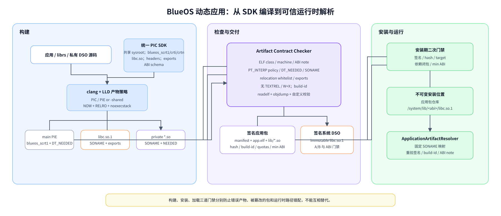

> 构建期产物契约、安装期签名/依赖检查和加载期身份复验是三道不同门禁，不能互相替代。可编辑源文件：[artifact-delivery-flow.drawio](./assets/dynamic-loading/artifact-delivery-flow.drawio)。

建议的产物关系：

```text
blueos-sdk/<abi>/
  lib/libc.so.1
  lib/libc.so                 # 仅 SDK 链接名
  lib/blueos_scrt1.o crti.o crtn.o
  lib/librs.exports
  include/ ...                # C API
  rustlib/<target>/lib/...    # 内核、应用与 DSO 共用的 PIC sysroot
  abi/blueos-abi.json         # note/schema/syscall/librs 版本
```

运行时路径不从 SDK 目录猜测，应由板级 ABI 配置冻结，例如 `libc.so.1 → /system/lib/<abi>/libc.so.1`。resolver 对系统 SONAME 只查这张只读映射，不读取环境变量或当前目录；打开文件后仍校验签名、build-id 和 ABI note，防止固定路径被错误内容替换。

#### 7.3.1 应用包、签名与 OTA 兼容

裸 ELF 是链接输入，不足以表达安装与回滚策略。建议最小应用包包含：

```text
manifest.cbor/toml
  app_id, version, target/float-abi/isa
  min_kernel_abi, min_librs_abi
  main ELF, private DSO 列表及各自 build-id/hash
  memory/thread/dependency quotas, requested capabilities
app.elf
lib/*.so
signature
```

安装期先验证签名、hash、target、依赖闭包与最低 ABI，加载期再校验 ELF 自身与 note，形成两道互补门禁。系统 `libc.so.1` 的逻辑路径应指向不可变版本文件：registry 中已有 `Ready/Quiescing` 实例时不得原位覆盖；新版本只有在旧实例 lease 归零并完成卸载后，或系统重启/A-B 切换后，才能成为下一次路径解析结果。A/B 回滚前必须验证“回滚后的 kernel/librs ABI >= 所有保留应用声明的最低版本”，否则系统回滚成功、应用却全部无法启动。

SONAME major 表示不兼容 ABI；同 major 内遵循 append-only 导出、已发布数据符号尺寸/语义不变，并由 ABI diff CI 强制。MVP 可以用 `.note.blueos.abi` + 导出清单，不必一开始实现 glibc 级多版本共存，但要为每个发布物保留 build-id 和精确 SDK revision。

#### 7.3.2 调试与可观测性必须与 loader 同期交付

动态地址若没有 link map，现场 PC 几乎无法定位。MVP 至少应提供：

- `LinkMapEntry { app_id, soname, build_id, load_bias, segments, state }`，在 publish/unpublish 时原子更新；
- 崩溃转储输出 PC 所属 image、`pc - load_bias`、segment 权限和 build-id，离线工具据此选择完全匹配的未剥离 ELF；
- 结构化 `LoadError`，至少包含 stage、image、ELF offset/virtual address、dynamic tag 或 relocation type、symbol、资源上限和底层 IO 原因；
- 提供 BlueOS 自有的稳定 link-map 导出，让 GDB 脚本能在模块发布后按 build-id/load bias 加载符号；当前无需实现用户态 ldso 的 `DT_DEBUG/r_debug` 协议；
- 每阶段计数与耗时：读取字节、映射/峰值 RAM、依赖数、symbol lookup 次数、各类 relocation 数、cache/ctor 时间。预算按板级配置，不在报告里臆造一个通用常数。

开发版保留完整信息，发布版可限制地址泄露，但 build-id、错误码和可信崩溃通道不能删除。strip 必须生成配套 debug 文件并与包一起归档；事后仅凭相同源码重编通常无法恢复准确地址。

### 7.4 分阶段实施路线

本节同时给出组件边界、阶段目标和逐阶段验收门槛。实施时应把每个阶段拆成可独立回滚的变更，但不得跳过前一阶段的正确性与安全 gate。

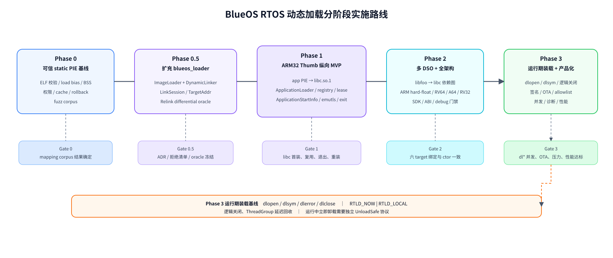

> 每一阶段都以可验证的 gate 收口；运行期 `dlopen/dlclose` 在 Phase 3 交付，不是 Phase 1 启动动态链接 MVP 的门槛。可编辑源文件：[implementation-roadmap.drawio](./assets/dynamic-loading/implementation-roadmap.drawio)。

#### 7.4.1 Phase 0：把当前单映像 loader 变成可信基线

目标不是动态链接，而是先得到正确、安全、可复用的装载机制。

- 带不可变快照契约的 read-at 输入、完整 ELF/program-header/架构 ABI 校验与板级资源上限；
- 正确 load bias、逐段布局、显式 BSS 清零、checked arithmetic；
- 保留现有 `R_RISCV_RELATIVE` 兼容回归，并以 ARM32 `R_ARM_RELATIVE` 打通 `DT_REL` 隐式 addend；归一化 REL/RELA，RELR 在 profile 未启用时只识别并明确拒绝；
- dynamic tag/flag 白名单、relocation 目标/结果/重复写入校验和峰值内存预算；
- granule-aware 权限计划、W^X、RELRO、逐范围实际 protection 结果和具有板级 capability/scope 的 cache sync；
- 用 `ElfReader/ReadAt` 替代整文件读入；
- 用 `AllocationLease + PreparedImage + committed owner` 建立单映像事务所有权；owned 映像支持强回滚，borrowed fixed 修改后失败进入 `Poisoned`；Phase 0 不引入 `ThreadGroup`；
- 畸形 ELF corpus、逐调用 fault injection 和 fuzz target。

验收：非零最低 `p_vaddr`、带洞 segment、大 BSS、错误 `p_align`、越界/溢出、canonical entry 最小指令跨度越出 X segment、未知 relocation、故意 W+X、错误 ABI flag、重复 relocation、权限粒度冲突和事务中每个故障点都有确定结果；ARM32 fixture 必须证明真实 relative relocation 被消费，现有 RISC-V64 QEMU 自包含 `ET_DYN` 继续稳定运行，并保证 local commit 后不存在可失败步骤。详细 gate 以 [Phase 0 详细实现方案](./dynamic-loading-phase0-implementation.md) 为准。

#### 7.4.2 Phase 0.5：扩充 `blueos_loader` 并冻结 DynamicLinker 架构

- 将上述 Rust 1.84 兼容实测、目标矩阵、Relink 固定 revision 和许可证结论写入 ADR，不再保留“完整复用还是自研”的开放选择门；
- 在现有 `blueos_loader` crate 内整理 `ImageLoader` 并新增 `dynamic_linker` 模块，冻结 `ElfReader/ImageMemory/ArtifactResolver/ArchRelocator/LinkSession/LinkContext/LoadError`；保留 `load_elf()` 兼容包装，链接器不得直接依赖 VFS、`ApplicationManager`、具体 allocator 或待装入的 `librs`；
- 冻结 `TargetAddr/TargetWord`、`LinkDomainId` 和绑定 address space 的 `ImageMemory`：链接器不得假定目标地址等于当前 Rust 指针，也不得使用全局地址空间单例；
- 将 artifact/catalog 与 mapped instance 分开建模，当前 `SystemDsoRegistry` 只是 `LinkDomainId::System` 的 instance registry，防止未来进程化时推翻对象所有权；
- 引入 `ApplicationArtifactPolicy`，对已识别的 `PT_INTERP/PT_TLS` 等标准元数据做 profile 级拒绝，而不是写死在 parser；
- 将当前 loader 的 load-bias、segment、BSS、relative relocation 测试保留并提升为 `ImageLoader/DynamicLinker` 的共同基线，避免长期维护两个 relocation 实现；
- 从 Relink/musl 选择人工 ELF fixture，在宿主 CI 建 differential oracle，比较依赖图、符号绑定、写值、错误和 init/fini 顺序；
- 冻结 Phase 0–2 拒绝清单：`ET_REL`、lazy binding、应用 `dlopen/dlclose`、原生 ELF TLS、IFUNC、COPY、TEXTREL、symbol version 和 section 重排；
- 建立代码量、text/data、峰值 RAM、装载时延与 unsafe 审计基线，防止自研核心逐步重新长成通用 ld.so。

#### 7.4.3 Phase 1：ARM32 Thumb v7-M RTOS 动态 `libc.so.1` MVP

- 从 `librs_swi` 依赖图生成带 SONAME/导出清单的 `libc.so.1`，所有内核访问经过静态并入的 `blueos_scal_swi`；
- 在内核 `application/thread_group` 后端新增与 `blueos_loader` 分离的特权 `ApplicationLoader`；它调用现有 loader crate 内的 `DynamicLinker`，由唯一的 `ApplicationManager` 编排，不实现 `PT_INTERP`、Linux initial stack 或 ldso stage0；
- 固定 `thumbv7m-vivo-blueos-newlibeabi`/soft-float EABI，生成 `ELFCLASS32 + EM_ARM` 的 Thumb PIE/DSO；实现 BlueOS `VfsElfReader`、`FlatImageMemory`、`ApplicationArtifactResolver`、ARM32 `ArchRelocator` 与 `arch/*/cache.rs` 的指令缓存服务（`sync_instruction_cache`）。首发 relocation 白名单为 `R_ARM_RELATIVE/R_ARM_ABS32/R_ARM_GLOB_DAT/R_ARM_JUMP_SLOT`，并有界读取 REL addend、校验 Thumb bit；线程创建仍由 `ThreadGroupBackend` 负责，不再引入含义重叠的 `CodeExecutor`；
- `qemu_mps2_an385` 无硬件 cache 的 backend 仍执行 DSB/ISB 并明确报告能力；cache-enabled Cortex-M 必须增加 D-cache clean/I-cache invalidate，不能复用空实现；
- 增加由 `DsoArtifactCatalog + DsoInstanceRegistry(LinkDomainId::System)` 组成的 `SystemDsoRegistry`：首个依赖者从固定可信路径按需装入 `libc.so.1`，并发首装只执行一次，每个依赖 `LinkDomainId` 持有 `SystemDsoLease`；
- 主程序只 `DT_NEEDED: libc.so.1`，立即绑定；
- 定义含标准 auxv 数组的 `ApplicationStartInfo`、SDK `blueos_scrt1.o` 和新版 `__librs_start_main`，在 libc 提供 `getauxval()`，用现有线程 entry+arg ABI 进入 `main(argc, argv, envp)`；
- 保留 emutls，实现线程归属和整 ThreadGroup 退出回收，不做 `dlopen`/单 DSO 卸载；
- 最后一个 lease 释放后进入 `Quiescing`；只有证明没有线程、TLS destructor、atexit、回调、函数指针和依赖边引用时才执行 fini 并卸载，否则保留为可复用缓存；
- shell 新增 `run <path> [args...]`，统一的 `ApplicationManager` 负责生命周期并在当前构建中分派到 `ThreadGroupBackend`。

验收用例至少覆盖：C hello、最小 Rust C-ABI 应用、argv/envp、文件 IO、heap、weak symbol、跨 DSO function/data、BSS、ctor 恰好一次及依赖顺序、emutls 多线程、错误依赖/符号/ABI note、重复启动与整组完整回收。完整 Rust `std` 支持可在 PIC sysroot 稳定后加入，不阻塞第一条 C 纵向链路。

#### 7.4.4 Phase 2：多 DSO 与其余 ARM32/AArch64/RISC-V profile

先在 ARM32 Thumb v7-M 增加 `app.elf → libfoo.so → libc.so.1` 和多层/菱形依赖 fixture，验证 BFS scope、SONAME 去重、weak symbol、init/fini 拓扑、应用私有 DSO 回收，以及系统 DSO 的按需装载、租约共享、静默卸载与重新装载；随后复用同一 `DynamicLinker` 扩展目标 profile。

建议顺序：ARM32 Thumb v7-M soft-float（Phase 1）→ ARM32 Thumb v8-M hard-float → RISC-V64 → AArch64 → RISC-V32 IMAC/IMC。这样先用已声明 PIC/dynamic 的 ARM target 解决 REL、Thumb bit 和 EABI，再让其他 backend 复用依赖图、scope、生命周期和 artifact gate；RV32 仍需区分 ISA/ABI 并验证无 A 扩展下的同步实现。

- 每个 ABI 建 relocation golden corpus 和 QEMU/板上 smoke test；
- ARM hard/soft float、Thumb entry/veneer、RISC-V ISA feature 严格匹配；
- 形成 SDK/EDK、artifact contract、ABI diff 与 build-id/debug 归档门禁；
- 每个平台都运行相同的 app/libfoo/libc 依赖图，并确认符号绑定与构造顺序一致；
- 分别测量系统 DSO 未装载、活动共享、静默后缓存和卸载四种状态下的装载时间、峰值 RAM、占用和内存碎片。

#### 7.4.5 Phase 3：RTOS 产品化与生命周期加固

- 在同一个 `DynamicLinker` 上增加 `RuntimeLoadSession` 和 per-ThreadGroup runtime registry，首批交付 `dlopen/dlsym/dlerror/dlclose`、`RTLD_NOW | RTLD_LOCAL` 与可选 `RTLD_NODELETE`；只解析当前签名包 manifest 声明的私有 DSO 或系统只读 catalog，同一工件的并发首开合并为一次增量事务；
- 新 group 完成依赖发现、NOW relocation、seal、cache sync 后原子发布为 `Initializing`，释放 loader/registry 锁后由 `librs` 执行 constructor，完成后才转为 `Ready` 并向 `dlopen` 调用方返回 handle；constructor 内嵌套 `dlopen` 不得等待自己；
- `RuntimeDsoHandle` 绑定当前 ThreadGroup 并带 generation；`dlsym` 只查 handle 对应的 root/group 依赖闭包，`dlerror` 使用线程局部状态；跨组、陈旧 handle、lazy/deepbind 和越权 symbol 均明确拒绝；
- `dlclose` 首先实现为逻辑关闭：减少 open count，最后一次 close 使 handle 失效，但映像、emutls 描述符和已经返回的裸地址保活到 ThreadGroup 退出；不在运行中直接 fini/unmap；
- 完成应用包签名、系统/应用 DSO allowlist、ABI note、SONAME/build-id 和 A/B 兼容门禁；
- 审计共享 `libc.so.1` 的 allocator、stdio、cwd、环境、pthread 和 emutls 状态，按产品需求区分 system/thread/LibcApplicationContext ownership；
- 完成并发启动锁、依赖环、OOM/故障注入、构造失败、线程退出与整组回收；把线程 PC、TLS destructor、atexit、信号/定时器/驱动回调、已登记函数指针和 DSO 依赖边纳入静默判定，无法证明安全时禁止释放 image；
- 发布所有平台的 `ProtectionRecord` 实际结果并完成 cache 正确性与实时性能测量；MPU/MMU/PMP 隔离仍作为独立后续演进，不属于本 Phase 完成门槛；
- 交付 link map、崩溃符号化、结构化错误和每阶段耗时/内存计数。
- 增加一次“未来 VM adapter”host 验证：用模拟的两个独立 address space 装载相同 DSO，确认可共享 artifact/只读 backing 元数据，但 load bias、RW/GOT、构造状态、lease 和 link map 保持实例级隔离；这不实现进程，却能防止 RTOS 代码重新耦合到全局地址空间。

#### 7.4.6 Phase 3 兼容扩展与真正卸载的边界

- local 基线稳定后，可增加 `RTLD_GLOBAL/RTLD_NOLOAD/RTLD_DEFAULT`、`dlopen(NULL, ...)` 与 `dladdr/dl_iterate_phdr`；新 global group 只影响事务提交后的未来查找，不反向重绑定既有 GOT，首版仍拒绝 `RTLD_NEXT`；
- 继续禁止 lazy binding。真正的单 DSO `fini + unmap` 必须另有可证明的线程/回调/TLS/atexit/unwind 安全协议；对任意 C DSO，`dlsym` 裸指针是否逃逸无法由 loader 判定；
- 如果业务必须在 ThreadGroup 运行中归还 RAM，应定义受限 `UnloadSafe` 插件 profile、显式调用/回调 lease 和线程安全点，而不是在引用计数归零时直接释放特权地址空间中的代码；
- RELR 或新增 relocation 只按真实产物与启动收益数据引入，不为追求 POSIX 接口数量扩大首版范围。

投入按 Phase 2 基础已经稳定计算：ARM32 的 NOW/local/逻辑关闭闭环约 **9–13 人周**，补齐其余目标 profile 后合计约 **14–21 人周**；较完整兼容层再增加约 **4–7 人周**。受限且可证明安全的运行中立即卸载属于单独能力，预计再增加约 **10–18 人周**。详细拆分见 [详细实现计划 §12.5](./dynamic-loading-implementation-plan.md#125-phase-3运行期装载与产品化)。

### 7.5 测试与验证矩阵

#### 7.5.1 主机侧

- parser/linker 单元测试：所有边界计算、hash、weak/visibility、依赖环、ctor 拓扑；
- libFuzzer/AFL 风格 fuzz：ELF header、phdr、dynamic、strtab/symtab/hash、REL/RELA/RELR；
- differential/oracle：同一组人工 ELF 在 Relink、musl/glibc 能覆盖的宿主架构上比较 relocation/link map；
- 每个 target 用小型汇编/C fixture 精确制造 relocation，不依赖“大应用碰巧生成”；
- 状态机/property test：0–8 任一点注入失败后 mapping/registry/引用计数恢复；constructor 失败则整 ThreadGroup 销毁且不承诺撤销外部副作用；
- ABI/包 CI：导出清单、symbol size/type/version、结构体布局、syscall 表 append-only、manifest/ELF 双层 target 校验和 A/B 回滚兼容检查。

#### 7.5.2 QEMU/硬件侧

| 类别 | 必测场景 |
| --- | --- |
| 装载 | segment gap、非零虚址基准、unaligned file tail、大 BSS、低内存/OOM 回滚 |
| 链接 | 每个白名单 relocation、weak 未定义、hidden/protected、缺 symbol/SONAME、依赖环 |
| 权限/cache | 有保护能力的平台验证 text 写失败、data 执行失败、RELRO 写失败和栈 NX；flat 平台验证逻辑权限；所有平台验证 cache sync 后新代码可见 |
| 生命周期 | 系统 libc 在每个装载生命周期 init 恰好一次；并发首装去重；lease 阻止提前卸载；末 lease 释放后仅在静默条件满足时 fini/卸载，并可再次装载；应用 ctor 依赖顺序、fini 逆序、ctor 失败、重复启动、线程未退出时拒绝回收 |
| TLS | 所有 DSO 绑定同一 `__emutls_get_address`、多线程 value 独立、线程退出释放、应用 image 在所属线程退出前保活 |
| ABI/启动信息 | 错架构/位宽/float ABI/ISA/syscall 版本均在执行前拒绝；校验 auxv 终止项、数量上限、各标准 tag 和 `getauxval()`/错误语义 |
| 调试 | 每个崩溃 PC 可由 build-id + load bias 定位；link map 状态不出现半发布模块 |
| DSO/架构一致性 | app → libfoo → libc 的同一 fixture 在 ARM32/AArch64/RISC-V 上生成相同依赖图、符号绑定和构造顺序 |
| 压力 | 并发启动、反复启动退出、依赖深度/数量上限、内存碎片和耗时分位数 |

每个测试都应记录 `llvm-readelf` 产物特征，避免链接器升级后 fixture 悄悄换了 relocation，测试仍以错误原因通过。

### 7.6 推荐的首个工程切片

如果只安排一个可演示、又不制造架构债务的里程碑，建议定义为：

> 在 `qemu_mps2_an385` 上，shell 启动一个由 `thumbv7m-vivo-blueos-newlibeabi` 生成、无 `PT_INTERP`、带 `DT_NEEDED: libc.so.1` 的 ARM32 Thumb C PIE。首个依赖触发系统从固定可信 VFS 路径装入由 `librs_swi` 生成的 `libc.so.1`；`ApplicationManager` 将已验证的 RTOS 启动请求分派到 `thread_group/` 后端，创建持有 libc lease 的 `ThreadGroup`，特权 `ApplicationLoader` 完成 main/libc 的符号绑定、ARM32 NOW relocation、Thumb 地址校验、逻辑 RELRO 和 DSB/ISB，生成带标准 auxv 的 `ApplicationStartInfo/InitPlan`；随后以 `blueos_scrt1::_start` 和 `ApplicationStartInfo *` 创建线程，经 `__librs_start_main` 运行带 argv、`getauxval()`、heap、文件 IO 和 emutls 的 `main`。并发启动的第二个应用必须复用同一 Ready 实例；全部应用退出并释放 lease 后，registry 通过静默检查再 fini/卸载，再次启动则重新装入并在新的装载生命周期只执行一次 init。

这个切片一次验证 RTOS 所需的完整纵向链路：`librs_swi` DSO 化、系统 DSO 按需装载/租约/静默卸载、应用动态符号解析、ARM32 REL relocation、Thumb 入口、VFS、内存/cache、线程入口、auxv、TLS 和退出生命周期。它不依赖进程、真正用户态、Linux initial stack、`mmap` 或解释器自举；跑通后增加其他 `.so` 主要是依赖图/作用域问题，扩展 hard-float ARM32、AArch64/RISC-V 则主要是 artifact profile、psABI relocation、cache 和内存后端问题。

## 8. 未来展望：通用内核与真正用户态

通用内核不是当前交付内容，但它会改变动态加载的执行位置、内存所有权和 libc 共享方式。合理的目标不是让未来进程继续调用当前特权 `ApplicationLoader` 完成所有 DSO relocation，而是让当前方案平滑演进为“kernel exec stage0 + 用户态 ld.so”，两者复用已经验证的链接语义核心。

### 8.1 推荐的演进阶段

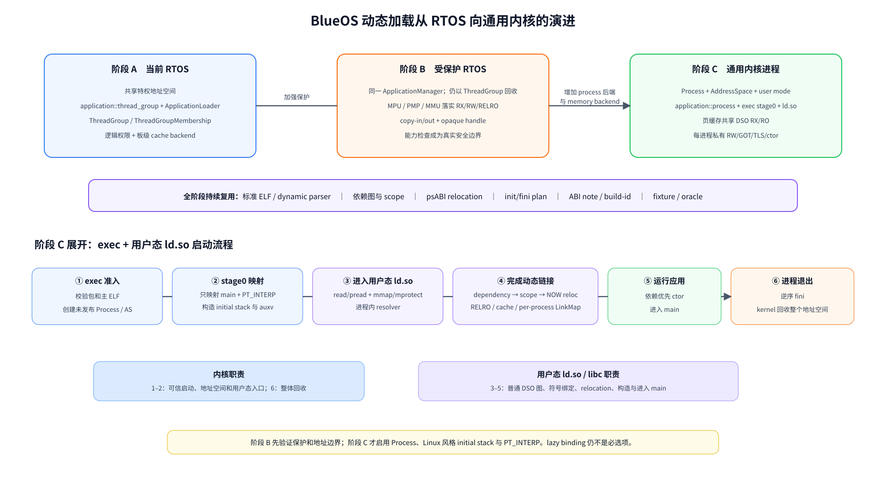

> 图的上半部分是三阶段演进路线，下半部分展开阶段 C 的 `exec + ld.so` 流程。可编辑源文件：[general-kernel-evolution.drawio](./assets/dynamic-loading/general-kernel-evolution.drawio)。

阶段 B 是很有价值的过渡，而不是一次性工程：它能先验证 `ImageMemory::protect`、用户指针复制、线程归属和异常回收，而无需同时引入完整进程 ABI。当前 `FlatImageMemory`、MPU/PMP 和未来 MMU backend 都应实现同一 capability 接口，使保护能力逐步增强而不改变 `DynamicLinker`。

这三个阶段都通过同一个内核 `ApplicationManager` 进入。阶段 A/B 只编译 `application/thread_group`；阶段 C 由单一配置启用同级的 `application/process`，顶层应用表、句柄、审计、查询、退出事件和资源记账保持不变。`process/` 只包含 Process、AddressSpace、exec stage0、initial-stack 与 user-thread 管理，用户态 `ld.so` 作为独立产物存在，不能因为目录统一就把普通 DSO 动态链接重新搬进内核。

### 8.2 未来 `exec + ld.so` 启动流程

当 BlueOS 已有 Process、独立页表和非特权执行级后，建议采用以下启动流程；各步与 8.1 图下半部分的编号一致：

1. `exec` 校验应用包和主 ELF，创建尚未发布的 Process/AddressSpace。
2. kernel 解析主程序的 `PT_LOAD/PT_INTERP`，只映射主程序与受信任解释器，并构造带 argc/argv/envp/auxv 的 initial stack；此时不遍历普通 `DT_NEEDED`。
3. kernel 进入用户态解释器 `_start`。用户态 `ld.so` 使用同一 `DynamicLinker` crate/语义，但 adapter 改为 `read/pread + mmap/mprotect/munmap`、进程内 resolver 和用户态同步原语。
4. `ld.so` 装载依赖、冻结 scope、完成 NOW relocation、RELRO 和 cache 同步，并发布每进程 link map。
5. `ld.so` 按依赖顺序执行构造函数，再跳到主程序入口并进入 `main`。
6. 进程退出时先执行逆序析构，再由 kernel 回收整个地址空间；`dlclose` 仍只在有完整 TLS、回调、unwind 和线程安全协议时开放。

当前选择 NOW binding、标准 `ET_DYN`、program-header 驱动和 C ABI 与该流程并不冲突。未来可以继续默认 NOW binding；是否增加 lazy binding 是独立的性能决策，不是拥有进程后必须实现的功能。

### 8.3 组件复用与替换清单

| 当前资产 | 未来处理 | 原因 |
| --- | --- | --- |
| ELF/phdr/dynamic/symbol/hash parser | 直接复用 | 与执行特权级和地址空间无关 |
| dependency graph、scope、relocation、init/fini plan | 直接复用 | 属于标准 ELF/psABI 链接语义 |
| `TargetAddr`、`LinkContext`、`LoadError`、fixture/oracle | 直接复用 | 已按目标地址和 link domain 建模 |
| `.note.blueos.abi`、SONAME、build-id、导出清单 | 直接复用并扩展 process feature | 保持 SDK、OTA 和诊断连续性 |
| `librs_swi/libc.so.1` 的 C/syscall ABI | 大部分复用 | SWI/SVC/ECALL 本来就是用户态进入内核的稳定边界 |
| `FlatImageMemory/MPU Memory` | 替换为 `ProcessImageMemory` | 映射、保护、COW 和 unmap 由进程页表承担 |
| kernel `ApplicationManager` 公共层 | 直接复用；增加条件编译的 `process/` 后端 | `ApplicationHandle`、准入、应用表、查询、退出事件和记账与执行模型无关 |
| kernel VFS/包 resolver adapter | 替换为受控 fd/loader namespace adapter | 用户态 ld.so 不应直接持有内核 VFS 对象 |
| `ApplicationStartInfo` 物理布局 | 替换为 initial stack，保留字段语义 | 兼容标准 crt/调试工具，同时复用 auxv 生成器 |
| 全局 system DSO instance/lease | 改为每进程 instance；共享 artifact/page cache | 不能跨进程共享 libc RW/GOT/ctor 状态 |
| `application::thread_group` 中的完整启动链接 | 保留为兼容 RTOS 路径；`application::process` 只做 exec stage0 | 通用内核不应在特权态执行普通 DSO 链接和 ctor |
| ThreadGroup/ThreadGroupMembership | 演进为 Process/Task membership | 状态机和最后执行单元回收语义仍成立 |
| BlueOS link map | 改为每进程发布，可增加 `DT_DEBUG/r_debug` | 保留 build-id/load-bias 诊断，改善 GDB 兼容 |

### 8.4 libc、TLS 与页共享的迁移

当前 RTOS 的共享 `libc.so.1` 是节省无 MMU RAM 的产品选择，不应成为永久 ABI。现在就把 allocator、stdio、cwd、环境、atexit、pthread key 和 emutls 状态归类为 `system/thread/LibcApplicationContext`，未来 LibcApplicationContext 可以自然变成每进程 libc 状态；如果当前任由这些内容通过未标注的 Rust `static` 混在一起，进程化时将很难判断哪些可以跨进程共享。

有 MMU 后，系统可以让多个进程映射同一 build-id 对应的 RX/RO 文件页，节省物理内存；每个进程保留独立的 RW、GOT、RELRO 前写入页、TLS 和 ctor/fini 状态，必要时由 COW 提供初始共享。`DsoArtifactCatalog` 可以成为可信文件与页缓存的元数据层，`DsoInstanceRegistry` 则下沉到每个进程的用户态 ld.so/link context。

当前继续使用 emutls 是合理的，它可直接运行在未来进程内；原生 ELF TLS 不是迁移前置条件。若未来为了性能支持 `PT_TLS/TLSDESC`，应在 `DynamicLinker` 增加独立的 `TlsLayout/TlsRuntime` backend，并由线程创建和 DTV 生命周期配合，不能把 native TLS 逻辑混入普通 symbol relocation 或当前 LibcApplicationContext。

### 8.5 当前阶段必须付出的有限兼容成本

为未来保留路径不等于现在实现进程、页表或用户态解释器。当前只需要承担以下低成本约束：

- `DynamicLinker` 使用目标地址整数和 region offset，不散布裸指针解引用；
- mapper/session 显式携带 `LinkDomainId/AddressSpaceHandle`，即使当前只有一个 shared space；
- artifact metadata 与 mapped instance 分层；
- `PT_INTERP/PT_TLS` 等由 profile 拒绝而不是 parser 永久不识别；
- `ApplicationStartInfo`、syscall request 和 handle 使用版本化 C ABI，所有输入先 copy/校验；
- libc 可写状态有明确 system/thread/LibcApplicationContext owner；
- init/fini 由 `DynamicLinker` 产出 plan、在链接器和全局锁之外执行；
- CI 增加两个模拟 address space 的 host test，防止 load bias、RW state、lease 或 link map 被误做成全局单例。

这些约束不会显著扩大当前 RTOS loader 的功能面，却能把未来改造从“推翻重写动态链接器”收敛为“新增 Process/exec/VM 能力并替换 adapter/frontend”。

## 9. 结论

BlueOS 当前不能实现严格意义上的用户态 `libc.so`，因为动态应用仍与内核共享特权地址空间；但它具备实现 **RTOS 动态 `libc.so.1`** 的现实基础：已有 `ET_DYN` 装载原型、面向动态应用的 `librs_swi`/SWI 调用路径、VFS、线程 entry+arg ABI、emutls，以及 GN 的 cdylib/solink 能力。缺失的是工程化动态链接器、跨架构 relocation、DSO 构建契约和应用生命周期，而不是进程模型。

对于当前 RTOS BlueOS，推荐方案是：

1. **主程序和共享库统一使用标准 `ET_DYN`。** 主程序包含 `PT_DYNAMIC/DT_NEEDED`、不包含 `PT_INTERP`；`.so` 带 SONAME。发布 ABI 只使用 C ABI，不使用 Rust `dylib` ABI。
2. **把 `librs_swi` 生成可按需装载的系统级 `libc.so.1`。** `blueos_scal_swi` 等内部依赖以 PIC 静态进入 libc，所有内核访问经过稳定 SWI ABI；首个依赖从固定可信路径触发装载，并发首装在 `SystemDsoRegistry` 中合并为一次事务。
3. **其他 `.so` 动态依赖统一 libc。** 普通库通过 `DT_NEEDED: libc.so.1` 使用 librs 接口，不能各自静态嵌入 `librs_swi`。系统库在活动期由 `SystemDsoLease` 全局共享；应用私有库只在所属 `ThreadGroup` 可见并随整组回收。末 lease 释放后，只有通过线程、TLS、atexit、回调、函数指针和依赖边的静默检查才卸载，否则保留为缓存。
4. **直接扩充现有 `blueos_loader`，内部形成 `ImageLoader + DynamicLinker`，再由特权 `ApplicationLoader` 部署。** 不废弃已有 loader，也不另建第二套产品链接器；两层共享 ELF、内存和 relocation 实现。产品固件不链接完整 Relink；Relink 只作为固定 revision 的设计参考和宿主 differential oracle。`DynamicLinker` 负责 `DT_NEEDED` 图、SONAME 去重、符号 scope、NOW relocation、link map 和 init plan；不实现用户态解释器、Linux initial stack 或 ldso stage0。
5. **通过单一 `ApplicationManager` 和 `blueos_scrt1 + ApplicationStartInfo` 接入现有线程模型。** `ApplicationManager` 当前只编译并选择 `ThreadGroupBackend`；链接成功后由该后端构造含标准 auxv 数组的 `ApplicationStartInfo`，以 `e_entry` 创建线程并传入该指针。libc 可立即提供 `getauxval()`，`__librs_start_main` 初始化当前线程运行时、执行 ctor、调用 `main`，最后按线程归属完成整组退出。
6. **共用链接核心，分架构实现 relocation/cache backend。** 先在 ARM32 Thumb v7-M soft-float 跑通纵向切片，再覆盖 Thumb v8-M hard-float、RISC-V64、AArch64 和 RISC-V32；REL/RELA、Thumb bit、float ABI 和 ISA feature 都由每目标 artifact test 冻结。
7. **内核、应用和 DSO 共用 PIC/dynamic-capable 工具链与 sysroot。** `dynamic` 是 target 能力而非内核运行时依赖；`kernel_static` 明确采用“PIC codegen + `-static` 最终链接”，应用和 DSO 分别使用 PIE/shared 策略。clang + LLD、板级脚本迁移及内核尺寸/性能 A/B 门禁是该统一方案的一部分。
8. **Phase 0–2 保持确定且可回收，Phase 3 再增加运行期装载。** 启动 MVP 使用立即绑定和现有 emutls，不支持应用侧 `dlopen/dlclose`；Phase 3 增加 NOW/local 的 `dlopen/dlsym/dlerror` 和逻辑 `dlclose`，映像仍延迟到整个 ThreadGroup 退出时回收。lazy binding、原生 ELF TLS、IFUNC、COPY relocation、TEXTREL、应用对系统 DSO 的 interposition，以及任意 DSO 的安全立即卸载仍不在当前交付范围。`SystemDsoRegistry` 的内部静默卸载是受控生命周期操作，不等同于允许应用任意立即卸载。
9. **从第一版保留单一 `application` 和通用内核迁移边界，但不提前实现进程后端。** 顶层 `ApplicationManager` 统一句柄、准入、状态、查询、退出通知与回收，当前只包含 `thread_group/` 后端；`DynamicLinker` 使用目标地址和 link domain，不依赖当前可解引用指针，`SystemDsoRegistry` 内部分离 artifact 与 instance。未来增加 Process/MMU 后，在同一模块中条件编译加入 `process/` 后端和 exec stage0；普通 `DT_NEEDED`、符号与 relocation 仍由用户态 `ld.so` 完成，并复用解析、链接语义、ABI note 和 fixture。

实施前仍必须先修复现有 loader 的 BSS 未清零、load bias、未知 relocation 静默忽略、`p_align`/范围/溢出校验和 cache 同步问题。共享 `libc.so.1` 能显著减少无 MMU RTOS 中的重复代码和运行时实现，但其 allocator、stdio、环境和其他普通全局状态也会系统级共享；需要隔离的部分必须明确改造成 thread-local 或 `LibcApplicationContext`，不能把共享地址空间描述成用户态隔离。
